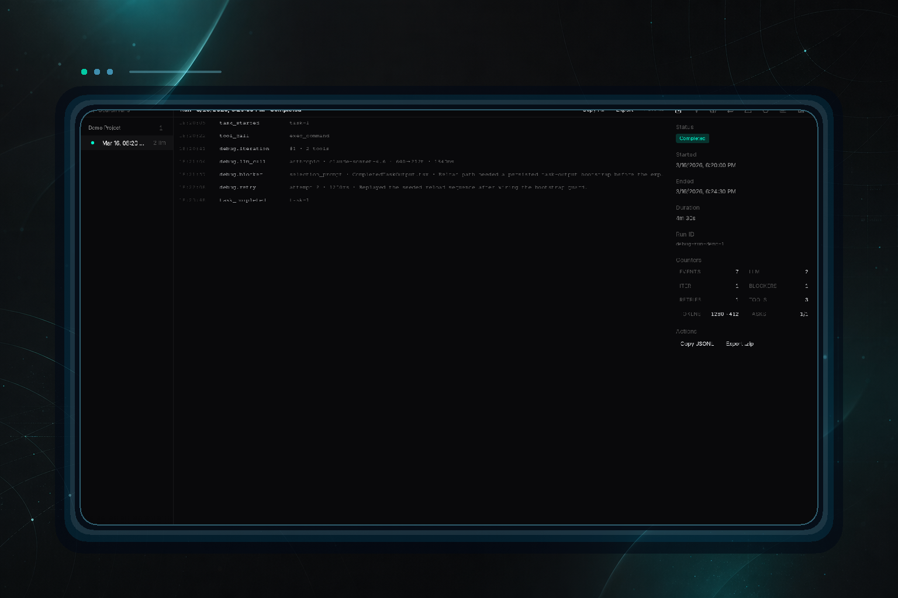
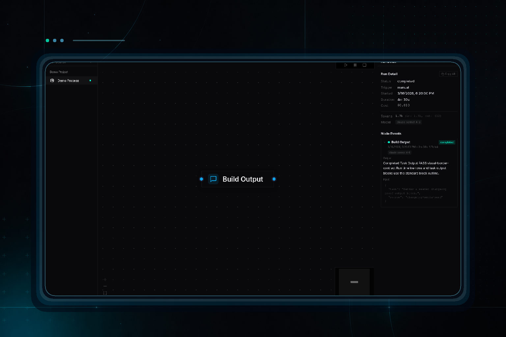
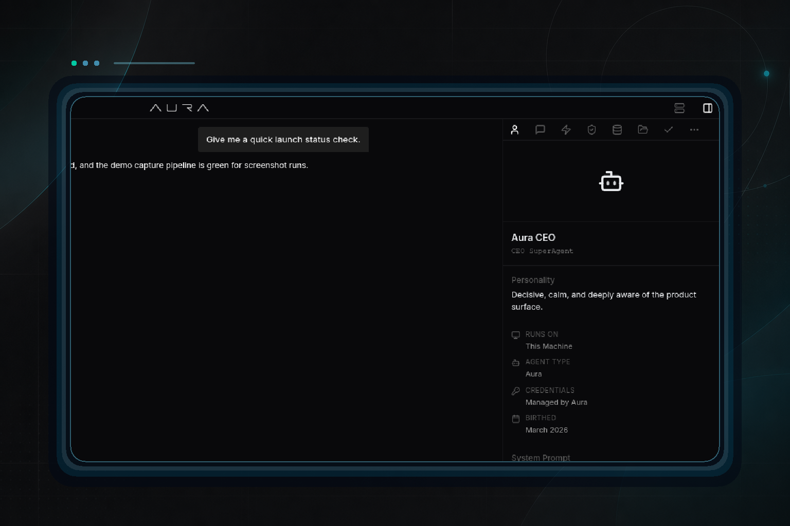
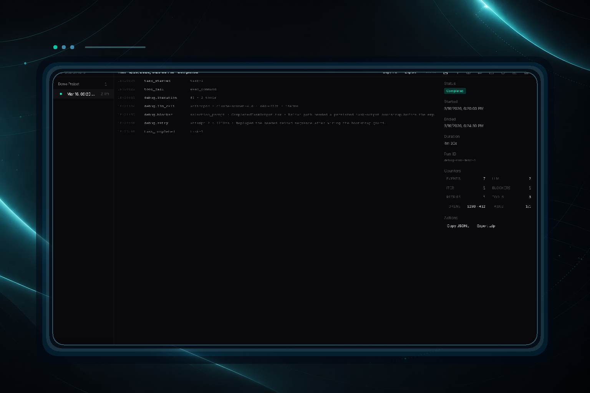

# Autonomous recovery, a rebuilt Debug workspace, and resilient release media

- Date: `2026-04-22`
- Channel: `nightly`
- Version: `0.1.0-nightly.348.1`
- Release: https://github.com/cypher-asi/aura-os/releases/tag/v0.1.0-nightly.348.1

Today's nightly lands a deep rework of the Debug app around a project-first nav and sidekick inspector, a new autonomous-recovery pipeline that splits oversized tasks and survives provider rate limits, and a substantially hardened changelog media pipeline. Along the way, chat streaming, the login screen, and the Windows auto-updater all got meaningful reliability fixes.

## 2:06 AM — Debug app rebuilt around project-first nav and a sidekick inspector

The Debug surface moved from a bespoke run-centric layout to the shared project tree with a sidekick-driven inspector, plus fixes that unblock real debugging sessions across chat, feed, and tool output.

<!-- AURA_CHANGELOG_MEDIA:BEGIN {"requested":true,"status":"published","score":6,"reason":"Entry looks like a user-visible product change and should receive changelog media.","reasons":["entry touches interface source files","entry language points to a visible product surface","entry language includes light config-style vocabulary","entry language points to release plumbing rather than a product screen","most changed files point at UI-facing surfaces"],"slotId":"entry-debug-app-rebuilt-around-project-first-nav-and-a-sidekick-inspec","slug":"debug-app-rebuilt-around-project-first-nav-and-a-sidekick-inspec","alt":"Debug app rebuilt around project-first nav and a sidekick inspector screenshot","files":["interface/src/apps/debug/DebugApp.ts","interface/src/apps/debug/DebugNav/DebugNav.module.css","interface/src/apps/debug/DebugNav/DebugNav.tsx","interface/src/apps/debug/DebugNav/debug-nav-explorer-node.tsx","interface/src/apps/debug/DebugRunDetailView/DebugEntryInspector.tsx","interface/src/apps/debug/DebugRunDetailView/DebugLogList.tsx","interface/src/apps/debug/DebugRunDetailView/DebugRunCounters.tsx","interface/src/apps/debug/DebugRunDetailView/DebugRunDetailView.module.css","interface/src/apps/debug/DebugRunDetailView/DebugRunDetailView.tsx","interface/src/apps/debug/DebugRunDetailView/DebugRunToolbar.tsx","interface/src/apps/debug/DebugRunListView/DebugRunListView.tsx","interface/src/apps/debug/components/DebugFilterMenu/DebugFilterMenu.module.css","interface/src/apps/debug/components/DebugFilterMenu/DebugFilterMenu.tsx","interface/src/apps/debug/components/DebugFilterMenu/index.ts","interface/src/apps/debug/components/DebugSidekickContent/ChannelSummary.tsx","interface/src/apps/debug/components/DebugSidekickContent/DebugSidekickContent.module.css","interface/src/apps/debug/components/DebugSidekickContent/DebugSidekickContent.tsx","interface/src/apps/debug/components/DebugSidekickContent/EntryInspector.tsx","interface/src/apps/debug/components/DebugSidekickContent/FiltersPanel.tsx","interface/src/apps/debug/components/DebugSidekickContent/RunInfoTab.tsx","interface/src/apps/debug/components/DebugSidekickContent/StatsTab.tsx","interface/src/apps/debug/components/DebugSidekickContent/TasksTab.tsx","interface/src/apps/debug/components/DebugSidekickContent/index.ts","interface/src/apps/debug/components/DebugSidekickTaskbar/DebugSidekickTaskbar.tsx"],"assetPath":"assets/changelog/nightly/0.1.0-nightly.348.1/entry-debug-app-rebuilt-around-project-first-nav-and-a-sidekick-inspec.png","screenshotSource":"openai-polish","originalScreenshotSource":"capture-proof","polishProvider":"openai","polishModel":"gpt-image-2","polishJudgeModel":"gpt-4.1-mini","polishScore":80,"updatedAt":"2026-04-23T05:11:35.950Z","storyTitle":"Debug app: project-first nav with sidekick inspector and run detail view"} -->

<!-- AURA_CHANGELOG_MEDIA:END entry-debug-app-rebuilt-around-project-first-nav-and-a-sidekick-inspec -->

- Rebuilt Debug navigation on the shared LeftMenuTree so every project shows up at the top level, and moved the run toolbar, counters, and entry inspector into a new sidekick with Run/Events/LLM/Iterations/Blockers/Retries/Stats/Tasks tabs driven by a debug-sidekick-store. A portal-backed filter menu and JSONL envelope unwrapping fix dropdown clipping and the long-standing 'unknown' type/timestamp rows. (`8e7e4f0`, `1b769a8`)
- Added Copy All / Copy Filtered and Export buttons to the run-detail header (backed by a shared clipboard helper), then tightened the header into a single compact line aligned with the sidebar search input and fixed inspector action alignment. (`865e7ec`, `586f744`)
- Restored a working agent stop button by unifying chat SSE streaming and loop-active state through a new useAgentBusy hook, routing stop to /loop/stop when the loop holds the turn, and surfacing a typed 409 agent_busy with a friendly message instead of the raw harness string. (`6dd691e`)
- Fixed ANSI-colored CLI output rendering as raw base64 in the task panel by letting ESC through the decoder, stripping ANSI escapes, and broadening base64 field decoding; also removed a stray horizontal scrollbar from the feed leaderboard and calmed borders on live task/run output blocks. (`7822fa1`, `13e2cae`, `a6f3a4c`)
- Stopped per-turn token counters from double-counting mid-stream token_usage frames and added a first-class narration_deltas signal to RunCounters so downstream consumers don't have to re-scan events.jsonl. (`f5921f6`)

## 5:49 PM — Actionable remediation hints on heuristic findings

Run heuristics now emit concrete remediation hints, giving dev loops a named next step for each detected failure mode.

- Extended Finding with a RemediationHint enum (split-write, reshape-search, force-tool-call, retry-smaller-scope, no-auto-fix) populated by each existing rule, and rendered it as a compact one-liner beneath each finding in aura-run-analyze. (`6b6d6d9`)

## 6:13 PM — Auto-decompose and reshape tasks after truncation failures

When a task fails with a truncation or no-file-ops reason, the dev loop now consults heuristics and acts on the first remediation hint instead of blindly retrying.

- Added a post-failure handler that loads the run bundle, runs heuristics, and spawns child tasks based on the hint: SplitWriteIntoSkeletonPlusAppends fans out skeleton+fill tasks, while ReshapeSearchQuery and ForceToolCallNextTurn emit a single shaped-retry. All paths honor MAX_RETRIES_PER_TASK, broadcast a task_auto_remediated domain event, and fall back to the existing retry path when AURA_AUTO_DECOMPOSE_DISABLED=1. (`79eab49`)

## 6:05 PM — Darker block border on run and task output sections

A small visual adjustment pulled the run event timeline and task output blocks back in line with the standard block outline.

<!-- AURA_CHANGELOG_MEDIA:BEGIN {"requested":true,"status":"published","score":6,"reason":"Entry looks like a user-visible product change and should receive changelog media.","reasons":["entry touches interface source files","entry language points to a visible product surface","entry language includes light config-style vocabulary","entry language points to release plumbing rather than a product screen","most changed files point at UI-facing surfaces"],"slotId":"entry-darker-block-border-on-run-and-task-output-sections","slug":"darker-block-border-on-run-and-task-output-sections","alt":"Darker block border on run and task output sections screenshot","files":["interface/src/apps/process/components/ProcessSidekickContent/EventTimelineItem.tsx","interface/src/components/Preview/Preview.module.css"],"assetPath":"assets/changelog/nightly/0.1.0-nightly.348.1/entry-darker-block-border-on-run-and-task-output-sections.png","screenshotSource":"openai-polish","originalScreenshotSource":"capture-proof","polishProvider":"openai","polishModel":"gpt-image-2","polishJudgeModel":"gpt-4.1-mini","polishScore":75,"updatedAt":"2026-04-23T05:14:17.765Z","storyTitle":"Darker block border on run and task output sections"} -->

<!-- AURA_CHANGELOG_MEDIA:END entry-darker-block-border-on-run-and-task-output-sections -->

- Swapped --color-border-light for the standard --color-border token on Process run timeline rows and the task live/build output blocks so they match the .block primitive outline. (`b2f25e4`)

## 6:40 PM — Chat border token propagated into sidekick and preview overlays

Extended the chat panel's darker border token into neighboring surfaces so sidekick and preview content shares the same subtle outline.

<!-- AURA_CHANGELOG_MEDIA:BEGIN {"requested":true,"status":"published","score":8,"reason":"Entry looks like a user-visible product change and should receive changelog media.","reasons":["entry touches interface source files","entry language points to a visible product surface","entry language includes light config-style vocabulary","most changed files point at UI-facing surfaces"],"slotId":"entry-chat-border-token-propagated-into-sidekick-and-preview-overlays","slug":"chat-border-token-propagated-into-sidekick-and-preview-overlays","alt":"Chat border token propagated into sidekick and preview overlays screenshot","files":["interface/src/components/PreviewOverlay/PreviewOverlay.module.css","interface/src/components/Sidekick/Sidekick.module.css"],"assetPath":"assets/changelog/nightly/0.1.0-nightly.348.1/entry-chat-border-token-propagated-into-sidekick-and-preview-overlays.png","screenshotSource":"openai-polish","originalScreenshotSource":"capture-proof","polishProvider":"openai","polishModel":"gpt-image-2","polishJudgeModel":"gpt-4.1-mini","polishScore":80,"updatedAt":"2026-04-23T05:15:49.081Z","storyTitle":"Chat border token propagated into Sidekick and Preview Overlay surfaces"} -->

<!-- AURA_CHANGELOG_MEDIA:END entry-chat-border-token-propagated-into-sidekick-and-preview-overlays -->

- Propagated the chat's --color-border override (#17171a) into the sidekick body and preview overlay so tables, blocks, tools, and output sections render with the same outline as the main LLM chat. (`cc9a050`)

## 6:45 PM — Rate-limit-aware dev loop, resilient updates, and hardened release media

A large batch landing the rest of the autonomous-recovery pipeline, a rebuilt login and streaming experience, a Windows updater that actually installs, and a thoroughly reworked changelog media pipeline.

<!-- AURA_CHANGELOG_MEDIA:BEGIN {"requested":true,"status":"published","score":5,"reason":"Entry looks like a user-visible product change and should receive changelog media.","reasons":["entry touches interface source files","entry touches desktop shell code","entry language points to a visible product surface","entry language points to runtime or infrastructure plumbing rather than a stable screen","entry language points to release plumbing rather than a product screen","most changed files point at UI-facing surfaces"],"slotId":"entry-rate-limit-aware-dev-loop-resilient-updates-and-hardened-release","slug":"rate-limit-aware-dev-loop-resilient-updates-and-hardened-release","alt":"Rate-limit-aware dev loop, resilient updates, and hardened release media screenshot","files":["apps/aura-os-server/src/handlers/agents/chat.rs","apps/aura-os-server/src/handlers/dev_loop.rs","apps/aura-os-server/src/handlers/mod.rs","apps/aura-os-server/src/handlers/task_decompose.rs","apps/aura-os-server/src/handlers/tasks.rs","crates/aura-os-core/src/entities.rs","crates/aura-os-core/src/testutil.rs","crates/aura-os-core/tests/round_trips.rs","crates/aura-os-storage/src/conversions.rs","crates/aura-os-tasks/tests/state_machine.rs",".env.example","apps/aura-os-server/src/handlers/live_heuristics.rs","apps/aura-os-server/src/lib.rs","apps/aura-os-server/tests/autonomous_recovery_replay.rs","apps/aura-run-analyze/tests/fixtures/truncated-run/events.jsonl","apps/aura-run-analyze/tests/fixtures/truncated-run/expected-output.txt","apps/aura-run-analyze/tests/fixtures/truncated-run/iterations.jsonl","apps/aura-run-analyze/tests/fixtures/truncated-run/metadata.json","apps/aura-run-analyze/tests/golden.rs","crates/aura-os-link/src/runner/mod.rs","interface/src/components/TaskOutputSection/TaskOutputSection.test.tsx","interface/src/components/TaskOutputSection/TaskOutputSection.tsx","interface/src/hooks/use-cooldown-status.test.ts","interface/src/hooks/use-cooldown-status.ts"],"assetPath":"assets/changelog/nightly/0.1.0-nightly.348.1/entry-rate-limit-aware-dev-loop-resilient-updates-and-hardened-release.png","screenshotSource":"openai-polish","originalScreenshotSource":"capture-proof","polishProvider":"openai","polishModel":"gpt-image-2","polishJudgeModel":"gpt-4.1-mini","polishScore":75,"updatedAt":"2026-04-23T05:17:30.972Z","storyTitle":"Debug app – Running Now panel with in-progress run detail"} -->

<!-- AURA_CHANGELOG_MEDIA:END entry-rate-limit-aware-dev-loop-resilient-updates-and-hardened-release -->

- Closed the autonomous-recovery loop with preflight decomposition of oversized task specs at ingestion, a LiveAnalyzer that re-runs heuristics every 50 events or 30s and broadcasts findings mid-run, and a replay integration test plus golden-output fixture that pin the classify -> heuristics -> decompose decision chain. (`4f8e0a6`, `097b5a5`, `6de6a5e`)
- Taught the dev loop to honor provider Retry-After on 429/529 responses (parsing structured fields and error text, clamped to 120s), recover from AutomatonStartError::Conflict by stopping stale automatons or adopting live ones, and surface cooldowns in TaskOutputSection as 'Rate limited by provider – resuming in Ns…' instead of an indefinite waiting state. (`dc50429`, `53dec4d`, `2d0124d`, `7a735ec`)
- Gated task completion on real build+test evidence for code changes, with a stricter four-gate Rust path (build + test + fmt + clippy), a conservative path classifier that lets docs-only edits through, and a new task_completion_gate telemetry event. Git push timeouts after a successful commit are now non-fatal, empty task_completed events convert to task_failed, and create_task is idempotent by (project, spec, title). (`371aacf`, `15c8728`, `a7f8494`, `8fb8af9`, `f7914db`)
- Rebuilt the Windows auto-updater handoff: Aura now downloads the verified NSIS installer itself, stages it under the updater data dir, tears down sidecars, and spawns setup with DETACHED_PROCESS/CREATE_BREAKAWAY_FROM_JOB so the install survives Aura's exit. The settings UI promotes update state to a full-width panel, and the auto-update smoke test now covers a Windows leg alongside macOS. (`61300eb`)
- Fixed logout black-screen redirect loops by gating the boot-time auth flag on live session state, dropping the forced window.location.href reload, and introducing a sticky aura-force-logged-out sentinel so a reload that re-runs the desktop init script can't resurrect a just-cleared session. IDE webview now receives the same auth bootstrap so file trees and editors stop failing with 'missing authorization token'. (`2ab59d4`, `dd97291`)
- Untangled live LLM streaming: text deltas strictly append to the timeline tail (no more mid-stream folding across tools), dangling markdown emphasis is hidden until balanced, and an isWriting-aware 'Cooking…' indicator was lifted out of the message flow into a pinned 680px column above the input so chat content no longer jitters as phases change. (`aabd229`, `c4f512d`, `16f38ac`)
- Expanded base64/ANSI decoding to command and read_file blocks (read_file now renders syntax-highlighted code instead of a JSON envelope), and taught ListBlock to extract rows from base64 stdout envelopes so list_files, find_files, and search_code stop reporting 'No results'. (`45e55ba`, `59d2aa6`, `f62eb9d`)
- Polished the Debug app further: a 'Running now' section lists in-progress runs across projects with 3s/10s polling, the run bundle reconciles orphan Running metadata at boot and on stop/restart, expand/collapse plus last project and last run persist across reloads, and Copy All gives a transient 'Copied' confirmation. (`46ae8e9`, `4f83bcf`, `3855508`, `5e25855`, `ea9ab6e`)
- Redesigned the desktop login into a full-screen AURA_visual_loop background with a centered glass 'Login with ZERO Pro' card, and locked the org billing email to the ZERO account identity to stop an edit path that was dropping users back to Free. (`dacd52e`, `3fdb15e`, `df72d28`, `3969c21`, `04b5496`, `a68d479`, `68ea3aa`)
- Made desktop window resizing fluid on Windows by replacing 40 scattered window.resize listeners with a single useSyncExternalStore snapshot and switching the window's class background from BLACK_BRUSH to NULL_BRUSH so the OS stops painting black bars during live resize. (`88a1fee`)
- Fixed a pile of smaller UI regressions: standalone agent chat scrolling (broken by a screenshot wrapper that dropped the flex height chain), sidekick context blinking during task refreshes, Build/Test Verification rows showing 'Running `undefined`', a duplicated last sidekick tab, block titles crowding trailing badges, stat card dollar values, and a consistent --color-border across sidekick/tools/blocks/previews. Also restored a commit-count fallback in PushCardBody. (`27d79bd`, `fe06055`, `f7914db`, `764be8b`, `ed2e669`, `773a3a8`, `150f142`, `070248d`)
- Reworked the changelog media pipeline to dispatch directly from the changelog publish job (instead of workflow_run coupling), publish successful media before retrying failures, harden proof capture and inference with balanced JSON extraction and tightened candidate rules, adopt adaptive retry policies, and require a mandatory OpenAI-polish stage (with a new OPENAI_API_KEY preflight) before publishing. gh-pages commits gained retry/backoff tooling. (`2f96782`, `14a67af`, `9005c60`, `e0b0ade`, `20b33ed`, `e017f5f`, `d231ae1`, `cdca78e`, `7435ea7`, `475df32`, `3decf57`, `3c8cbc1`, `eb42a29`, `027e0e2`, `f7c1a9f`, `2dcf19f`, `bbc82f3`)
- Surfaced AURA_DESKTOP_EXTERNAL_HARNESS in the desktop runtime config and dropped the abandoned AURA_NODE_AUTH_TOKEN shared-secret bearer path from the harness gateway, keeping the user JWT flow untouched. (`9993d15`, `c205261`)

## Highlights

- Debug app rebuilt around project-first nav and a sidekick inspector
- Dev loop now auto-decomposes oversized tasks and honors provider Retry-After
- Windows auto-updater reliably hands off to NSIS
- Logout no longer strands users on a black-screen redirect loop
- Changelog media pipeline hardened with adaptive retries and OpenAI polish gate

