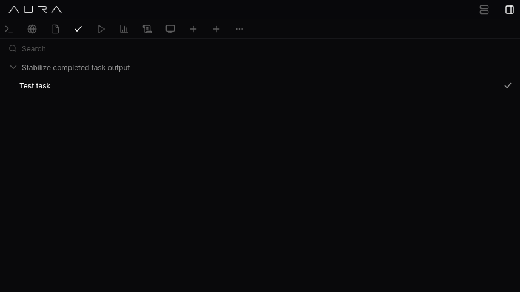

# Autonomous dev-loop recovery and a rebuilt Debug app

- Date: `2026-04-22`
- Channel: `nightly`
- Version: `0.1.0-nightly.335.1`
- Release: https://github.com/cypher-asi/aura-os/releases/tag/v0.1.0-nightly.335.1

Today's nightly is a heavy one: a multi-phase autonomous recovery pipeline landed in the dev loop — classifying truncation failures, splitting oversized task specs into skeleton-plus-fill children, and surfacing heuristic findings live — alongside a project-first rebuild of the Debug app, a linearized LLM streaming surface, and a safer logout flow. Release tooling also got more forgiving when changelog media capture partially fails.

## 2:06 AM — Autonomous recovery pipeline for truncated dev-loop runs

A full multi-phase pipeline now classifies truncation failures, decomposes oversized tasks preemptively or after the fact, and streams heuristic findings live during a run.

<!-- AURA_CHANGELOG_MEDIA:BEGIN {"slotId":"entry-autonomous-recovery-pipeline-for-truncated-dev-loop-runs","slug":"autonomous-recovery-pipeline-for-truncated-dev-loop-runs","alt":"Autonomous recovery pipeline for truncated dev-loop runs screenshot"} -->
<!-- AURA_CHANGELOG_MEDIA:PENDING -->
<!-- AURA_CHANGELOG_MEDIA:END entry-autonomous-recovery-pipeline-for-truncated-dev-loop-runs -->

- Dev-loop failures classified as truncation now trigger remediation: SplitWriteIntoSkeletonPlusAppends spawns skeleton+fill child tasks, while ReshapeSearchQuery and ForceToolCallNextTurn issue shaped retries, all gated by a MAX_RETRIES_PER_TASK budget and an AURA_AUTO_DECOMPOSE_DISABLED kill switch. (`79eab49`, `6b6d6d9`)
- Oversized task specs are now caught at ingestion: detect_preflight_decomposition flags full-implementation phrasing and large line-count hints, splits them into skeleton+fill children at creation time, and broadcasts a task_preflight_decomposed event. The skeleton+fill fan-out is shared with the post-failure path. (`4f8e0a6`)
- A new LiveAnalyzer re-runs heuristics against the in-progress bundle every 50 events, every 30s, or immediately on task_failed, broadcasting deduped Warn/Error findings as heuristic_finding domain events with remediation hints so the UI can surface them mid-flight. (`097b5a5`)
- Loop-log counters stopped double-counting mid-stream token_usage frames and now expose narration_deltas as a first-class signal, giving heuristics cleaner input for zero-tool-call and narration-bloat rules. (`f5921f6`)
- A replay-based integration test reproduces the original write_file truncation scenario end-to-end (classify_failure → Truncation → SplitWriteIntoSkeletonPlusAppends → preflight match), and a golden test pins aura-run-analyze's rendered output including the new remediation fix: lines. (`6de6a5e`)
- Chat input now reflects agent-busy state from any source via a new useAgentBusy hook, routes Stop to /loop/stop when the automation loop holds the turn, and renders a typed 409 agent_busy response as a friendly message instead of the raw harness string. (`6dd691e`)
- The Debug app was rebuilt around a project-first left tree and a tabbed sidekick (Run, Events, LLM, Iterations, Blockers, Retries, Stats, Tasks) driven by a debug-sidekick-store; a portal-backed filter menu fixes clipped dropdowns, JSONL rows no longer show 'unknown' types, and a Copy all/Copy filtered/Export toolbar lets operators grab channel JSONL or a full run bundle in one click. (`8e7e4f0`, `1b769a8`, `865e7ec`, `586f744`)
- Tool output from colored CLIs (cargo, rustc, npm) now decodes correctly in the task panel — ESC bytes are allowed through base64 detection, ANSI escapes are stripped, and decoding recurses into additional output/text/content/log fields. (`7822fa1`)
- Border tokens across the chat, sidekick, preview overlays, tables, tool rows, message bubbles, and terminal/task panels were unified on a single darker --color-border value, and the leaderboard feed no longer produces a stray horizontal scrollbar. (`150f142`, `cc9a050`, `a6f3a4c`, `b2f25e4`, `13e2cae`)
- PushCardBody in the feed now falls back to commitIds.length when metadata.commits is absent, so older posts stop showing a misleading 0-commit count. (`070248d`)

## 8:00 AM — Shared-secret harness bearer path retired

The in-progress AURA_NODE_AUTH_TOKEN plumbing between aura-os and the harness is formally abandoned in favor of the existing user-JWT flow.

- Dropped the uncommitted shared-secret bearer token path (HarnessHttpGateway.auth_token, AURA_NODE_AUTH_TOKEN env reads, desktop warnings, LocalHarness WS Authorization injection). The user JWT flow through HarnessClient, auth_guard, and downstream services is untouched. (`c205261`)

## 8:48 AM — Linear LLM streaming, decoded tool blocks, and a safer logout

A second wave of interface fixes untangles live streaming, makes tool-result blocks readable, and rescues logout from a redirect loop — plus a billing identity correctness fix.

<!-- AURA_CHANGELOG_MEDIA:BEGIN {"slotId":"entry-linear-llm-streaming-decoded-tool-blocks-and-a-safer-logout","slug":"linear-llm-streaming-decoded-tool-blocks-and-a-safer-logout","alt":"Linear LLM streaming, decoded tool blocks, and a safer logout screenshot","status":"published","assetPath":"assets/changelog/nightly/0.1.0-nightly.335.1/entry-linear-llm-streaming-decoded-tool-blocks-and-a-safer-logout.png","screenshotSource":"capture-proof","updatedAt":"2026-04-22T18:26:09.232Z","storyTitle":"Linear LLM Streaming, Decoded Tool Blocks & Safer Logout"} -->

<!-- AURA_CHANGELOG_MEDIA:END entry-linear-llm-streaming-decoded-tool-blocks-and-a-safer-logout -->

- Live LLM streaming is now strictly linear: text deltas append only to the timeline tail instead of folding back into earlier items, a new markdown-safety pass hides dangling * / _ markers under the cursor, and a writing-aware phase label hides the 'Cooking' indicator only while words are actively revealing. (`aabd229`)
- Command, read_file, list_files, find_files, and search_code blocks now decode their base64 stdout envelopes through a shared helper — file contents render syntax-highlighted, command stdout/stderr reads as legible text, and search_code results split into file:line plus match preview columns instead of showing '0 items'. (`45e55ba`, `59d2aa6`)
- Logout no longer strands users on a black screen: App.tsx's boot-time login flag is now only a first-render hint, logout skips the full page reload that resurrected baked-in desktop auth literals, and a new aura-force-logged-out sentinel survives reloads and 401s to guarantee the app comes up on the login view. (`2ab59d4`)
- Org billing email is now read-only and tied to the ZERO account identity — the server discards billing_email from SetBillingRequest, and the Team Settings UI shows a 'Tied to your ZERO account' caption instead of an editable input that could boot users to a Free plan on mismatch. (`68ea3aa`)
- GenericToolBlock (task_done and unregistered tools) restored its 10px inset and visible border by rendering JSON containers as divs so Block.module.css's pre-reset stops stripping the padded JSON viewer. (`f62eb9d`)
- Hardened the changelog media proof-capture scripts with balanced-JSON extraction, fenced-block parsing, and loose field recovery so demo screenshot automation survives messier agent output. (`eb42a29`)

## 9:51 AM — External harness flag surfaced in desktop runtime config

The desktop runtime config now exposes AURA_DESKTOP_EXTERNAL_HARNESS so the UI can tell whether an external harness is in use without reading process env directly.

<!-- AURA_CHANGELOG_MEDIA:BEGIN {"slotId":"entry-external-harness-flag-surfaced-in-desktop-runtime-config","slug":"external-harness-flag-surfaced-in-desktop-runtime-config","alt":"External harness flag surfaced in desktop runtime config screenshot"} -->
<!-- AURA_CHANGELOG_MEDIA:PENDING -->
<!-- AURA_CHANGELOG_MEDIA:END entry-external-harness-flag-surfaced-in-desktop-runtime-config -->

- Desktop runtime config exposes AURA_DESKTOP_EXTERNAL_HARNESS alongside the other harness toggles, letting the UI reflect external-harness mode without reaching into the process environment. (`9993d15`)

## 9:51 AM — Post-landing cleanup to unblock the build

Small follow-ups after the big dev-loop and streaming landings: dead fields trimmed, formatting applied, and unused TS declarations removed so tsc and vite build cleanly.

<!-- AURA_CHANGELOG_MEDIA:BEGIN {"slotId":"entry-post-landing-cleanup-to-unblock-the-build","slug":"post-landing-cleanup-to-unblock-the-build","alt":"Post-landing cleanup to unblock the build screenshot","status":"published","assetPath":"assets/changelog/nightly/0.1.0-nightly.335.1/entry-post-landing-cleanup-to-unblock-the-build.png","screenshotSource":"capture-proof","updatedAt":"2026-04-22T18:32:53.127Z","storyTitle":"Post-landing cleanup: dead fields trimmed, unused TS declarations removed, build un…"} -->

<!-- AURA_CHANGELOG_MEDIA:END entry-post-landing-cleanup-to-unblock-the-build -->

- LiveAnalyzer shed its unused run_id field (callers pass run_id directly into the emitted payload), and cargo fmt was applied across the server handlers, aura-run-analyze, and aura-run-heuristics rules. (`2a78b8e`, `d8d4ab9`)
- Dropped an unused useIsWriting binding, MARKER_RUN_RE constant, and clearStoredAuth import so tsc -b && vite build passes cleanly after the streaming and auth refactors. (`b0e2713`)

## 10:58 AM — Changelog media workflow keeps successful shots when others fail

The release changelog media pipeline now commits successful slot captures before retrying failures, and a dedicated retry workflow picks up the leftovers.

- publish-release-changelog-media and reconcile-release-changelog now tolerate capture failures, read a summary file to separate published from failed slots, commit what succeeded, and dispatch a new retry-release-changelog-media workflow for the remainder before enforcing the strict rubric. (`2f96782`)

## Highlights

- Autonomous truncation recovery ships end-to-end
- Debug app rebuilt around projects and a sidekick inspector
- Chat streaming is now strictly linear with markdown-safe rendering
- Logout no longer dead-ends on a black-screen redirect loop
- Release workflow publishes successful media even when some slots fail

