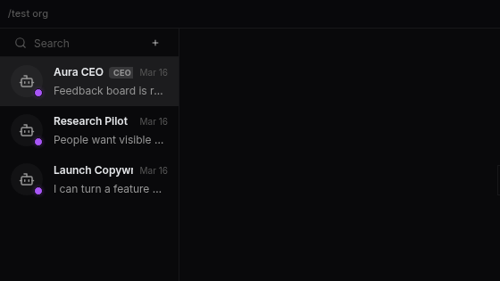
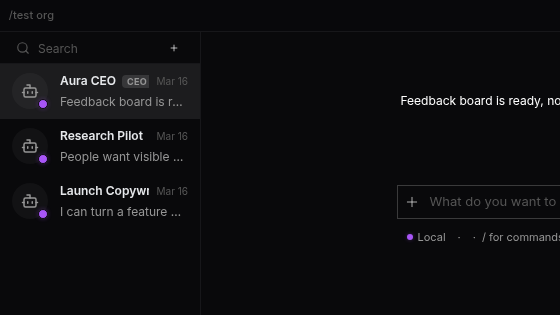

# Autonomous recovery loop, streaming fixes, and a new login surface

- Date: `2026-04-22`
- Channel: `nightly`
- Version: `0.1.0-nightly.338.1`
- Release: https://github.com/cypher-asi/aura-os/releases/tag/v0.1.0-nightly.338.1

A heavy day across the stack: Aura gains an end-to-end autonomous recovery pipeline that detects oversized tasks, splits them preemptively, and learns from live runs. The chat surface fixes several long-standing streaming glitches, the Debug app gets a project-first redesign with exports, logout finally stops black-screening, and Windows auto-updates actually install. The Login view also picked up a full-screen video treatment.

## 2:06 AM — Debug app redesign and agent-busy chat signal

The Debug workspace shifts to a project-first, sidekick-driven layout while chat gains a real busy state, and tool output stops rendering as raw base64.

<!-- AURA_CHANGELOG_MEDIA:BEGIN {"slotId":"entry-debug-app-redesign-and-agent-busy-chat-signal","slug":"debug-app-redesign-and-agent-busy-chat-signal","alt":"Debug app redesign and agent-busy chat signal screenshot"} -->
<!-- AURA_CHANGELOG_MEDIA:PENDING -->
<!-- AURA_CHANGELOG_MEDIA:END entry-debug-app-redesign-and-agent-busy-chat-signal -->

- Debug app now lists every project at the top level via the shared LeftMenuTree, moves the run toolbar, counters, and entry inspector into a tabbed sidekick (Run, Events, LLM, Iterations, Blockers, Retries, Stats, Tasks), and adds a portal-backed type-filter dropdown that no longer clips against the main lane. JSONL rows also unwrap the `{_ts, event}` envelope so type and timestamp stop showing as "unknown". (`8e7e4f0`, `1b769a8`)
- Run detail view gained Copy all / Copy filtered and Export buttons in the header, with the copy payload following the visible timeline and export reusing the existing run-bundle zip. The header itself was tightened to a single stable line so metadata arrival no longer reflows the title, and inspector actions were re-aligned with their field labels. (`865e7ec`, `586f744`)
- Chat input now reflects agent-busy state from any source: a new `useAgentBusy` hook combines SSE streaming with loop activity so the stop icon appears whenever an automation turn is in flight, `onStop` routes to `/loop/stop` when the loop owns the turn, and the server returns a typed `409 agent_busy` rendered as a friendly message instead of the raw harness string. (`6dd691e`)
- ANSI-colored tool output from cargo, rustc, npm and friends now decodes cleanly in the task panel — the base64 decoder no longer bails on ESC bytes, strips ANSI escapes, and recurses into `output`/`text`/`content`/`log` fields. Per-turn token counters also stopped double-counting mid-stream `token_usage` frames, and `narration_deltas` is now a first-class run counter. (`7822fa1`, `f5921f6`)
- Leaderboard content renders directly inside the feed's scroll area, removing a nested wrapper that surfaced a stray horizontal scrollbar and threw off centering. (`13e2cae`)

## 5:49 PM — Remediation hints attached to run heuristics

Each heuristic finding now carries an actionable RemediationHint, setting up the autonomous recovery work that follows.

- Extends `Finding` with an optional `RemediationHint` enum (split-write, reshape-search, force-tool-call, retry-smaller-scope, no-auto-fix) and wires every existing rule to emit the hint that matches its failure mode; `aura-run-analyze` renders the hint as a compact one-liner under each finding so dev loops inherit next-step guidance. (`6b6d6d9`)

## 6:13 PM — Auto-decompose tasks after truncation failures

Phase 3 turns the new remediation hints into real action: failed tasks are automatically split or reshaped instead of blindly retried.

- When a task fails with a truncation / no-file-ops reason, the server now loads the run bundle, runs heuristics, and acts on the first RemediationHint: SplitWriteIntoSkeletonPlusAppends spawns skeleton + fill child tasks, while ReshapeSearchQuery and ForceToolCallNextTurn spawn a single shaped-retry task. Parents transition to failed, a `task_auto_remediated` domain event is broadcast for the UI, and the feature honors `MAX_RETRIES_PER_TASK` and an `AURA_AUTO_DECOMPOSE_DISABLED=1` kill switch. (`79eab49`)

## 6:05 PM — Darker outline on run timeline and task output blocks

Run and task output containers move to the standard border token so they match the rest of the block primitive.

<!-- AURA_CHANGELOG_MEDIA:BEGIN {"slotId":"entry-darker-outline-on-run-timeline-and-task-output-blocks","slug":"darker-outline-on-run-timeline-and-task-output-blocks","alt":"Darker outline on run timeline and task output blocks screenshot"} -->
<!-- AURA_CHANGELOG_MEDIA:PENDING -->
<!-- AURA_CHANGELOG_MEDIA:END entry-darker-outline-on-run-timeline-and-task-output-blocks -->

- Run event timeline rows and the task live/build output blocks swap the lighter `--color-border-light` stroke for `--color-border`, aligning with the `.block` primitive outline. (`b2f25e4`)

## 6:40 PM — Chat border token propagated to sidekick and preview overlays

The main chat's darker border override now extends into the sidekick body and preview overlay for a unified outline.

<!-- AURA_CHANGELOG_MEDIA:BEGIN {"slotId":"entry-chat-border-token-propagated-to-sidekick-and-preview-overlays","slug":"chat-border-token-propagated-to-sidekick-and-preview-overlays","alt":"Chat border token propagated to sidekick and preview overlays screenshot","status":"published","assetPath":"assets/changelog/nightly/0.1.0-nightly.338.1/entry-chat-border-token-propagated-to-sidekick-and-preview-overlays.png","screenshotSource":"capture-proof","updatedAt":"2026-04-22T20:39:38.453Z","storyTitle":"Chat border token propagated to Sidekick and PreviewOverlay"} -->

<!-- AURA_CHANGELOG_MEDIA:END entry-chat-border-token-propagated-to-sidekick-and-preview-overlays -->

- Propagates the `#17171a` `--color-border` override from ChatPanel into the Sidekick and PreviewOverlay stylesheets so tables, blocks, tool rows, and output sections inside the sidekick share the subtle outline used by the main LLM chat. (`cc9a050`)

## 6:45 PM — Preflight decomposition, live heuristics, and a reshaped login flow

A major thread finishes the autonomous recovery pipeline end to end, alongside rebuilt chat streaming, a new login experience, a Windows auto-updater fix, and logout reliability.

<!-- AURA_CHANGELOG_MEDIA:BEGIN {"slotId":"entry-preflight-decomposition-live-heuristics-and-a-reshaped-login-flo","slug":"preflight-decomposition-live-heuristics-and-a-reshaped-login-flo","alt":"Preflight decomposition, live heuristics, and a reshaped login flow screenshot","status":"published","assetPath":"assets/changelog/nightly/0.1.0-nightly.338.1/entry-preflight-decomposition-live-heuristics-and-a-reshaped-login-flo.png","screenshotSource":"capture-proof","updatedAt":"2026-04-22T20:41:51.583Z","storyTitle":"Preflight Decomposition, Live Heuristics & Rebuilt Chat Streaming"} -->

<!-- AURA_CHANGELOG_MEDIA:END entry-preflight-decomposition-live-heuristics-and-a-reshaped-login-flo -->

- Tasks whose titles or descriptions signal a likely-oversized generation are now detected at ingestion by `detect_preflight_decomposition()` and split into skeleton + fill children before they ever run, with the parent moved to a non-runnable status and a `task_preflight_decomposed` event broadcast. A new `LiveAnalyzer` re-runs heuristics every 50 events / 30s / on task_failed during an active run and broadcasts deduped Warn/Error findings as `dev_loop_advisory` events so the UI can surface hints mid-flight. A replay integration test and an `aura-run-analyze` golden test pin the full decision chain end to end. (`4f8e0a6`, `097b5a5`, `6de6a5e`, `2a78b8e`)
- Live LLM streaming was rebuilt around strict tail-append ordering so text chunks no longer fold back across intervening tool/thinking blocks, a hardened `getStreamSafeContent` keeps dangling `*` / `_` markers from flashing under the cursor, and a new `isWriting` signal hides the cooking indicator only while words are actively revealing — it stays up for thinking, pending tools, and inter-chunk stalls. (`aabd229`, `b0e2713`)
- Command and read_file tool blocks now render captured stdout/stderr as legible text via a shared `decodeCapturedOutput` helper, with read_file piping decoded contents into CodeView for syntax highlighting instead of a raw JSON envelope. ListBlock also learned to extract rows from base64 stdout envelopes used by list_files, find_files, and search_code (including `path:line: match` line splitting) so these tools stop rendering as "0 items / No results". (`45e55ba`, `59d2aa6`, `f62eb9d`)
- Logout no longer strands users on a black-screen redirect loop: the boot-time `initiallyLoggedIn` flag is now gated on the auth store having resolved, `logout()` drops its `window.location.href` reload and always runs local cleanup even when the server call fails, and a sticky `aura-force-logged-out` sentinel survives reloads that would otherwise resurrect a ghost session from baked-in desktop init globals. (`2ab59d4`)
- Desktop on Windows now installs updates reliably: Aura downloads the verified NSIS installer itself, stages it under `runtime/updater/`, runs `trigger_shutdown` to release file locks, and spawns setup with `DETACHED_PROCESS | CREATE_BREAKAWAY_FROM_JOB | CREATE_NEW_PROCESS_GROUP` so the installer survives app exit. UpdateControl also split into inline and full-width panel layouts so the settings row stops squishing in available/installing states, and the local auto-update smoke test gained a Windows leg. (`61300eb`, `9993d15`)
- Login view was rebuilt around a full-screen AURA visual-loop video with a centered, translucent glass sign-in card titled "Login with ZERO Pro", iterated down to a tighter 308px card width. Billing email was also locked to the ZERO account identity — the field is now read-only, the server silently discards `billing_email` from `SetBillingRequest`, and the Team Settings UI drops the stale Save flow that was kicking users into Free plan. (`dacd52e`, `3fdb15e`, `df72d28`, `3969c21`, `04b5496`, `a68d479`, `68ea3aa`)
- Release Infrastructure: the changelog media workflow now publishes successful screenshots before retrying failures, dispatching a separate retry workflow for the still-failed slots while enforcing a strict rubric. Candidate inference was tightened and the debug and agent-brief capture scripts were hardened with balanced-block JSON extraction and seeded Debug API routes for repeatable proofs. (`2f96782`, `14a67af`, `eb42a29`, `027e0e2`)
- Global `--color-border` token was promoted to `:root` so tables, blocks, tool rows, message bubbles, preview overlays, task/terminal panels, and sidekick surfaces all share the main chat's subtle outline, dropping the per-container overrides added earlier. The feed's push card also falls back to `commitIds.length` when `metadata.commits` is missing instead of showing a 0 count, and GenericToolBlock's Input/Result containers switched to `
`s so the intended 10px inset border renders again. (`150f142`, `070248d`, `f62eb9d`)

## Highlights

- Autonomous dev-loop recovery: preflight + post-failure task decomposition
- Chat streaming: linear ordering, safe markdown, writing-aware indicator
- Debug app redesigned with sidekick, export, and ANSI-decoded output
- Windows auto-updater now hands off to NSIS reliably
- Logout no longer traps users on a black-screen redirect loop

