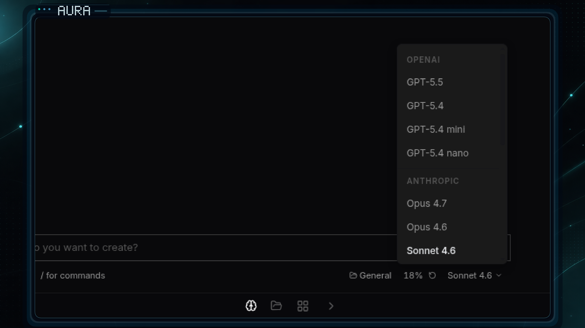

# AURA 3D debuts alongside a hardened nightly release pipeline

- Date: `2026-04-23`
- Channel: `nightly`
- Version: `0.1.0-nightly.364.1`
- Release: https://github.com/cypher-asi/aura-os/releases/tag/v0.1.0-nightly.364.1

Today's nightly introduces AURA 3D, a new image-to-3D studio built on three.js, backed by artifact persistence and project-scoped navigation. Alongside it, the team shipped broad reliability work on the changelog media pipeline, the nightly release workflow, and the Windows desktop updater.

## 9:17 AM — GPT-5.5 support and a smarter changelog media proofer

GPT-5.5 lands in the chat model picker while the release pipeline gains a stricter AI-driven screenshot proofer and a recoverable nightly prune/gh-pages flow.

<!-- AURA_CHANGELOG_MEDIA:BEGIN {"slotId":"entry-1-nightly-release-prune-gh-pages-recovery-and-gpt-5-5-in-the-picke","batchId":"entry-1","slug":"nightly-release-prune-gh-pages-recovery-and-gpt-5-5-in-the-picke","alt":"Nightly release prune, gh-pages recovery, and GPT-5.5 in the picker screenshot","status":"published","assetPath":"assets/changelog/nightly/0.1.0-nightly.362.1/entry-1-nightly-release-prune-gh-pages-recovery-and-gpt-5-5-in-the-picke.png"} -->

<!-- AURA_CHANGELOG_MEDIA:END entry-1-nightly-release-prune-gh-pages-recovery-and-gpt-5-5-in-the-picke -->

- Added GPT-5.5 to the chat model picker and benchmark pricing tables, with the new model wired through the dev loop handler. (`d9d82e9`)
- Reported ZERO Pro status alongside usage in network responses so clients can reflect entitlement state. (`b2847a4`)
- Hardened the nightly release workflow: asset pruning now retries via a dedicated script that tolerates missing nightly assets, and a new gh-pages republish recovery workflow plus history-media sync job keep the changelog site self-healing. (`a7eb25a`, `ac61ac3`, `ca9eaa8`, `d81834c`)
- Upgraded the AI changelog media proofer to prompt version 4 with stricter classification, new raw-contextual vs branded-card presentation modes, and tighter heuristics that reject backend-only, maintenance-only, and desktop-updater entries from screenshot capture. (`8ef3f5b`, `60f4bab`, `2217600`, `43ac905`, `a0f9f63`, `4c104ae`)

## 5:11 PM — AURA 3D studio: image-to-model flow with WebGL viewer

A new AURA 3D app joins the registry, combining streamed image generation, a Three.js-based 3D viewer, and project-aware navigation.

<!-- AURA_CHANGELOG_MEDIA:BEGIN {"slotId":"entry-2-aura-3d-studio-image-to-model-flow-with-webgl-viewer","batchId":"entry-2","slug":"aura-3d-studio-image-to-model-flow-with-webgl-viewer","alt":"AURA 3D studio: image-to-model flow with WebGL viewer screenshot"} -->
<!-- AURA_CHANGELOG_MEDIA:PENDING -->
<!-- AURA_CHANGELOG_MEDIA:END entry-2-aura-3d-studio-image-to-model-flow-with-webgl-viewer -->

- Scaffolded a new AURA 3D app at /3d in the app registry with a Box icon, Zustand store, and three.js added as a dependency for the upcoming WebGL viewer. (`1b20985`)
- Replaced the early tab stubs with a unified image-generation flow: an SSE-driven image stream with style-locked prompts, a sidekick panel with Images and Models tabs, and a ChatInputBar-style model selector. (`90887d5`)
- Added a full WebGL viewer built on a 4-light Three.js scene with GLTF auto-center/scale loading, lifecycle cleanup, and grid, wireframe, and texture toggles, plus a Tripo-backed 3D generation SSE stream that auto-populates from the generated image. (`8b2b861`)
- Introduced a project selector dropdown in the left nav (initially gated behind a VITE_ENABLE_AURA_3D flag) along with store unit tests covering generation completion, asset selection, and error paths. (`9cb954d`)

## 5:11 PM — Generation SSE proxy tolerates data-only frames

The aura-os-server generation proxy no longer drops events when upstream omits the event: line.

- Fixed the generation handler to extract the event type from the JSON data field when aura-router emits data-only SSE frames, unblocking end-to-end image and 3D generation streams. (`e0d60fd`)

## 5:11 PM — AURA 3D polish: persistence, project tree nav, and GA rollout

Follow-up work on AURA 3D adds artifact persistence end to end, aligns the left nav with the Projects app, and removes the feature flag to ship the app to everyone.

<!-- AURA_CHANGELOG_MEDIA:BEGIN {"slotId":"entry-4-aura-3d-polish-persistence-project-tree-nav-and-ga-rollout","batchId":"entry-4","slug":"aura-3d-polish-persistence-project-tree-nav-and-ga-rollout","alt":"AURA 3D polish: persistence, project tree nav, and GA rollout screenshot"} -->
<!-- AURA_CHANGELOG_MEDIA:PENDING -->
<!-- AURA_CHANGELOG_MEDIA:END entry-4-aura-3d-polish-persistence-project-tree-nav-and-ga-rollout -->

- Reworked the main panel with an IMAGE header, click-to-expand lightbox preview, a 50/50 image-vs-model split, and eventually an Image/3D Model tab layout driven by feedback. (`ddb0b7e`, `5f41de6`)
- Replaced the custom project dropdown with LeftMenuTree so AURA 3D's left nav now matches the Projects app, showing images and models as prefixed children under the active project. (`9250ebf`, `6229c31`)
- Added end-to-end artifact persistence: new StorageProjectArtifact types and client methods in aura-os-storage, JWT-authenticated proxy routes at /api/projects/:id/artifacts, a frontend artifacts API, and store wiring that loads artifacts on project select and links models to source images via parentId. (`d3ad5ec`, `f3dc0ae`, `e204d4c`, `5df2a3b`)
- Removed the VITE_ENABLE_AURA_3D feature flag so AURA 3D is always visible in the app registry, and required an active project before the prompt input and Generate 3D button become usable. (`6bbc5df`, `e204d4c`)

## 7:00 PM — Windows auto-update handoff and changelog capture hardening

A focused fix restores the Windows updater handoff while the changelog media capture pipeline gets a major reliability overhaul.

- Fixed the Windows updater handoff in the desktop app, with supporting updates to the desktop-validate workflow and the local auto-update smoke script. (`bb28191`)
- Substantially hardened the changelog media capture pipeline, adding screenshot quality checks, a seed planner, navigation lessons, and a richer demo-agent brief that rejects maintenance-only, backend-only, and non-renderable entries from screenshot capture. (`0b64b22`)
- Taught the publisher to clear stale media paths after a capture failure so a broken run no longer leaves stale screenshots referenced by downstream steps. (`9941234`)

## 10:32 PM — Stricter quality gates on changelog screenshots

A final pass tightens the quality gates that decide whether a generated screenshot is good enough to publish.

- Raised the bar on changelog media quality gates across the daily changelog generator, publisher, and agent demo screenshot producer so borderline captures are rejected before they reach the site. (`7291956`)

## Highlights

- AURA 3D studio ships with image + WebGL model generation
- GPT-5.5 available in the chat model picker
- Nightly release prune and gh-pages sync now self-heal
- Windows updater handoff fixed for desktop auto-update

