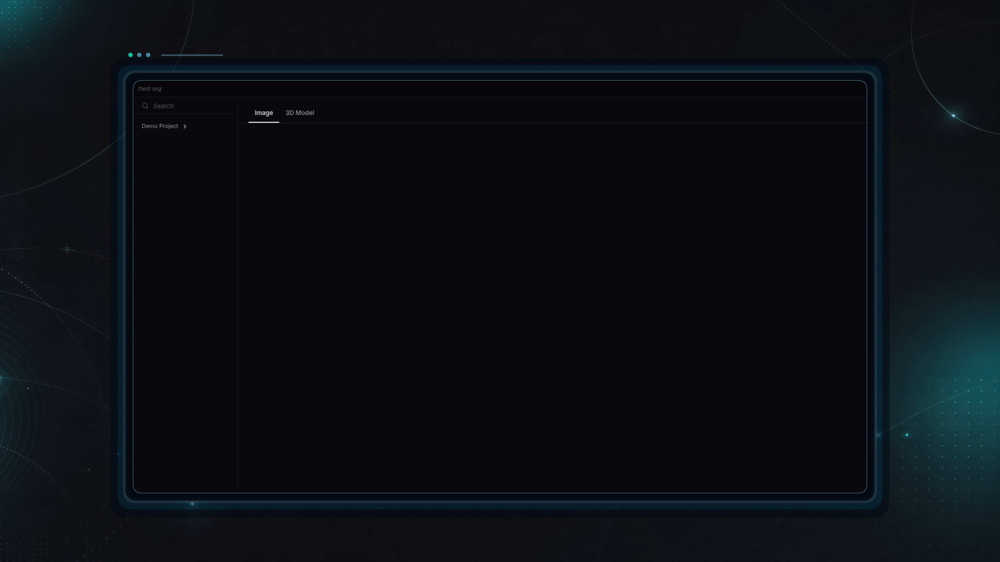
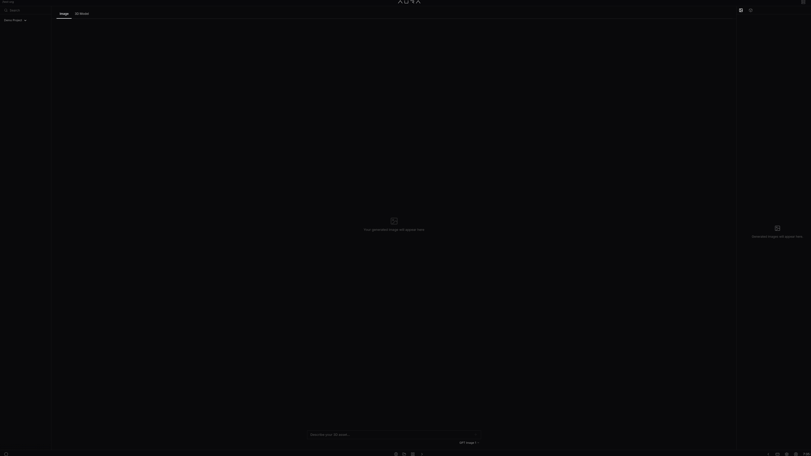

# AURA 3D studio lands alongside release pipeline hardening

- Date: `2026-04-23`
- Channel: `nightly`
- Version: `0.1.0-nightly.362.1`
- Release: https://github.com/cypher-asi/aura-os/releases/tag/v0.1.0-nightly.362.1

Today's nightly introduces AURA 3D, a brand-new in-app studio that takes a prompt from image generation all the way to a live WebGL 3D model viewer, with project-scoped persistence backing every asset. Around it, the release team tightened the nightly publishing pipeline, sharpened AI-driven changelog screenshot proofing, and fixed a Windows updater handoff regression.

## 9:17 AM — Nightly release prune, gh-pages recovery, and GPT-5.5 in the picker

The morning block hardened the nightly release pipeline end-to-end and shipped GPT-5.5 as a selectable chat model, while overhauling how AI-driven changelog screenshots are chosen and framed.

<!-- AURA_CHANGELOG_MEDIA:BEGIN {"slotId":"entry-1-nightly-release-prune-gh-pages-recovery-and-gpt-5-5-in-the-picke","batchId":"entry-1","slug":"nightly-release-prune-gh-pages-recovery-and-gpt-5-5-in-the-picke","alt":"Nightly release prune, gh-pages recovery, and GPT-5.5 in the picker screenshot"} -->
<!-- AURA_CHANGELOG_MEDIA:PENDING -->
<!-- AURA_CHANGELOG_MEDIA:END entry-1-nightly-release-prune-gh-pages-recovery-and-gpt-5-5-in-the-picke -->

- Nightly releases now prune stale assets through a retry-aware shell script that tolerates missing releases, and a new Sync Release Changelog Media History workflow keeps gh-pages history in step with the latest entries. (`a7eb25a`, `ac61ac3`, `ca9eaa8`)
- GPT-5.5 is now a first-class option in the chat model picker, with matching benchmark pricing wired through the interface and server dev loop. (`d9d82e9`)
- The daily changelog media pipeline learned to tell raw contextual screenshots (pickers, menus, settings rows) apart from branded product cards, rejects maintenance-only or desktop-updater changes as screenshot targets, and preserves crisper framing for proof captures. (`d81834c`, `2217600`, `43ac905`, `8ef3f5b`, `a0f9f63`, `4c104ae`, `60f4bab`)
- Usage reports from the server now include ZERO Pro status so downstream clients can reflect entitlement alongside usage counts. (`b2847a4`)

## 5:11 PM — AURA 3D: new studio app with WebGL viewer

A new AURA 3D app lands in the registry, going from a three-tab scaffold to a working prompt → image → 3D model flow backed by Three.js and a Tripo generation stream.

<!-- AURA_CHANGELOG_MEDIA:BEGIN {"slotId":"entry-2-aura-3d-app-debuts-with-image-to-3d-generation-and-webgl-viewer","batchId":"entry-2","slug":"aura-3d-app-debuts-with-image-to-3d-generation-and-webgl-viewer","alt":"AURA 3D app debuts with image-to-3D generation and WebGL viewer screenshot","status":"published","assetPath":"assets/changelog/nightly/0.1.0-nightly.361.1/entry-2-aura-3d-app-debuts-with-image-to-3d-generation-and-webgl-viewer.png"} -->

<!-- AURA_CHANGELOG_MEDIA:END entry-2-aura-3d-app-debuts-with-image-to-3d-generation-and-webgl-viewer -->

- AURA 3D is registered as a new app at /3d with its own left nav, main panel, and sidekick, initially scaffolded as an Imagine/Generate/Tokenize studio and then collapsed into a single-page image-above-model flow with an Images/Models sidekick. (`1b20985`, `90887d5`)
- Image generation streams over SSE with a style-locked prompt and feeds the resulting image directly into a Three.js WebGL viewer, which loads GLTF models with auto-center/scale and a 4-light rig, plus toggles for grid, wireframe, and texture. (`90887d5`, `8b2b861`)
- A project selector dropdown modeled on the ChatInputBar pattern lands in the left nav, initially gated behind a VITE_ENABLE_AURA_3D flag with unit tests covering the Zustand store's state transitions. (`9cb954d`)

## 5:11 PM — SSE generation proxy handles data-only frames

The generation proxy now survives upstream events that omit an explicit event line.

- aura-os-server's generation handler now extracts the event type from the JSON data field when the aura-router emits data-only SSE frames, instead of silently dropping them and stalling image or 3D generation. (`e0d60fd`)

## 5:11 PM — AURA 3D tabs, lightbox, and Projects-style left nav

Follow-up polish restructures AURA 3D around Image/3D Model tabs and brings its left nav in line with the Projects app.

<!-- AURA_CHANGELOG_MEDIA:BEGIN {"slotId":"entry-4-aura-3d-layout-moves-to-tabs-with-a-project-tree-left-nav","batchId":"entry-4","slug":"aura-3d-layout-moves-to-tabs-with-a-project-tree-left-nav","alt":"AURA 3D layout moves to tabs with a project-tree left nav screenshot","status":"published","assetPath":"assets/changelog/nightly/0.1.0-nightly.361.1/entry-4-aura-3d-layout-moves-to-tabs-with-a-project-tree-left-nav.png"} -->

<!-- AURA_CHANGELOG_MEDIA:END entry-4-aura-3d-layout-moves-to-tabs-with-a-project-tree-left-nav -->

- The horizontal image/model split is replaced with Image and 3D Model tabs, and generated images gain a click-to-expand lightbox with backdrop-close and an explicit X control. (`ddb0b7e`, `5f41de6`)
- The custom project dropdown is swapped for the shared LeftMenuTree from the Projects app, so projects expand inline and generated images appear as children under the active project. (`5f41de6`, `9250ebf`)

## 5:11 PM — AURA 3D artifacts persist per project

AURA 3D gains a real backend: images and 3D models are stored as project artifacts and reload automatically when switching projects.

<!-- AURA_CHANGELOG_MEDIA:BEGIN {"slotId":"entry-5-3d-artifacts-persist-per-project-and-the-studio-comes-out-of-fla","batchId":"entry-5","slug":"3d-artifacts-persist-per-project-and-the-studio-comes-out-of-fla","alt":"3D artifacts persist per project and the studio comes out of flag gating screenshot","status":"published","assetPath":"assets/changelog/nightly/0.1.0-nightly.361.1/entry-5-3d-artifacts-persist-per-project-and-the-studio-comes-out-of-fla.png"} -->

<!-- AURA_CHANGELOG_MEDIA:END entry-5-3d-artifacts-persist-per-project-and-the-studio-comes-out-of-fla -->

- A new project artifacts API in aura-os-storage and aura-os-server exposes list/create/get/delete under /api/projects/:id/artifacts and /api/artifacts/:id, with JWT-forwarded proxy handlers and a routing fix that moves the routes under project_routes to avoid a 404-on-GET trie conflict. (`d3ad5ec`, `5df2a3b`)
- Selecting a project now loads its artifacts from aura-storage into the AURA 3D store, stripping the style-lock suffix for display and linking each 3D model to its source image via sourceImageId/parentId passed through the generation stream. (`f3dc0ae`, `e204d4c`)
- Left nav, sidekick, and viewer are polished together: images and models appear as icon-prefixed children per project, the sidekick uses a thumbnail grid with section headings, viewer controls become icon toggles, and Generate 3D is hidden once a model is loaded with cycling progress messages during generation. (`6229c31`)
- The VITE_ENABLE_AURA_3D feature flag is removed — AURA 3D is now always visible in the app registry. (`6bbc5df`)

## 7:00 PM — Windows updater handoff fix and changelog capture rebuild

Late-evening work fixes a Windows auto-update handoff regression and substantially rebuilds the changelog screenshot capture pipeline.

- The Windows desktop updater handoff is fixed in the Tauri main/updater paths, with the desktop-validate workflow and local auto-update smoke script updated to verify the corrected behavior. (`bb28191`)
- Changelog media capture gets a major overhaul: a new demo-screenshot-quality module, a navigation lessons corpus, and a smarter seed planner are added, while the media heuristic now penalizes subtle maintenance fixes, interface-support-only code, and desktop-only updater changes so only genuinely screenshot-able product surfaces are captured. (`0b64b22`)

## Highlights

- New AURA 3D app: prompt → image → WebGL 3D model
- Artifacts now persist per project via aura-storage
- GPT-5.5 available in the chat model picker
- Nightly release prune + gh-pages recovery hardened
- Windows updater handoff fix

