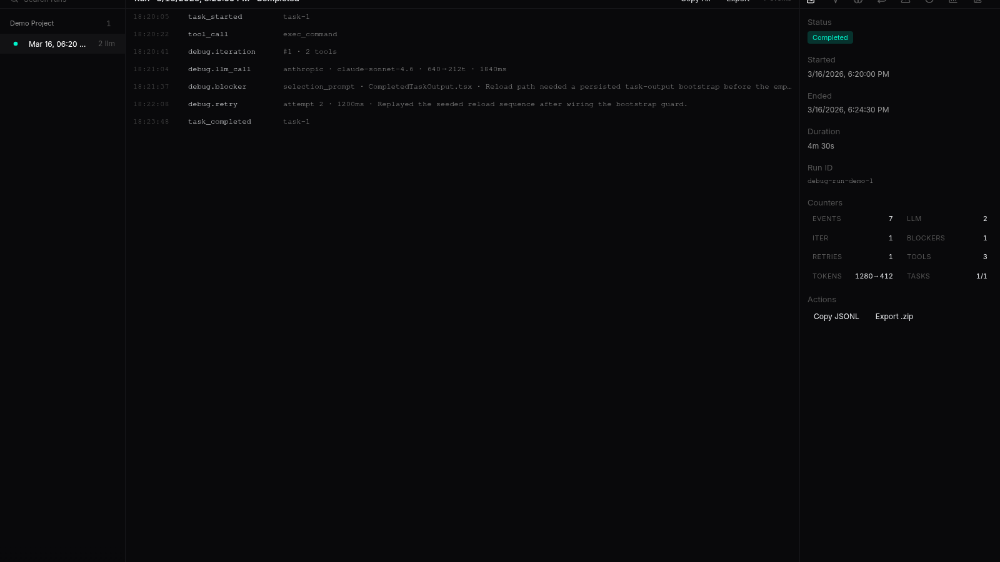
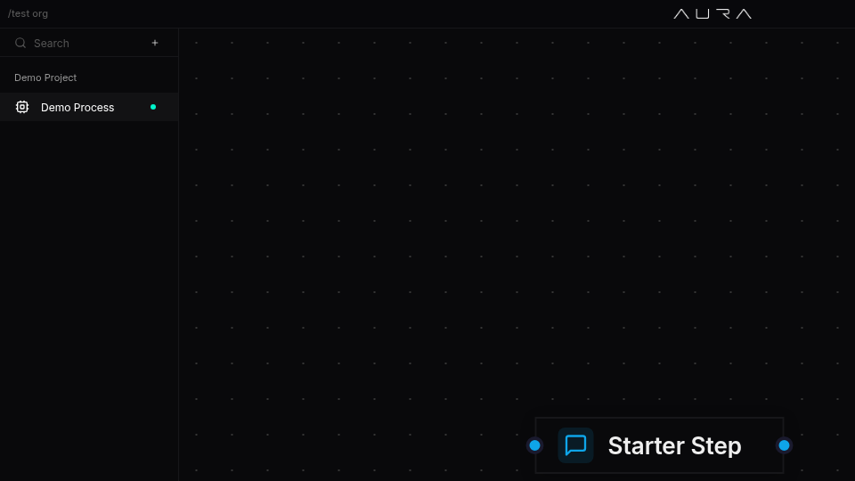

# Autonomous recovery, streaming polish, and a reworked Debug app

- Date: `2026-04-22`
- Channel: `nightly`
- Version: `0.1.0-nightly.345.1`
- Release: https://github.com/cypher-asi/aura-os/releases/tag/v0.1.0-nightly.345.1

A heavy day for Aura's autonomy story: the dev loop learned to decompose oversized tasks, survive provider rate limits, and gate completion on real build/test evidence. Alongside that, the Debug app was rebuilt around a project-first nav and sidekick inspector, the chat stream stopped jittering under the cursor, and Windows auto-updates now hand off cleanly to NSIS.

## 2:06 AM — Debug app gets a sidekick-driven inspector and chat learns the agent-busy state

A large interface sweep reshaped the Debug app around a project-first nav with a tabbed sidekick, while chat, feed, and tool output each got targeted fixes.

<!-- AURA_CHANGELOG_MEDIA:BEGIN {"slotId":"entry-debug-app-gets-a-sidekick-driven-inspector-and-chat-learns-the-a","slug":"debug-app-gets-a-sidekick-driven-inspector-and-chat-learns-the-a","alt":"Debug app gets a sidekick-driven inspector and chat learns the agent-busy state screenshot","status":"published","assetPath":"assets/changelog/nightly/0.1.0-nightly.345.1/entry-debug-app-gets-a-sidekick-driven-inspector-and-chat-learns-the-a.png","screenshotSource":"capture-proof","updatedAt":"2026-04-23T02:59:09.949Z","storyTitle":"Debug app: sidekick-driven inspector with tabbed Run detail view"} -->

<!-- AURA_CHANGELOG_MEDIA:END entry-debug-app-gets-a-sidekick-driven-inspector-and-chat-learns-the-a -->

- Rebuilt the Debug app around the shared project tree: runs, counters, and the entry inspector moved into a new sidekick with Run/Events/LLM/Iterations/Blockers/Retries/Stats/Tasks tabs, the type filter became a portal-backed dropdown, and the run-detail header was stabilized, tightened to a single line, and gained Copy all / Copy filtered / Export actions. (`8e7e4f0`, `1b769a8`, `865e7ec`, `586f744`)
- Chat input now reflects a unified agent-busy state: a new useAgentBusy hook flips to the stop icon whenever either SSE streaming or the automation loop is holding the turn, /loop/stop is wired up as the cancel path, and the server returns a typed 409 agent_busy instead of the raw harness string. (`6dd691e`)
- Tool output now renders legibly again: ANSI-colored CLI output from cargo/rustc/npm is decoded instead of showing as base64, and the leaderboard feed panel stopped surfacing a stray horizontal scrollbar. (`7822fa1`, `13e2cae`)
- Fixed a double-counting bug in loop_log token counters and added a narration_deltas signal so downstream heuristics can flag narration bloat without re-scanning events.jsonl. (`f5921f6`)

## 5:49 PM — Heuristic findings now carry actionable remediation hints

Every finding from the run-heuristics engine now ships with a concrete next-step hint that downstream tools can act on.

- Extended Finding with a RemediationHint enum (split-write, reshape-search, force-tool-call, retry-smaller-scope, no-auto-fix) and populated each existing rule with the hint that matches its failure mode; aura-run-analyze renders the hint inline under each finding. (`6b6d6d9`)

## 6:05 PM — Run timeline and task output borders match the chat surface

A small visual follow-up aligning run event rows and task output blocks with the standard block outline.

<!-- AURA_CHANGELOG_MEDIA:BEGIN {"slotId":"entry-run-timeline-and-task-output-borders-match-the-chat-surface","slug":"run-timeline-and-task-output-borders-match-the-chat-surface","alt":"Run timeline and task output borders match the chat surface screenshot","status":"published","assetPath":"assets/changelog/nightly/0.1.0-nightly.345.1/entry-run-timeline-and-task-output-borders-match-the-chat-surface.png","screenshotSource":"capture-proof","updatedAt":"2026-04-23T03:01:07.622Z","storyTitle":"Run Timeline & Task Output Borders — Process Sidekick Event Timeline"} -->

<!-- AURA_CHANGELOG_MEDIA:END entry-run-timeline-and-task-output-borders-match-the-chat-surface -->

- Swapped the lighter border token back to the standard --color-border on run event timeline rows and task live/build output blocks so they match the .block primitive outline. (`b2f25e4`)

## 6:13 PM — Auto-recovery from truncation failures

After a truncation or no-file-ops failure, the dev loop now consults heuristics and automatically decomposes or reshapes the task instead of simply retrying.

- On truncation/no-file-ops failures, the dev loop loads the run bundle, runs heuristics, and acts on the first RemediationHint: SplitWrite fans out into skeleton+fill children, ReshapeSearchQuery and ForceToolCallNextTurn each spawn one shaped-retry task, and a task_auto_remediated event is broadcast. Honours MAX_RETRIES_PER_TASK and an AURA_AUTO_DECOMPOSE_DISABLED kill switch. (`79eab49`)

## 6:40 PM — Sidekick and preview overlays adopt the chat border token

Propagated the darker chat border token into sidekick and preview surfaces for visual consistency.

<!-- AURA_CHANGELOG_MEDIA:BEGIN {"slotId":"entry-sidekick-and-preview-overlays-adopt-the-chat-border-token","slug":"sidekick-and-preview-overlays-adopt-the-chat-border-token","alt":"Sidekick and preview overlays adopt the chat border token screenshot","status":"published","assetPath":"assets/changelog/nightly/0.1.0-nightly.345.1/entry-sidekick-and-preview-overlays-adopt-the-chat-border-token.png","screenshotSource":"capture-proof","updatedAt":"2026-04-23T03:01:55.763Z","storyTitle":"Sidekick and Preview Overlay adopt the chat border token"} -->

<!-- AURA_CHANGELOG_MEDIA:END entry-sidekick-and-preview-overlays-adopt-the-chat-border-token -->

- Pushed ChatPanel's darker --color-border override into the sidekick body and preview overlay so tables, blocks, tools, and output sections render with the same subtle outline as the main LLM chat. (`cc9a050`)

## 6:45 PM — Autonomy, reliability, and release polish land together

A large afternoon-through-evening batch shipped preflight task decomposition, live heuristics, rate-limit-aware retries, a DoD completion gate, a reworked login and Debug experience, reliable Windows updates, and hardened changelog media orchestration.

<!-- AURA_CHANGELOG_MEDIA:BEGIN {"slotId":"entry-autonomy-reliability-and-release-polish-land-together","slug":"autonomy-reliability-and-release-polish-land-together","alt":"Autonomy, reliability, and release polish land together screenshot","status":"published","assetPath":"assets/changelog/nightly/0.1.0-nightly.345.1/entry-autonomy-reliability-and-release-polish-land-together.png","screenshotSource":"capture-proof","updatedAt":"2026-04-23T03:02:51.859Z","storyTitle":"Debug app — Running Now list with live run awareness and persistence"} -->

<!-- AURA_CHANGELOG_MEDIA:END entry-autonomy-reliability-and-release-polish-land-together -->

- Completed the autonomous-recovery pipeline: oversized specs are now preemptively split into skeleton+fill children at ingestion, heuristics run live against in-progress bundles and broadcast advisories mid-flight, and a replay integration test plus golden output pin the full classify -> hint -> decompose chain. (`4f8e0a6`, `097b5a5`, `6de6a5e`)
- Dev loop now survives provider rate limits cleanly: 429/529 failures are classified as RateLimited before Truncation, provider Retry-After is parsed from structured fields or free text and clamped into the project cooldown, restart conflicts are resolved by stop-stale / adopt-live, git push timeouts no longer fail the task, and empty task_completed events are rejected as failures. (`dc50429`, `53dec4d`, `a7f8494`, `2d0124d`)
- Task completion is now gated on real verification evidence: code-touching tasks must show a build and test step, Rust changes must additionally show fmt and clippy, docs-only edits pass without gates, and a new task_completion_gate event captures the inputs and outcome for audit. (`371aacf`, `15c8728`)
- Duplicate-task and ghost-run bugs fixed: create_task now dedupes by (project, spec, case-insensitive title), failure reasons are always persisted even without a session_id, and stale Running bundles are reconciled to Interrupted on server boot and on stop/restart so the Debug "Running now" list no longer shows phantoms. (`8fb8af9`, `4f83bcf`, `3855508`)
- Chat streaming got a major polish pass: text deltas now strictly append to the timeline tail instead of folding back across tool blocks, dangling markdown markers are suppressed mid-stream, and the Cooking/Thinking indicator was pinned above the input bar (aligned to the 680px text column, lifted above the fade gradient) so it no longer jitters message content on every phase change. (`aabd229`, `c4f512d`, `16f38ac`)
- Fixed a logout loop that left users on a black screen: App.tsx no longer pins showShell from a boot-time snapshot, logout no longer full-reloads into the stale desktop init script, and a sticky aura-force-logged-out sentinel blocks resurrected sessions from IDB/localStorage mirrors. (`2ab59d4`)
- Tool-call rendering now handles base64 envelopes end-to-end: command, read_file, list_files, find_files, and search_code blocks decode captured stdout/stderr (stripping ANSI), and the generic tool block's JSON viewer renders with its intended 10px inset instead of flushing against the border. (`45e55ba`, `59d2aa6`, `f62eb9d`)
- Redesigned the login view around a full-screen AURA_visual_loop background with a compact glass sign-in card centered above it, iterated down to a 308px width with a "Login with ZERO Pro" title. (`dacd52e`, `3fdb15e`, `df72d28`, `04b5496`, `3969c21`, `a68d479`)
- Debug app gained live awareness and persistence: a "Running now" section lists in-progress runs across projects (polled at 3s while active), expand/collapse state and the last project/run are remembered across reloads, Copy All confirms with a transient "Copied" label, and a sidekick tab-overflow oscillation that duplicated the last icon was fixed. (`46ae8e9`, `5e25855`, `ea9ab6e`, `764be8b`)
- Windows auto-update now hands off to NSIS reliably: Aura stages the verified installer under its data dir, runs trigger_shutdown to release file locks, and spawns setup with DETACHED_PROCESS | CREATE_BREAKAWAY_FROM_JOB so it survives Aura's exit. The Updates settings row also promotes to a full-width panel during downloading/installing, and the auto-update smoke test grew a Windows leg. (`61300eb`)
- Desktop reliability fixes: window resize no longer leaves black edges on Windows (NULL_BRUSH plus a shared useSyncExternalStore snapshot for useAuraCapabilities collapses per-frame cascades), the IDE window webview now receives the same auth bootstrap as the main shell, and AURA_DESKTOP_EXTERNAL_HARNESS is exposed in runtime config. (`88a1fee`, `dd97291`, `9993d15`)
- Interface polish: Billing Email is now read-only and tied to the ZERO account to stop edits from dropping orgs to Free; the feed push card falls back to commitIds.length when metadata.commits is absent; standalone agent chat scrolling was restored after the changelog-screenshot wrapper broke the flex chain; sidekick context no longer blinks off during task refreshes; Build/Test Verification renders the real command instead of "Running `undefined`"; and stat-card dollar values always show two decimals. (`68ea3aa`, `070248d`, `27d79bd`, `fe06055`, `f7914db`, `773a3a8`, `ed2e669`)
- Unified the --color-border token globally so tables, blocks, tool rows, message bubbles, preview overlays, task/terminal panels, and sidekick surfaces all share the same subtle outline as the main chat. (`150f142`)
- Changelog media publishing was decoupled from the main release workflow and made more resilient: it now runs via explicit dispatch with channel/version/date inputs, publishes successful captures before queuing failures for retry, uses an adaptive retry policy with a unified partial-success gate, tightens demo screenshot quality and candidate inference, and hardens gh-pages commits. (`2f96782`, `14a67af`, `9005c60`, `e0b0ade`, `20b33ed`, `e017f5f`, `bbc82f3`, `d231ae1`, `eb42a29`, `027e0e2`)
- Dropped an abandoned AURA_NODE_AUTH_TOKEN bearer path between aura-os and the harness; user JWT flow is untouched. (`c205261`)

## Highlights

- Debug app rebuilt with project-first nav and sidekick inspector
- Dev loop auto-decomposes, retries, and honours provider Retry-After
- Windows auto-updater now reliably hands off to NSIS
- Logout no longer strands users on a black-screen redirect loop
- Chat streaming indicator pinned so content stops jittering
- Definition-of-Done gate requires real build/test evidence

