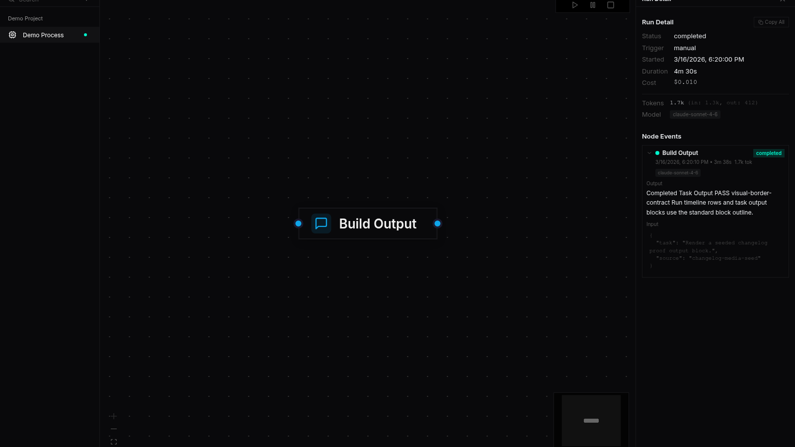
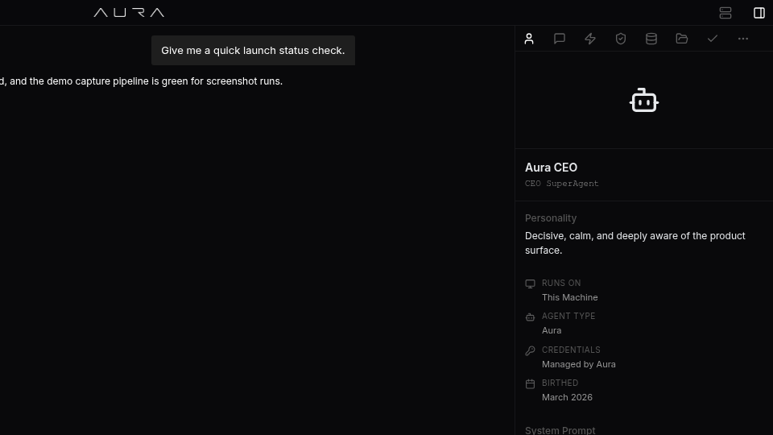

# Autonomous recovery, Debug app overhaul, and a calmer chat stream

- Date: `2026-04-22`
- Channel: `nightly`
- Version: `0.1.0-nightly.346.1`
- Release: https://github.com/cypher-asi/aura-os/releases/tag/v0.1.0-nightly.346.1

A dense day across the stack: the dev loop learned to recover from rate limits and truncation failures on its own, the Debug app was rebuilt around projects with a proper sidekick, and the chat surface stopped jittering mid-stream. Desktop reliability, login polish, and the changelog media pipeline all got meaningful attention too.

## 2:06 AM — Debug app rebuilt around projects and a sidekick inspector

The Debug app moved to a project-first layout with a dedicated sidekick, plus fixes to chat busy-state, ANSI-colored tool output, and feed centering.

<!-- AURA_CHANGELOG_MEDIA:BEGIN {"slotId":"entry-debug-app-rebuilt-around-projects-and-a-sidekick-inspector","slug":"debug-app-rebuilt-around-projects-and-a-sidekick-inspector","alt":"Debug app rebuilt around projects and a sidekick inspector screenshot","status":"published","assetPath":"assets/changelog/nightly/0.1.0-nightly.346.1/entry-debug-app-rebuilt-around-projects-and-a-sidekick-inspector.png","screenshotSource":"capture-proof","updatedAt":"2026-04-23T04:14:50.472Z","storyTitle":"Debug App — Project-First Layout with Sidekick Inspector"} -->

<!-- AURA_CHANGELOG_MEDIA:END entry-debug-app-rebuilt-around-projects-and-a-sidekick-inspector -->

- Debug now uses the shared project tree in the left nav and moves the run toolbar, counters, and entry inspector into a proper sidekick (Run, Events, LLM, Iterations, Blockers, Retries, Stats, Tasks). A portal-backed filter menu no longer gets clipped, and the run-detail header was stabilized into a single line so it stops reflowing while metadata loads. Operators can now Copy All / Copy Filtered and Export a run bundle directly from the header. (`8e7e4f0`, `1b769a8`, `865e7ec`, `586f744`)
- Chat input now reflects a new useAgentBusy state so the stop icon appears whenever the agent is busy — including while the automation loop is holding the turn — and routes cancellation to /loop/stop. The server returns a typed 409 agent_busy instead of leaking the raw harness string. (`6dd691e`)
- ANSI-colored output from cargo, rustc, and npm no longer renders as raw base64 in the task panel — the decoder now allows ESC through, strips ANSI escapes, and recurses into more output fields. (`7822fa1`)
- Leaderboard rows in Feed are centered again after dropping a nested scroll wrapper that was surfacing a stray horizontal scrollbar, and per-turn token counters in loop_log no longer double-count mid-stream usage frames. (`13e2cae`, `f5921f6`)

## 5:49 PM — Remediation hints attached to heuristic findings

Run heuristics now carry actionable hints so downstream consumers can act on failures rather than just describe them.

- Every heuristic rule now emits a RemediationHint (split-write, reshape-search, force-tool-call, retry-smaller-scope, or no-auto-fix), and aura-run-analyze renders the hint as a one-liner beneath each finding so dev loops inherit concrete next steps. (`6b6d6d9`)

## 6:05 PM — Darker block outlines on run and task output

Run event rows and task output blocks adopt the standard block border for consistency with other surfaces.

<!-- AURA_CHANGELOG_MEDIA:BEGIN {"slotId":"entry-darker-block-outlines-on-run-and-task-output","slug":"darker-block-outlines-on-run-and-task-output","alt":"Darker block outlines on run and task output screenshot","status":"published","assetPath":"assets/changelog/nightly/0.1.0-nightly.346.1/entry-darker-block-outlines-on-run-and-task-output.png","screenshotSource":"capture-proof","updatedAt":"2026-04-23T04:10:29.149Z","storyTitle":"Darker block outlines on run and task output — Process event timeline rows and Prev…"} -->

<!-- AURA_CHANGELOG_MEDIA:END entry-darker-block-outlines-on-run-and-task-output -->

- Process run timeline rows and the Preview task stream / build output blocks now use the standard --color-border token, matching the .block primitive outline. (`b2f25e4`)

## 6:13 PM — Automatic task decomposition after truncation failures

Tasks that fail with truncation now trigger heuristic-driven remediation instead of a blind retry.

- When a task fails with a truncation or no-file-ops reason, the server loads the run bundle, runs heuristics, and acts on the first RemediationHint: SplitWrite spawns skeleton+fill children, ReshapeSearchQuery and ForceToolCallNextTurn spawn shaped retries. Each path marks the parent failed and broadcasts task_auto_remediated so the UI can render the chain, while honouring MAX_RETRIES_PER_TASK and the AURA_AUTO_DECOMPOSE_DISABLED kill switch. (`79eab49`)

## 6:40 PM — Chat border token reaches sidekick and preview overlays

A small polish pass so embedded surfaces match the main chat's subtler outline.

<!-- AURA_CHANGELOG_MEDIA:BEGIN {"slotId":"entry-chat-border-token-reaches-sidekick-and-preview-overlays","slug":"chat-border-token-reaches-sidekick-and-preview-overlays","alt":"Chat border token reaches sidekick and preview overlays screenshot","status":"published","assetPath":"assets/changelog/nightly/0.1.0-nightly.346.1/entry-chat-border-token-reaches-sidekick-and-preview-overlays.png","screenshotSource":"capture-proof","updatedAt":"2026-04-23T04:11:09.924Z","storyTitle":"Chat border token reaches Sidekick and Preview Overlay"} -->

<!-- AURA_CHANGELOG_MEDIA:END entry-chat-border-token-reaches-sidekick-and-preview-overlays -->

- The darker chat border token now propagates into the sidekick body and preview overlay so tables, blocks, tools, and output sections render with the same subtle outline as the main LLM chat. (`cc9a050`)

## 6:45 PM — Autonomous recovery lands end-to-end in the dev loop

The orchestrator can now preemptively decompose oversized specs, observe runs live, honour provider Retry-After, and gate completion on real build/test evidence.

- Oversized task specs are now split at ingestion: detect_preflight_decomposition flags full-implementation phrasing and large line counts, spawns skeleton+fill children, and moves the parent to a non-runnable status. A new LiveAnalyzer re-runs heuristics every 50 events / 30s against the in-progress bundle and broadcasts findings with RemediationHint payloads, and a replay integration test plus a golden render test pin the whole decision chain against a truncated-run fixture. (`4f8e0a6`, `097b5a5`, `6de6a5e`)
- Rate-limit handling is now provider-aware: a new RateLimited failure class is checked before Truncation, Retry-After values are parsed from structured fields and error text, and project-wide cooldowns are raised to the provider's hint (clamped to 120s). A companion fix recovers from AutomatonStartError::Conflict on restart by mirroring start_loop's stop-stale / adopt-live logic, and the UI's TaskOutputSection now subscribes to loop_paused and renders "Rate limited by provider — resuming in Ns…" instead of a stuck "Waiting for agent output". (`dc50429`, `2d0124d`, `53dec4d`, `7a735ec`)
- Task completion is now gated on real evidence: tasks that modify code must show build+test telemetry, Rust changes additionally require fmt and clippy, and docs-only edits pass without build evidence. A new task_completion_gate domain event snapshots the inputs and verdict for audit. Separately, create_task is now idempotent on (project, spec, trimmed title) so re-running generate-spec → extract-tasks no longer doubles the task list, empty task_completed events are rejected as failures, and git push timeouts after a successful commit are treated as non-fatal. (`371aacf`, `15c8728`, `8fb8af9`, `2d0124d`, `a7f8494`)
- Run bundles no longer get stuck at status: running. A new reconcile_orphan_runs sweep rewrites stale Running metadata to Interrupted at server startup (backfilling ended_at and a summary), and stop_loop / start_loop now finalize bundles explicitly so the Debug "Running now" list doesn't show ghosts between restarts. (`4f83bcf`, `3855508`)
- The live LLM stream was untangled: text deltas now strictly append to the timeline tail instead of folding back across tool blocks, trailing markdown markers are sanitized so raw ** or * no longer flash under the cursor, and the Cooking/Thinking indicator was lifted out of the message flow into a pinned element above the input so content stops jittering on every phase change. (`aabd229`, `c4f512d`, `16f38ac`)
- Tool rendering gets a much-needed cleanup: command and read_file blocks now decode their base64 stdout envelopes so captured output renders as legible text and files come back syntax-highlighted; list_files, find_files, and search_code extract rows from stdout envelopes instead of showing "0 items"; GenericToolBlock regains its 10px inset; and long command titles stop ellipsizing flush against trailing badges. (`45e55ba`, `59d2aa6`, `f62eb9d`, `ed2e669`, `f7914db`)
- Logout no longer produces a black-screen redirect loop. App.tsx no longer OR-es a stale boot-time login flag forever, logout() dropped the full-page reload that let the desktop init script resurrect a dead session, and a new aura-force-logged-out sentinel survives reloads to force the app up on LoginView. Clearing auth now also wipes the IDB localStorage mirror that was previously left behind. (`2ab59d4`)
- Debug left menu gained a "Running now" section that polls in-progress runs across every project (3s while active, 10s idle), the run detail timeline no longer swaps channels when sidekick tabs change, and expand/collapse state plus last-visited project/run now persist across reloads with a /debug index redirect that honours them. Copy All confirms with a transient "Copied" label. (`46ae8e9`, `5e25855`, `ea9ab6e`)
- Windows auto-update now reliably hands off to the NSIS installer: Aura downloads the verified installer itself, stages it under the data dir, runs the shutdown hook to release file locks, and spawns setup with DETACHED_PROCESS / CREATE_BREAKAWAY_FROM_JOB before exiting. The Updates row also splits into inline and full-panel layouts so attention states stop squishing General settings, and the auto-update smoke test grew a Windows leg. (`61300eb`)
- Window resizing on desktop is fluid again: useAuraCapabilities is now a single shared useSyncExternalStore snapshot with rAF coalescing instead of ~40 independent resize listeners, and the main window's class brush was switched from BLACK_BRUSH to NULL_BRUSH so Windows no longer paints black bars chasing the edge during live drags. Separately, the IDE window webview is now bootstrapped with the same auth init script as the main webview, so file trees stop coming back blank. (`88a1fee`, `dd97291`)
- The login view was reworked into a full-screen AURA visual loop video with a centered glass sign-in card titled "Login with ZERO Pro", sized down 30% for a more compact feel. Billing email is now read-only and tied to the ZERO account identity, closing a regression that could boot users to Free plan when the edit didn't match their ZERO record. (`dacd52e`, `3fdb15e`, `df72d28`, `04b5496`, `a68d479`, `68ea3aa`)
- Changelog media publishing was reworked end-to-end: the workflow now dispatches explicitly with channel/version/date/head_sha instead of chaining on workflow_run artifacts, successful slots are published before failed ones are queued for retry via a dedicated retry workflow, partial-success policy is unified across publish/reconcile/retry, retries are adaptive, gh-pages commits use a retry-with-rebase helper, and screenshot capture prefers sidekick context with hardened quality gates. (`2f96782`, `14a67af`, `9005c60`, `e0b0ade`, `20b33ed`, `e017f5f`, `d231ae1`, `cdca78e`, `eb42a29`, `bbc82f3`, `f7c1a9f`, `2dcf19f`, `027e0e2`)
- Standalone agent chat regained its scrollbar after the changelog-screenshot wrapper broke the flex-column height chain, the tasks sidekick no longer blinks off during refreshes, Build/Test Verification shows the real command instead of "Running `undefined`", stat card dollar values always show two decimals, and the last Debug sidekick tab stopped doubling beside the More button thanks to hysteresis in useOverflowTabs. (`27d79bd`, `fe06055`, `f7914db`, `773a3a8`, `764be8b`)
- Border tokens were unified globally so tables, blocks, tool rows, message bubbles, preview overlays, and sidekick surfaces all share the main chat's subtle outline, and PushCard now falls back to commitIds.length when metadata.commits is missing instead of showing 0 commits on older posts. (`150f142`, `070248d`)

## Highlights

- Dev loop auto-decomposes oversized tasks and honours provider Retry-After
- Debug app rebuilt with project-first nav and a live sidekick
- Windows auto-updater reliably hands off to NSIS
- Logout no longer lands on a black-screen redirect loop
- Chat streaming indicator pinned so content stops jittering

