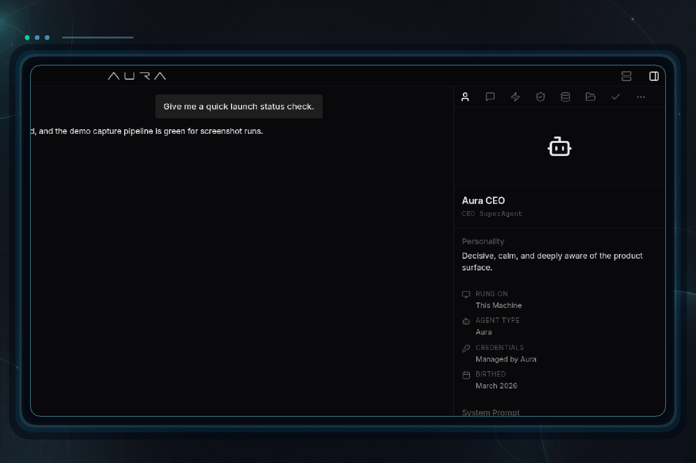
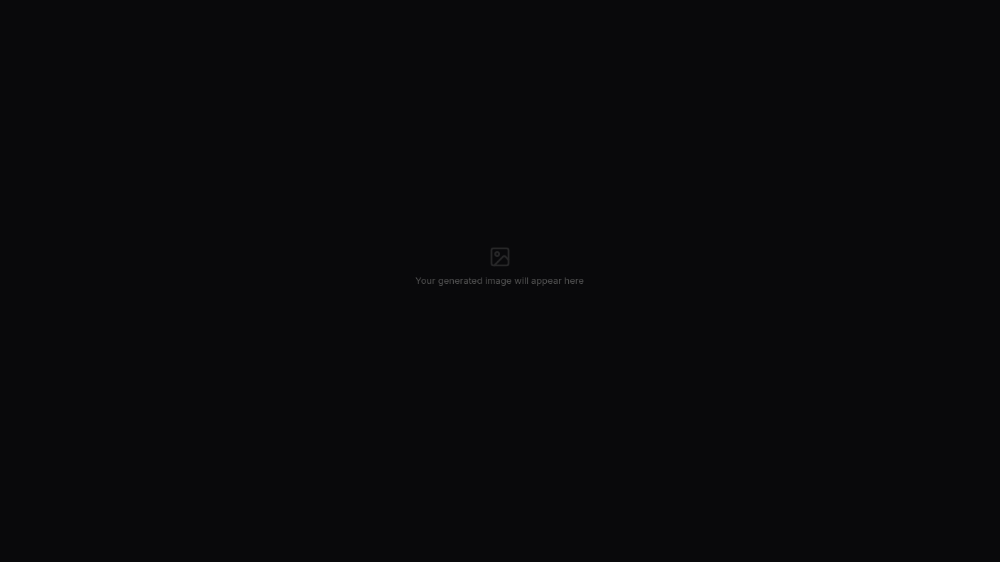
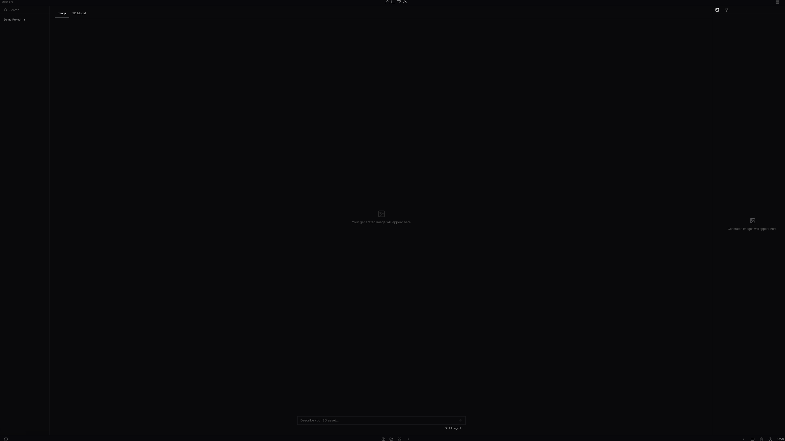

# AURA 3D studio debuts alongside nightly release hardening

- Date: `2026-04-23`
- Channel: `nightly`
- Version: `0.1.0-nightly.360.1`
- Release: https://github.com/cypher-asi/aura-os/releases/tag/v0.1.0-nightly.360.1

Today's nightly ships the first end-to-end cut of AURA 3D — a new studio for generating images and turning them into textured 3D models inside a WebGL viewer — along with a meaningful round of hardening for the nightly release pipeline and changelog media tooling. Desktop builds landed across macOS, Windows, and Linux.

## 9:17 AM — Nightly asset pruning and gh-pages recovery hardening

The nightly release workflow got a more resilient asset-cleanup path and a dedicated recovery route for changelog media publishing.

- Replaced the inline nightly asset cleanup with a retrying prune script that tolerates missing releases and missing assets, so nightly runs no longer fail on transient GitHub API hiccups or a deleted nightly tag. (`a7eb25a`, `ac61ac3`)
- Added a Sync Release Changelog Media History workflow plus a gh-pages republish recovery workflow, giving the team a repeatable way to reconcile changelog media to gh-pages after a failed publish. (`a7eb25a`, `ca9eaa8`)
- Reworked changelog media publishing to sync into dated history entries and tightened the framing and readability of generated media cards. (`d81834c`, `2217600`, `43ac905`)

## 11:43 AM — GPT-5.5 support and sharper AI-driven changelog proofs

Chat gained a new top-tier model option while the automated changelog-media pipeline got a stricter proofing pass with crisper, larger proof screenshots.

<!-- AURA_CHANGELOG_MEDIA:BEGIN {"slotId":"entry-gpt-5-5-in-the-model-picker-and-zero-pro-usage-reporting","batchId":"entry-2","slug":"gpt-5-5-in-the-model-picker-and-zero-pro-usage-reporting","alt":"GPT-5.5 in the model picker and ZERO Pro usage reporting screenshot","status":"published","assetPath":"assets/changelog/nightly/0.1.0-nightly.356.1/entry-gpt-5-5-in-the-model-picker-and-zero-pro-usage-reporting.png"} -->

<!-- AURA_CHANGELOG_MEDIA:END entry-gpt-5-5-in-the-model-picker-and-zero-pro-usage-reporting -->

- Added GPT-5.5 as a selectable model in the chat input bar, with matching benchmark pricing entries and server-side dev loop handling. (`d9d82e9`)
- Introduced a tool-driven media inference pass (prompt v4) that decides which changelog entries actually warrant a screenshot, rejecting CI, backend-only, and non-visual work instead of producing weak proofs. (`8ef3f5b`)
- Preserved crisp, higher-resolution proof screenshots and enlarged the branded proof cards so published changelog media reads clearly at final size. (`a0f9f63`, `4c104ae`)
- Server now reports ZERO Pro status alongside usage on the dev loop handler so downstream clients can reflect entitlement state. (`b2847a4`)

## 5:11 PM — AURA 3D app: image-to-model studio takes shape

A brand new AURA 3D app landed, moving from a tab scaffold to a working image generation flow and a WebGL-backed 3D viewer gated behind a feature flag.

<!-- AURA_CHANGELOG_MEDIA:BEGIN {"slotId":"entry-3-aura-3d-app-debuts-with-image-generation-and-webgl-viewer","batchId":"entry-3","slug":"aura-3d-app-debuts-with-image-generation-and-webgl-viewer","alt":"AURA 3D app debuts with image generation and WebGL viewer screenshot","status":"published","assetPath":"assets/changelog/nightly/0.1.0-nightly.359.1/entry-3-aura-3d-app-debuts-with-image-generation-and-webgl-viewer.png"} -->

<!-- AURA_CHANGELOG_MEDIA:END entry-3-aura-3d-app-debuts-with-image-generation-and-webgl-viewer -->

- Scaffolded AURA 3D at /3d in the app registry with a Box-icon entry, Zustand store, and initial Imagine/Generate/Tokenize tab layout, and pulled in three.js for the upcoming viewer. (`1b20985`)
- Replaced the tab stubs with a single-page image generation flow driven by an SSE stream and a style-locked prompt, plus a sidekick panel with Images and Models tabs for asset management. (`90887d5`)
- Added a Three.js WebGL viewer with a 4-light rig, GLTF auto-center/scale loader, grid/wireframe/texture toggles, and wired a Tripo-backed 3D generation SSE stream that auto-populates the source image from the image step. (`8b2b861`)
- Added a project selector dropdown in the left nav, gated the whole app behind VITE_ENABLE_AURA_3D, and backed the store with nine unit tests covering state transitions, completion, selection, and error handling. (`9cb954d`)

## 5:11 PM — Generation proxy now handles data-only SSE frames

Fixed a silent drop in the generation proxy when upstream sent SSE frames without an explicit event line.

- The aura-os-server generation handler now extracts the event type from the JSON data field when the upstream router emits data-only SSE frames, so start/progress/completed events no longer get silently dropped. (`e0d60fd`)

## 5:11 PM — AURA 3D layout switches to tabs and project-tree navigation

Based on feedback, the studio layout moved from a vertical split to Image/3D Model tabs and adopted the shared Projects-app left menu tree.

<!-- AURA_CHANGELOG_MEDIA:BEGIN {"slotId":"entry-5-aura-3d-adopts-tab-layout-and-projects-style-left-nav","batchId":"entry-5","slug":"aura-3d-adopts-tab-layout-and-projects-style-left-nav","alt":"AURA 3D adopts tab layout and Projects-style left nav screenshot","status":"published","assetPath":"assets/changelog/nightly/0.1.0-nightly.359.1/entry-5-aura-3d-adopts-tab-layout-and-projects-style-left-nav.png"} -->

<!-- AURA_CHANGELOG_MEDIA:END entry-5-aura-3d-adopts-tab-layout-and-projects-style-left-nav -->

- Replaced the horizontal image/model split with Image and 3D Model tabs and removed the redundant section headers, giving the studio a more familiar app-shell layout. (`5f41de6`, `ddb0b7e`)
- Swapped the custom project dropdown for LeftMenuTree so AURA 3D's left nav matches the Projects app, with generated images appearing as children under the active project. (`9250ebf`, `5f41de6`)
- Added a click-to-expand lightbox for generated images with backdrop and X-button close, plus a centered empty state and IMAGE section header for parity with the 3D MODEL section. (`ddb0b7e`)

## 5:11 PM — Artifact persistence and general availability for AURA 3D

AURA 3D now persists generated images and models to aura-storage, links models back to their source image, and is turned on for everyone.

<!-- AURA_CHANGELOG_MEDIA:BEGIN {"slotId":"entry-6-aura-3d-ships-artifact-persistence-and-goes-on-by-default","batchId":"entry-6","slug":"aura-3d-ships-artifact-persistence-and-goes-on-by-default","alt":"AURA 3D ships artifact persistence and goes on by default screenshot","status":"published","assetPath":"assets/changelog/nightly/0.1.0-nightly.359.1/entry-6-aura-3d-ships-artifact-persistence-and-goes-on-by-default.png"} -->

<!-- AURA_CHANGELOG_MEDIA:END entry-6-aura-3d-ships-artifact-persistence-and-goes-on-by-default -->

- Added a project artifacts backend in aura-os-storage and aura-os-server with list/create/get/delete endpoints at /api/projects/:id/artifacts, and resolved a router trie conflict that was causing GETs to 404 while OPTIONS passed. (`d3ad5ec`, `5df2a3b`)
- Wired the store to load a project's artifacts on selection, captured the image artifact ID from the SSE completed event, and passed it as parentId so generated 3D models link back to their source image. (`f3dc0ae`, `e204d4c`)
- Polished the studio shell: images and models now show under each project with icons in the left nav, sidekick panels use a thumbnail grid with headings, viewer controls became icon toggles, and the Generate 3D button hides once a model is loaded. (`6229c31`)
- Removed the VITE_ENABLE_AURA_3D feature flag so AURA 3D is now always available in the app registry, and disabled prompt input until a project is selected. (`6bbc5df`, `e204d4c`)

## Highlights

- New AURA 3D app: image → 3D model flow with WebGL viewer
- Artifact persistence wires generations to projects
- GPT-5.5 model available in chat
- Nightly release pruning and gh-pages recovery hardened

