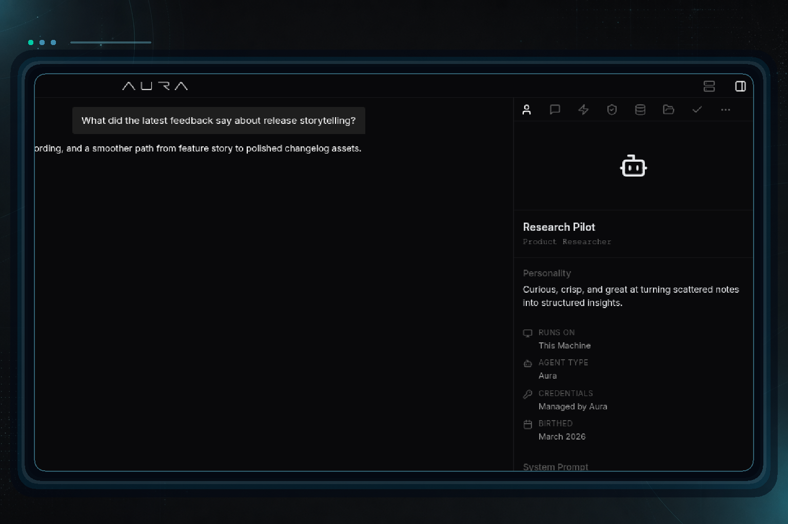

# GPT-5.5 pricing lands and nightly release pipeline gets sturdier

- Date: `2026-04-23`
- Channel: `nightly`
- Version: `0.1.0-nightly.355.1`
- Release: https://github.com/cypher-asi/aura-os/releases/tag/v0.1.0-nightly.355.1

Today's nightly brings the GPT-5.5 family into Aura's chat and cost accounting, on top of a substantial hardening pass across the release pipeline — dated changelog history, safer nightly asset pruning, a gh-pages recovery path, and cleaner changelog media framing.

## 9:17 AM — Nightly release pipeline hardening and changelog media overhaul

A broad reliability pass on the nightly release workflow, a new gh-pages recovery path, and sharper changelog media rendering.

- Nightly asset pruning moved into a dedicated retry-aware script that tolerates missing releases and 404s on already-deleted assets, replacing the inline workflow step that would fail on transient GitHub API errors. (`a7eb25a`, `ac61ac3`)
- Added a Sync Release Changelog Media History workflow plus a script that mirrors newly published media into dated history entries, so older changelog pages stop drifting from latest. (`a7eb25a`, `d81834c`)
- New Republish GitHub Pages workflow can force a fresh gh-pages push — including an allow-empty commit path — giving operators a one-click recovery when Pages gets stuck. (`ca9eaa8`)
- Changelog media now renders screenshots at their true aspect ratio with a larger card footprint, a safety inset that prevents edge clipping, a quieter central background, and higher OpenAI image quality by default. (`2217600`, `43ac905`)

## 11:43 AM — GPT-5.5 model support in chat and pricing

The GPT-5.5 family is now selectable in the chat input and fully wired into Aura's per-token fee schedule.

<!-- AURA_CHANGELOG_MEDIA:BEGIN {"slotId":"entry-gpt-5-5-model-support-in-chat-and-pricing","slug":"gpt-5-5-model-support-in-chat-and-pricing","alt":"GPT-5.5 model support in chat and pricing screenshot","status":"published","assetPath":"assets/changelog/nightly/0.1.0-nightly.355.1/entry-gpt-5-5-model-support-in-chat-and-pricing.png","screenshotSource":"openai-polish","originalScreenshotSource":"capture-proof","polishProvider":"openai","polishModel":"gpt-image-2","polishJudgeModel":"gpt-4.1-mini","polishScore":85,"updatedAt":"2026-04-23T19:04:14.470Z","storyTitle":"GPT-5.5 Model Selectable in Chat Input Bar"} -->

<!-- AURA_CHANGELOG_MEDIA:END entry-gpt-5-5-model-support-in-chat-and-pricing -->

- GPT-5.5 is now exposed in the chat input bar and model constants, making it selectable alongside the existing Claude lineup. (`d9d82e9`)
- Server-side fee schedule was restructured to carry explicit input, output, cache-write, and cache-read rates per model, and now covers gpt-5.5, gpt-5.4, gpt-5.4-mini, and gpt-5.4-nano in addition to the Claude 4 family. (`d9d82e9`)
- Benchmark pricing tooling was updated in lockstep so cost reporting recognizes the new GPT-5 tier instead of falling back to default rates. (`d9d82e9`)

## Highlights

- GPT-5.5 available in chat with full pricing support
- Nightly asset prune tolerates missing releases
- New gh-pages republish recovery workflow
- Changelog media preserves screenshot aspect and framing

