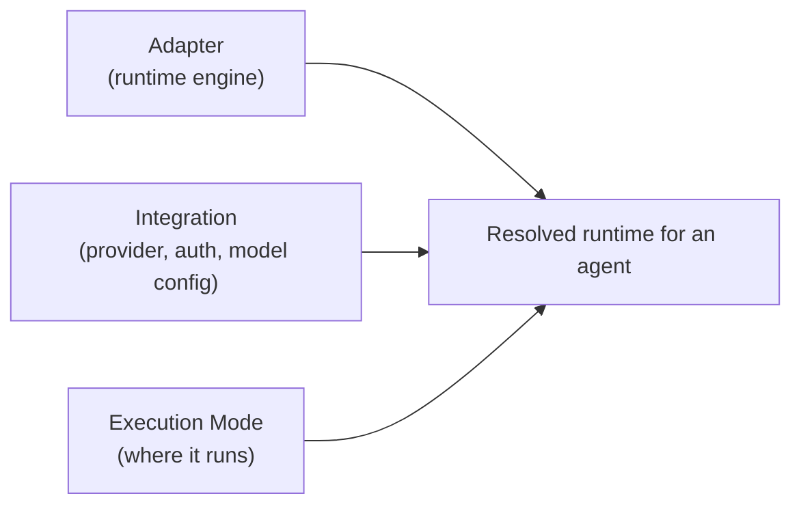
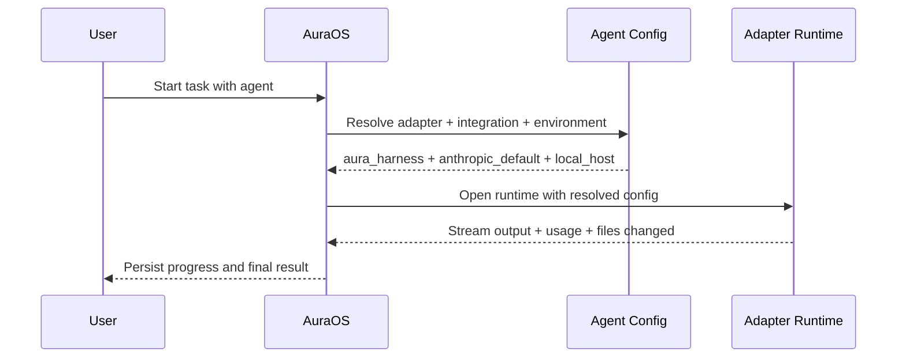
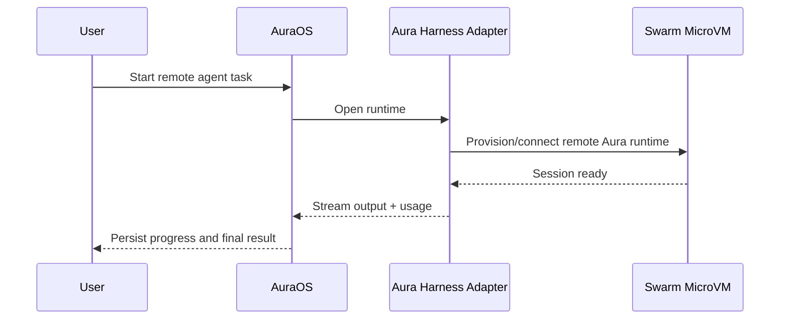

# Agent Runtime Adapter Plan

This is the simple proposal I would pitch for Aura.

There are only **three concepts**:

1. **Adapter**
   Which runtime does the work?
2. **Integration**
   What provider/auth/model config does that runtime use?
3. **Environment**
   Where does that runtime run?

That is the clearest model I see.

## The three concepts

## 1. Adapter

An adapter is the runtime engine that executes the agent.

Examples:

- `aura_harness`
- `claude_code`
- `codex`

This should be selected at the **agent level**.

Why:

- one agent may use Aura harness
- another may use Claude Code
- another may use Codex

## 2. Integration

An integration is the provider/auth/config that the adapter uses.

Examples:

- `anthropic_default`
- `openai_default`
- later maybe `vertex_default`

For v1, I would keep this mostly **organization-level**.

Important point:

- **Aura harness also uses integrations**

It is not special here.

Examples:

- Claude Code + Anthropic integration
- Codex + OpenAI integration
- Aura harness + Anthropic integration

So adapters do the work, and integrations tell them how to authenticate and which model/provider setup to use.

Execution itself happens at the runtime/harness layer, inside the selected environment.

## 3. Environment

Environment describes where the adapter runs.

For Aura v1, I think we only need:

- `local_host`
- `swarm_microvm`

This is the part that maps to the old `machine_type` concept.

So the old harness/swarm story still matters:

- Aura Harness = runtime engine
- Aura Swarm = remote isolated environment

## The core model

## Simple examples

### Example 1: Aura harness agent

- Adapter: `aura_harness`
- Integration: `anthropic_default`
- Environment: `local_host`

Meaning:

- run Aura harness locally
- Aura harness uses Anthropic credentials/model from the integration

### Example 2: Claude Code agent

- Adapter: `claude_code`
- Integration: `anthropic_default`
- Environment: `local_host`

Meaning:

- run Claude Code locally
- use Anthropic credentials/model from the integration

### Example 3: Codex agent

- Adapter: `codex`
- Integration: `openai_default`
- Environment: `local_host`

Meaning:

- run Codex locally
- use OpenAI credentials/model from the integration

### Example 4: Remote Aura agent

- Adapter: `aura_harness`
- Integration: `anthropic_default`
- Environment: `swarm_microvm`

Meaning:

- run Aura harness remotely
- use the same provider integration pattern
- place the runtime in isolated swarm infra

## Why this is better than the current model

Today Aura mostly thinks in terms of:

- `machine_type`
- `HarnessMode`
- optional `model`

That works for:

- local Aura harness
- remote Aura swarm

But it does not scale cleanly to:

- Claude Code
- Codex
- future vendor runtimes

The problem is that the old model mixes:

- runtime choice
- provider config
- deployment placement

The new model separates those concerns cleanly.

## What happens to `machine_type`?

I would not keep `machine_type` as the main user-facing concept.

But I would keep its meaning.

Recommended mapping:

- `machine_type = local` -> `environment = local_host`
- `machine_type = remote` -> `environment = swarm_microvm`

So:

- we are not deleting the old concept
- we are clarifying it

## Suggested flow

Remote Aura flow:

## Who owns task / Kanban transitions?

I do **not** think task board state should be owned by the runtime adapter.

My recommendation:

- adapters do the work
- Aura OS orchestration owns the task transitions

So the agent can propose things like:

- task done
- task blocked
- retry task

But Aura OS should remain the source of truth for:

- assign
- in progress
- done
- failed
- retry
- dependency unlocks

That keeps workflow semantics consistent across Aura, Claude, and Codex.

## Do the current benchmarks still fit this architecture?

Yes, very well.

The benchmark adapters I already built map directly onto the **adapter** layer:

- Aura benchmark adapter
- Claude benchmark adapter
- Codex benchmark adapter

That means the benchmark work is still valid and useful.

In fact, it becomes more useful under this architecture because it gives us:

- a comparison layer for adapter choices
- a regression harness as we turn these benchmark adapters into real product adapters

## Recommended v1 scope

Keep v1 simple.

### Adapters

- `aura_harness`
- `claude_code`
- `codex`

### Integrations

- org-level only for now
- `anthropic`
- `openai`

### Environments

- `local_host`
- `swarm_microvm`

That is enough for a strong first version.

## Recommended implementation order

1. add `adapter_type`
2. add `environment`
3. keep compatibility with current `machine_type`
4. introduce a runtime adapter abstraction above `HarnessLink`
5. make Aura local/swarm the first concrete adapters
6. add org-level integration profiles
7. add Claude Code and Codex runtime adapters
8. wire the API/UI to select adapter + integration + environment

## Final recommendation

If I had to pitch this in one sentence:

> Aura should separate the runtime that does the work, the integration it uses, and the place where it runs.

That is the version I would move forward with.
