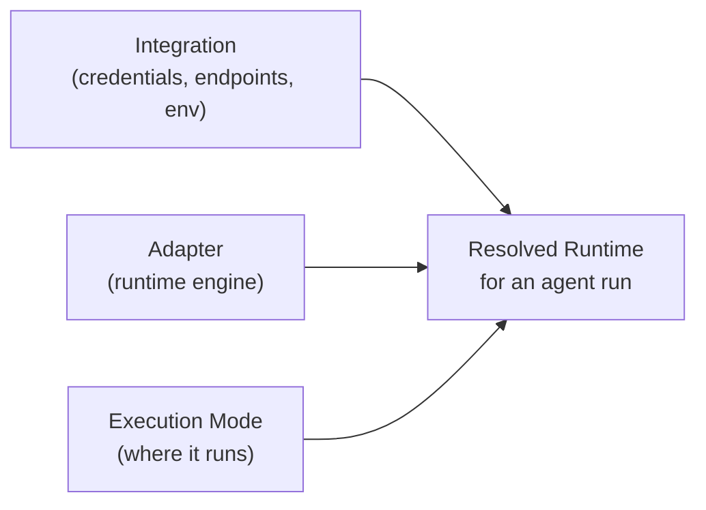
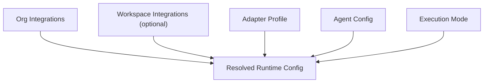
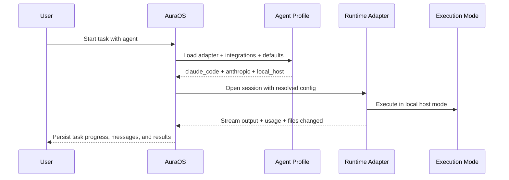
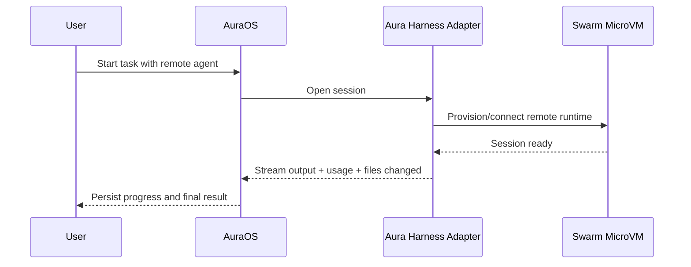

# Agent Runtime Adapter Plan

This document is the simplified proposal for how Aura should support multiple agent runtimes cleanly.

The core idea is simple:

- **integrations** answer: "what credentials / endpoints / environment can I use?"
- **adapters** answer: "which runtime engine is this agent using?"
- **execution mode** answers: "where is that runtime actually running?"

This is the clearest model I see for Aura.

## Why this change is needed

Today Aura is still mostly shaped around:

- `machine_type`
- `HarnessMode`
- optional `model`

That works for:

- local Aura harness
- remote Aura swarm

But it does not scale well to:

- Claude Code
- Codex
- OpenCode
- local OSS model runners
- adapter-specific auth, diagnostics, and session behavior

The old model bundled too much into one concept.

## The three concepts

## 1. Integrations

Integrations are reusable connections and credentials.

Examples:

- Anthropic API key
- OpenAI API key
- Vertex / Google project config
- remote gateway URL + token
- local model server URL
- MCP credentials
- workspace-specific env bundle

Best scope:

- **organization-level by default**
- **workspace-level when the integration is truly workspace-specific**

What integrations are **not**:

- they are not the runtime
- they are not the agent
- they are not the deployment mode

## 2. Adapters

Adapters are the runtime engines that actually execute agent work.

Examples:

- `aura_harness`
- `claude_code`
- `codex`
- `opencode`

Best scope:

- **agent-level**

Why:

- one agent might use Aura harness
- another might use Claude Code
- another might use Codex

That flexibility is valuable.

## 3. Execution mode

Execution mode describes where/how an adapter runs.

Examples:

- `local_host`
- `swarm_microvm`
- `remote_gateway`

This is the part that maps most closely to the old `machine_type` idea.

So I do **not** think we should delete the old harness/swarm concept.
I think we should rename and clarify it.

Old idea:

- `machine_type = local | remote`

Better new idea:

- `execution_mode = local_host | swarm_microvm | remote_gateway`

That keeps the original Aura Harness / Aura Swarm meaning intact:

- **Aura Harness** = runtime engine
- **Aura Swarm** = isolated remote placement mode

## Simple model

## Example combinations

Example 1:

- Integration: Anthropic API key
- Adapter: Claude Code
- Execution mode: local host

Meaning:

- use the local Claude CLI
- authenticate with Anthropic
- run on the user's machine

Example 2:

- Integration: OpenAI API key
- Adapter: Codex
- Execution mode: local host

Meaning:

- use local Codex CLI
- authenticate with OpenAI
- run on the user's machine

Example 3:

- Integration: org default Aura gateway / auth
- Adapter: Aura harness
- Execution mode: swarm microVM

Meaning:

- use Aura runtime
- run remotely in isolated infrastructure
- preserve the original swarm deployment story

## How this maps to the current Aura system

After reviewing:

- [aura-harness/README.md](/Users/shahrozkhan/Documents/zero/aura-harness/README.md)
- [aura-harness/docs/architecture.md](/Users/shahrozkhan/Documents/zero/aura-harness/docs/architecture.md)
- [aura-swarm/README.md](/Users/shahrozkhan/Documents/zero/aura-swarm/README.md)
- [01-system-overview.md](/Users/shahrozkhan/Documents/zero/aura-swarm/docs/spec/v0.1.0/01-system-overview.md)
- [06-agent-runtime.md](/Users/shahrozkhan/Documents/zero/aura-swarm/docs/spec/v0.1.0/06-agent-runtime.md)

my read is:

- the old harness/swarm model is still meaningful
- it should not be treated as a competing idea
- it fits naturally as the **execution mode** layer

So in the new world:

- `adapter_type` should choose the runtime engine
- `execution_mode` should replace the old overloaded meaning of `machine_type`

## Recommended ownership model

I recommend:

- **Integrations**
  - org-level by default
  - workspace-level when needed
- **Adapters**
  - agent-level
- **Execution mode**
  - agent-level or adapter-profile-level

That gives us:

- shared credentials
- flexible agent runtime choice
- consistent deployment/isolation semantics

## Adapter profiles

To avoid duplication, I recommend reusable adapter profiles.

Examples:

- "Aura local default"
- "Aura swarm default"
- "Claude Code Opus local"
- "Codex GPT-5.4 local"

An agent should reference a profile, not re-enter everything from scratch.

## Suggested resolved runtime flow

## Example end-to-end flow

Here is one realistic flow:

Same idea for Aura swarm:

## What happens to `machine_type`?

Short answer:

- I would not keep it as the top-level runtime selector
- I would keep its meaning, but rename it

Recommended migration:

- old `machine_type = local` -> `execution_mode = local_host`
- old `machine_type = remote` -> `execution_mode = swarm_microvm`

Compatibility mapping:

- `local` -> `aura_harness + local_host`
- `remote` -> `aura_harness + swarm_microvm`

So yes, the concept still matters. It just becomes more precise.

## Who owns task / Kanban transitions?

This is important.

I do **not** think task board state should be owned directly by whichever runtime adapter the coding agent is using.

Based on the current system:

- [task_service.rs](/Users/shahrozkhan/Documents/zero/aura-os-external-bench/crates/aura-os-tasks/src/task_service.rs)
- [task_tools.rs](/Users/shahrozkhan/Documents/zero/aura-os-external-bench/crates/aura-os-super-agent/src/tools/task_tools.rs)

task transitions are already mostly Aura OS service-level actions:

- assign
- move to in progress
- move to done
- fail
- retry
- unlock dependent tasks

That is the right direction.

My recommendation:

- runtime adapters do the work
- Aura OS orchestration owns the authoritative task transitions

So the agent can propose:

- "task is done"
- "task is blocked"
- "retry this"

But the durable board state should still go through Aura OS orchestration.

That gives us:

- consistent Kanban semantics
- easier auditing
- less adapter-specific business logic
- cleaner workflow control

## How the benchmark work fits this architecture

Yes, the benchmarks I already built still fit this architecture very well.

Why:

- the **external benchmark adapters** are already modeling the **adapter layer**
- the Aura benchmark lane already exercises the **Aura harness adapter**
- the Claude and Codex benchmark lanes already exercise **vendor adapters**
- the benchmarks do not block or conflict with adding **integrations** or **execution mode**

In fact, they become more useful under this architecture because they give us:

- a product comparison layer for adapter choices
- a regression tool as we turn benchmark adapters into real product adapters

So the benchmark work is not throwaway.
It is a direct stepping stone into the runtime-adapter architecture.

## Recommended v1 scope

Keep v1 small.

### Must have

- `adapter_type`
- `execution_mode`
- reusable integration profiles
- adapter profiles
- environment-test endpoint
- Aura harness, Claude Code, and Codex as supported runtime adapters

### Not yet

- deeply nested per-project secret graphs
- arbitrary runtime composition
- adapter-specific workflow engines
- making every board/system action runtime-owned

## Recommended implementation order

1. add `adapter_type` and `execution_mode` with compatibility mapping
2. keep current Aura local/swarm behavior working
3. introduce a higher-level runtime adapter abstraction above `HarnessLink`
4. make Aura local/swarm the first concrete runtime adapters
5. add integration profiles and adapter profiles
6. add environment test endpoints
7. add Claude Code / Codex / OpenCode runtime adapters
8. wire UI and API for profile selection

## Final recommendation

If I had to pitch this in one sentence:

> Aura should separate reusable integrations, agent runtime adapters, and execution placement, while keeping task orchestration owned by Aura OS.

That is the model I would move forward with.
