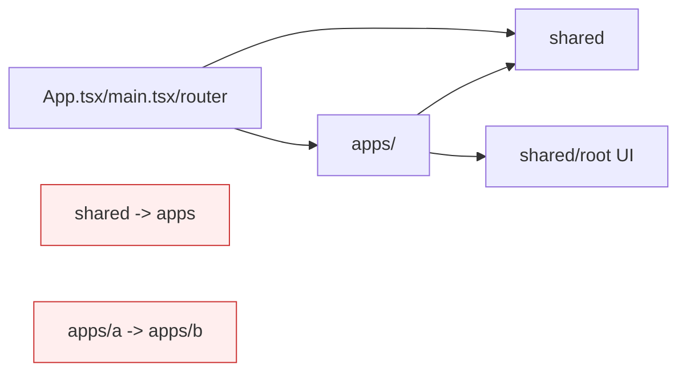

# Frontend Architecture (`interface/`)

This note documents the direction for the refactored frontend tree. It is a
rubric for ongoing work, not a claim that every directory already satisfies the
target layering.

## Goals

1. Keep dependencies one-way: app code may depend on shared code, but shared
   code must not depend on apps.
2. Avoid cross-app coupling: code in `apps/<app>/` should not import from a
   different app folder. Move common behavior to `shared/` or a focused
   cross-app feature module.
3. Co-locate app-owned UI, routes, hooks, stores, and queries under the app
   that owns them.
4. Keep `shared/` for reusable API clients, types, hooks, libraries, and
   utilities that do not know about one particular app.
5. Prefer small component folders with an explicit `index.ts` public surface.

## Current Shape

The current tree has already moved many app components into app folders:

```text
interface/src/
  apps/
    agents/
    aura3d/
    browser/
    chat/
    debug/
    desktop/
    feed/
    feedback/
    integrations/
    marketplace/
    notes/
    process/
    profile/
    projects/
    tasks/
  shared/
    api/
    hooks/
    lib/
    types/
    utils/
  components/
  hooks/
  lib/
  stores/
  utils/
  views/
```

The remaining root-level folders are transitional. Leave code there only when
it is genuinely cross-cutting or has not yet been assigned a clear owner.

## Target Layering



Allowed edges:

- `apps/<app>/` may import from `shared/`, root-level shared UI, and its own
  app subtree.
- Root bootstrapping code may import app registrations, routes, and shell-level
  shared modules.
- `shared/` modules may import other `shared/` modules, but not app modules.

Avoided edges:

- `shared/` importing from `apps/`.
- One app importing from another app.
- Generic UI reaching into app-specific stores, routes, queries, or API
  orchestration.

## Component Folder Shape

For app-specific components, prefer:

```text
apps/<app>/components/<Component>/
  index.ts
  <Component>.tsx
  <Component>.module.css
  use<Component>*.ts
  <Component>.test.tsx
```

For reusable UI primitives, use the same shape under the current shared UI
location. Consumers should import through `index.ts` so internal files remain
private to the component folder.

## Migration Guidance

- When touching a root-level component, decide whether it is reusable UI or
  app-specific UI. Move app-specific code into `apps/<app>/components/`.
- When a hook imports app stores, app routes, or app-only APIs, keep it with
  that app instead of placing it in `shared/hooks/`.
- Keep API clients and protocol/entity types in `shared/api/` and
  `shared/types/`. App-specific query orchestration belongs in the owning app.
- Do not add new dependency-cruiser, madge, or ts-prune baselines unless they
  are regenerated from the current tree and reviewed for signal. The older
  baseline outputs from the refactor staging branch were intentionally not
  ported because they describe a stale tree.

## Useful Checks

The frontend build remains the authoritative TypeScript validation:

```bash
npm run build --prefix interface
```

The repo root also provides a non-blocking size-budget check:

```bash
npm run lint:file-sizes
```

That check reports large `.ts`, `.tsx`, and `.rs` files. It is advisory while
the existing tree still has known large modules.
