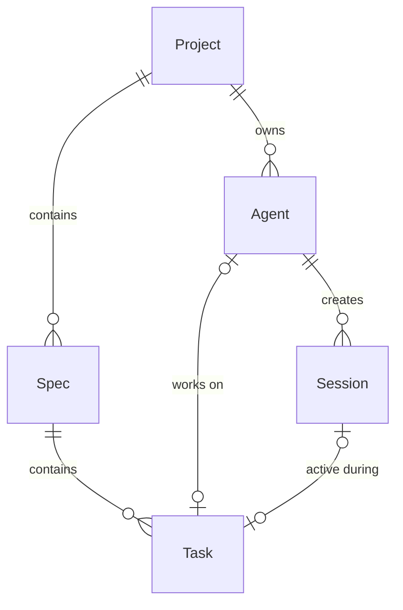
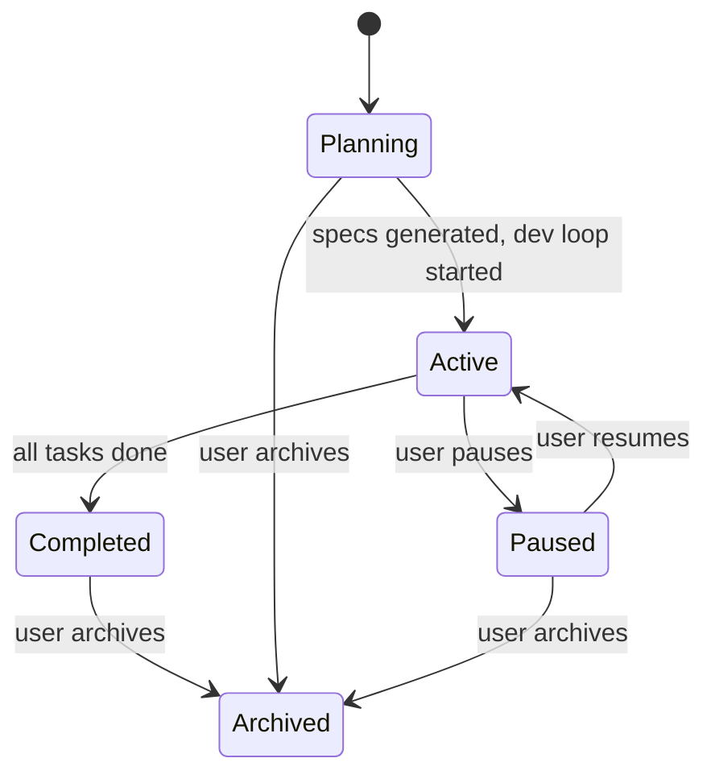
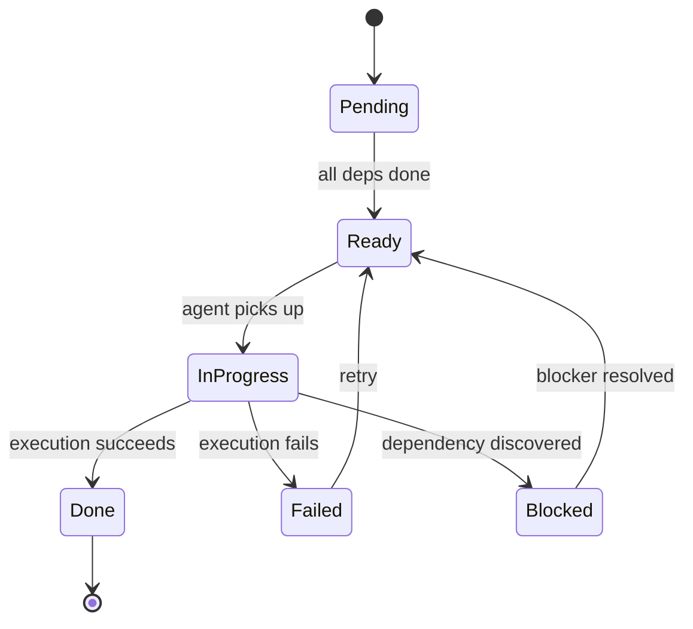
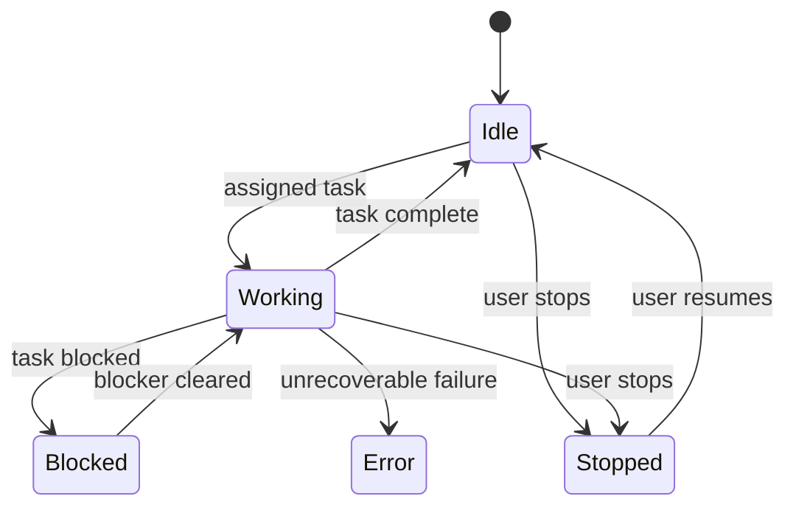
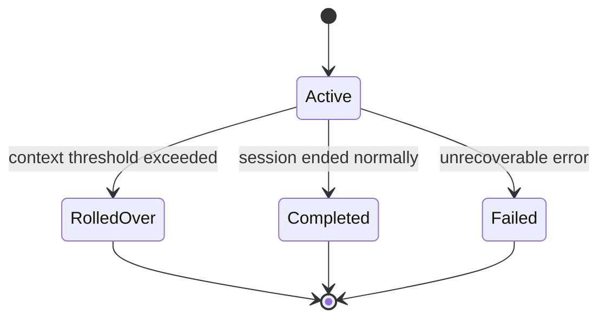

# Spec 01 — Core Domain Types

## Purpose

Define the foundational type system that every other crate imports. This layer contains **zero business logic and zero I/O** — only data definitions, identity types, enums, entity structs, and their serialization contracts. Getting this right first means every subsequent spec builds on a stable, well-tested vocabulary.

## Core Concepts

### Newtype IDs

Every domain entity gets its own strongly-typed identifier wrapping a `Uuid`. This prevents accidental mixing (e.g., passing a `SpecId` where a `ProjectId` is expected). All IDs are generated via UUID v4, serialized as hyphenated strings, and are `Copy + Clone + Eq + Hash`.

### Domain Enums

Status fields use Rust enums with `serde(rename_all = "snake_case")` so the JSON wire format is always lowercase_snake. Each enum is exhaustive — no catch-all variants — so adding a new status is a compile-time decision.

### Entity Structs

Plain data containers with public fields, `Serialize + Deserialize`, and no methods beyond construction helpers. They map 1:1 to what gets stored in RocksDB and what gets sent over the HTTP API.

### Timestamps

All timestamps are stored as `chrono::DateTime<Utc>` and serialized to ISO 8601 strings.

---

## Interfaces

### Newtype IDs

```rust
use serde::{Deserialize, Serialize};
use std::fmt;
use uuid::Uuid;

macro_rules! define_id {
    ($name:ident) => {
        #[derive(Clone, Copy, PartialEq, Eq, Hash, Serialize, Deserialize)]
        #[serde(transparent)]
        pub struct $name(Uuid);

        impl $name {
            pub fn new() -> Self {
                Self(Uuid::new_v4())
            }

            pub fn from_uuid(uuid: Uuid) -> Self {
                Self(uuid)
            }

            pub fn as_uuid(&self) -> &Uuid {
                &self.0
            }
        }

        impl fmt::Display for $name {
            fn fmt(&self, f: &mut fmt::Formatter<'_>) -> fmt::Result {
                write!(f, "{}", self.0)
            }
        }

        impl fmt::Debug for $name {
            fn fmt(&self, f: &mut fmt::Formatter<'_>) -> fmt::Result {
                write!(f, "{}({})", stringify!($name), self.0)
            }
        }

        impl std::str::FromStr for $name {
            type Err = uuid::Error;
            fn from_str(s: &str) -> Result<Self, Self::Err> {
                Ok(Self(s.parse()?))
            }
        }

        impl Default for $name {
            fn default() -> Self {
                Self::new()
            }
        }
    };
}

define_id!(ProjectId);
define_id!(SpecId);
define_id!(TaskId);
define_id!(AgentId);
define_id!(SessionId);
```

### Domain Enums

```rust
#[derive(Debug, Clone, Copy, PartialEq, Eq, Hash, Serialize, Deserialize)]
#[serde(rename_all = "snake_case")]
pub enum ProjectStatus {
    Planning,
    Active,
    Paused,
    Completed,
    Archived,
}

#[derive(Debug, Clone, Copy, PartialEq, Eq, Hash, Serialize, Deserialize)]
#[serde(rename_all = "snake_case")]
pub enum TaskStatus {
    Pending,
    Ready,
    InProgress,
    Blocked,
    Done,
    Failed,
}

#[derive(Debug, Clone, Copy, PartialEq, Eq, Hash, Serialize, Deserialize)]
#[serde(rename_all = "snake_case")]
pub enum AgentStatus {
    Idle,
    Working,
    Blocked,
    Stopped,
    Error,
}

#[derive(Debug, Clone, Copy, PartialEq, Eq, Hash, Serialize, Deserialize)]
#[serde(rename_all = "snake_case")]
pub enum SessionStatus {
    Active,
    Completed,
    Failed,
    RolledOver,
}
```

### Entity Structs

```rust
use chrono::{DateTime, Utc};

#[derive(Debug, Clone, Serialize, Deserialize)]
pub struct Project {
    pub project_id: ProjectId,
    pub name: String,
    pub description: String,
    pub requirements_doc_path: String,
    pub current_status: ProjectStatus,
    pub created_at: DateTime<Utc>,
    pub updated_at: DateTime<Utc>,
}

#[derive(Debug, Clone, Serialize, Deserialize)]
pub struct Spec {
    pub spec_id: SpecId,
    pub project_id: ProjectId,
    pub title: String,
    pub order_index: u32,
    pub markdown_contents: String,
    pub created_at: DateTime<Utc>,
    pub updated_at: DateTime<Utc>,
}

#[derive(Debug, Clone, Serialize, Deserialize)]
pub struct Task {
    pub task_id: TaskId,
    pub project_id: ProjectId,
    pub spec_id: SpecId,
    pub title: String,
    pub description: String,
    pub status: TaskStatus,
    pub order_index: u32,
    pub dependency_ids: Vec<TaskId>,
    pub assigned_agent_id: Option<AgentId>,
    pub execution_notes: String,
    pub created_at: DateTime<Utc>,
    pub updated_at: DateTime<Utc>,
}

Note: the current runtime architecture keeps executable workspace paths on `AgentInstance`, not on `Project`.

#[derive(Debug, Clone, Serialize, Deserialize)]
pub struct Agent {
    pub agent_id: AgentId,
    pub project_id: ProjectId,
    pub name: String,
    pub status: AgentStatus,
    pub current_task_id: Option<TaskId>,
    pub current_session_id: Option<SessionId>,
    pub created_at: DateTime<Utc>,
    pub updated_at: DateTime<Utc>,
}

#[derive(Debug, Clone, Serialize, Deserialize)]
pub struct Session {
    pub session_id: SessionId,
    pub agent_id: AgentId,
    pub project_id: ProjectId,
    pub active_task_id: Option<TaskId>,
    pub context_usage_estimate: f64,
    pub summary_of_previous_context: String,
    pub status: SessionStatus,
    pub started_at: DateTime<Utc>,
    pub ended_at: Option<DateTime<Utc>>,
}
```

### Entity Relationships



---

## State Machines

### ProjectStatus



### TaskStatus

Defined here for reference; full transition rules are in Spec 05.



### AgentStatus

Defined here for reference; full transition rules are in Spec 06.



### SessionStatus



---

## Key Behaviors

1. **ID uniqueness** — every `new()` call produces a cryptographically random UUID v4. Collision probability is negligible.
2. **Serialization stability** — JSON field names use `snake_case`, enum variants use `snake_case`. Adding a new field must use `#[serde(default)]` to remain backwards-compatible with existing stored data.
3. **Timestamp precision** — `DateTime<Utc>` provides millisecond precision. All entity creation helpers set both `created_at` and `updated_at` to `Utc::now()`.
4. **No validation in types** — entity structs are pure data. Validation (e.g., "name must not be empty") lives in the service layer (Specs 03–05), not here.
5. **`PartialEq` for entities** — derived, field-by-field equality. Two entities with the same ID but different fields are **not** equal. Identity-only comparison should use the ID field directly.

---

## Dependencies

None. This is the foundation crate with no internal dependencies.

**External crates:**

| Crate | Version | Purpose |
|-------|---------|---------|
| `serde` | 1.x | Serialize/Deserialize derives |
| `serde_json` | 1.x | JSON round-trip (dev/test) |
| `uuid` | 1.x | UUID v4 generation, parsing, serde |
| `chrono` | 0.4.x | DateTime<Utc>, serde |
| `thiserror` | 1.x | Error type (for parse failures) |

---

## Tasks

| ID | Task | Description |
|----|------|-------------|
| T01.1 | Create `aura-os-core` crate | `cargo new aura-os-core --lib`, add to workspace `Cargo.toml`, add dependencies |
| T01.2 | Implement ID newtype macro | Create `src/ids.rs` with `define_id!` macro producing `ProjectId`, `SpecId`, `TaskId`, `AgentId`, `SessionId` |
| T01.3 | Implement domain enums | Create `src/enums.rs` with `ProjectStatus`, `TaskStatus`, `AgentStatus`, `SessionStatus` |
| T01.4 | Implement entity structs | Create `src/entities.rs` with `Project`, `Spec`, `Task`, `Agent`, `Session` |
| T01.5 | Wire up `lib.rs` | Public re-exports from `ids`, `enums`, `entities` modules |
| T01.6 | Unit tests — ID round-trips | For each ID type: `new()`, `Display`, `FromStr`, JSON serialize/deserialize |
| T01.7 | Unit tests — enum serde | For each enum: verify every variant serializes to expected snake_case string and deserializes back |
| T01.8 | Unit tests — entity round-trips | For each entity: construct with sample data, serialize to JSON, deserialize back, assert equality |
| T01.9 | Clippy + fmt clean | `cargo clippy -p aura-os-core -- -D warnings` and `cargo fmt -p aura-os-core -- --check` pass |

---

## Test Criteria

All of the following must pass before proceeding to Spec 02:

- [ ] `cargo build -p aura-os-core` compiles with zero warnings
- [ ] `cargo test -p aura-os-core` passes all tests
- [ ] Every ID type round-trips through `Display` / `FromStr` and `serde_json`
- [ ] Every enum variant round-trips through `serde_json` with expected snake_case value
- [ ] Every entity struct round-trips through `serde_json`
- [ ] `cargo clippy -p aura-os-core -- -D warnings` is clean
- [ ] `cargo fmt -p aura-os-core -- --check` is clean
