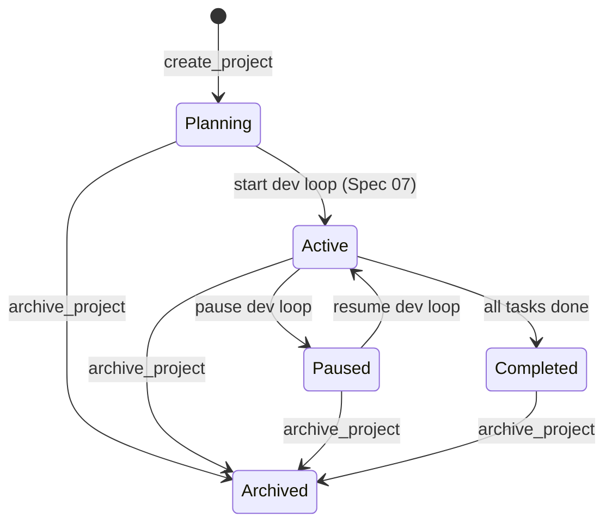
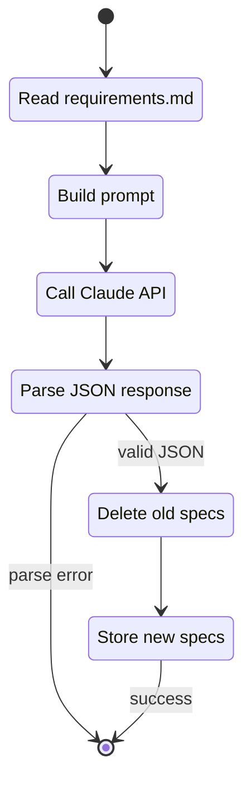

# Spec 04 — Project & Spec Management

## Purpose

Implement project lifecycle operations (create, read, update, archive) and the AI-powered requirements-to-spec pipeline. This is where the user's `requirements.md` file gets transformed into a structured, ordered set of spec files stored in the database. This spec covers the service layer that sits between the store and the HTTP API.

---

## Core Concepts

### Project Lifecycle

A project is the top-level container. The user creates it with a name, description, and linked folder path, then attaches a `requirements.md` file. The project starts in `Planning` status and remains there until the user starts the dev loop (Spec 07).

### Requirements Ingestion Pipeline

The pipeline reads the `requirements.md` file from disk, sends its contents to Claude with a structured prompt, and parses the response into multiple `Spec` entities. Each spec is assigned an `order_index` reflecting its position in the dependency hierarchy (most foundational = lowest index).

### Spec Generation Prompt

The system prompt instructs Claude to produce a JSON array of spec objects. Each object contains a title, purpose, and full markdown body. The prompt is deterministic (same requirements produce similar output), and the response schema is validated before storage.

### Idempotent Regeneration

The user can regenerate specs for a project. This replaces all existing specs (and their downstream tasks, handled in Spec 05). Regeneration is destructive — it deletes old specs and creates new ones in a single batch write.

---

## Interfaces

### Project Service

```rust
use std::sync::Arc;
use chrono::Utc;

pub struct ProjectService {
    store: Arc<RocksStore>,
}

impl ProjectService {
    pub fn new(store: Arc<RocksStore>) -> Self { /* ... */ }

    pub fn create_project(&self, input: CreateProjectInput) -> Result<Project, ProjectError> {
        let now = Utc::now();
        let project = Project {
            project_id: ProjectId::new(),
            name: input.name,
            description: input.description,
            requirements_doc_path: input.requirements_doc_path,
            current_status: ProjectStatus::Planning,
            created_at: now,
            updated_at: now,
        };
        self.store.put_project(&project)?;
        Ok(project)
    }

    pub fn get_project(&self, id: &ProjectId) -> Result<Project, ProjectError> { /* ... */ }

    pub fn list_projects(&self) -> Result<Vec<Project>, ProjectError> { /* ... */ }

    pub fn update_project(
        &self,
        id: &ProjectId,
        input: UpdateProjectInput,
    ) -> Result<Project, ProjectError> {
        // Load existing, apply changes, set updated_at, save
    }

    pub fn archive_project(&self, id: &ProjectId) -> Result<Project, ProjectError> {
        // Set status to Archived, save
    }
}

#[derive(Debug, Clone)]
pub struct CreateProjectInput {
    pub name: String,
    pub description: String,
    pub requirements_doc_path: String,
}

#[derive(Debug, Clone, Default)]
pub struct UpdateProjectInput {
    pub name: Option<String>,
    pub description: Option<String>,
    pub requirements_doc_path: Option<String>,
}
```

### Spec Generation Service

```rust
pub struct SpecGenerationService {
    store: Arc<RocksStore>,
    settings: Arc<SettingsService>,
    claude_client: Arc<ClaudeClient>,
}

impl SpecGenerationService {
    pub fn new(
        store: Arc<RocksStore>,
        settings: Arc<SettingsService>,
        claude_client: Arc<ClaudeClient>,
    ) -> Self { /* ... */ }

    /// Read requirements.md, call Claude, parse response, store specs.
    pub async fn generate_specs(
        &self,
        project_id: &ProjectId,
    ) -> Result<Vec<Spec>, SpecGenError> {
        // 1. Load project to get requirements_doc_path
        // 2. Read file from disk
        // 3. Build prompt
        // 4. Call Claude
        // 5. Parse response into Vec<RawSpecOutput>
        // 6. Delete existing specs for this project (idempotent regen)
        // 7. Create Spec entities with sequential order_index
        // 8. Batch write all specs
        // 9. Return the new specs
    }

    /// Get all specs for a project, ordered by order_index.
    pub fn list_specs(&self, project_id: &ProjectId) -> Result<Vec<Spec>, SpecGenError> {
        let mut specs = self.store.list_specs_by_project(project_id)?;
        specs.sort_by_key(|s| s.order_index);
        Ok(specs)
    }

    /// Get a single spec by ID.
    pub fn get_spec(
        &self,
        project_id: &ProjectId,
        spec_id: &SpecId,
    ) -> Result<Spec, SpecGenError> { /* ... */ }
}
```

### Claude Client

```rust
pub struct ClaudeClient {
    http: reqwest::Client,
    base_url: String,
}

impl ClaudeClient {
    pub fn new() -> Self {
        Self {
            http: reqwest::Client::new(),
            base_url: "https://api.anthropic.com".to_string(),
        }
    }

    /// Send a message to Claude and return the text response.
    pub async fn complete(
        &self,
        api_key: &str,
        system_prompt: &str,
        user_message: &str,
        max_tokens: u32,
    ) -> Result<String, ClaudeClientError> { /* ... */ }
}

#[derive(Debug, thiserror::Error)]
pub enum ClaudeClientError {
    #[error("HTTP error: {0}")]
    Http(#[from] reqwest::Error),
    #[error("API error {status}: {message}")]
    Api { status: u16, message: String },
    #[error("response parse error: {0}")]
    Parse(String),
}
```

### Spec Generation Prompt & Response Schema

```rust
pub(crate) const SPEC_GENERATION_SYSTEM_PROMPT: &str = r#"
You are an expert software architect. Given a requirements document, produce
a structured implementation specification broken into logical phases ordered
from most foundational to least foundational.

Respond with a JSON array. Each element has:
- "title": short title for the spec section
- "purpose": one paragraph explaining what this section covers
- "markdown": full markdown body including:
  - Major concepts
  - Interfaces (code-level)
  - Use cases
  - Test cases
  - Dependencies on other sections
  - State-machine diagrams (mermaid) where applicable

Order the array so that the most fundamental sections come first.
Respond ONLY with the JSON array, no other text.
"#;

#[derive(Debug, Clone, Serialize, Deserialize)]
pub(crate) struct RawSpecOutput {
    pub title: String,
    pub purpose: String,
    pub markdown: String,
}
```

### Response Parsing

```rust
impl SpecGenerationService {
    fn parse_claude_response(response: &str) -> Result<Vec<RawSpecOutput>, SpecGenError> {
        // Try to parse as JSON array directly
        // If that fails, look for ```json ... ``` fenced block and parse that
        // Validate: at least 1 spec, each has non-empty title and markdown
    }

    fn raw_to_specs(
        project_id: &ProjectId,
        raw: Vec<RawSpecOutput>,
    ) -> Vec<Spec> {
        let now = Utc::now();
        raw.into_iter()
            .enumerate()
            .map(|(i, r)| Spec {
                spec_id: SpecId::new(),
                project_id: *project_id,
                title: r.title,
                order_index: i as u32,
                markdown_contents: format!("## Purpose\n\n{}\n\n{}", r.purpose, r.markdown),
                created_at: now,
                updated_at: now,
            })
            .collect()
    }
}
```

### Error Type

```rust
#[derive(Debug, thiserror::Error)]
pub enum ProjectError {
    #[error("store error: {0}")]
    Store(#[from] StoreError),
    #[error("project not found: {0}")]
    NotFound(ProjectId),
    #[error("invalid input: {0}")]
    InvalidInput(String),
}

#[derive(Debug, thiserror::Error)]
pub enum SpecGenError {
    #[error("store error: {0}")]
    Store(#[from] StoreError),
    #[error("project not found: {0}")]
    ProjectNotFound(ProjectId),
    #[error("requirements file not found: {0}")]
    RequirementsFileNotFound(String),
    #[error("requirements file read error: {0}")]
    RequirementsFileRead(#[from] std::io::Error),
    #[error("Claude API error: {0}")]
    Claude(#[from] ClaudeClientError),
    #[error("settings error: {0}")]
    Settings(#[from] SettingsError),
    #[error("response parse error: {0}")]
    ParseError(String),
}
```

---

## State Machines

### Project Status Transitions (Service-Enforced)



### Spec Generation Pipeline



---

## Key Behaviors

1. **File read from disk** — the `requirements_doc_path` on the project points to a local file. The service reads it at generation time. If the file has moved or is unreadable, `SpecGenError::RequirementsFileNotFound` is returned.
2. **Claude prompt structure** — the system prompt is fixed (defined in the constant). The user message is the full contents of `requirements.md`. The model is `claude-sonnet-4-20250514` (configurable via settings in the future).
3. **Response parsing robustness** — Claude may wrap JSON in a markdown code fence. The parser strips ` ```json ` / ` ``` ` before attempting `serde_json::from_str`. If parsing fails after both attempts, the raw response is included in the error for debugging.
4. **Idempotent regeneration** — calling `generate_specs` on a project that already has specs deletes all existing specs (and their tasks, via batch op) before writing new ones. This is atomic via `write_batch`.
5. **Order index** — specs are numbered 0, 1, 2, ... in the order Claude returns them. The prompt instructs Claude to order from most foundational to least. `list_specs` always sorts by `order_index`.
6. **Workspace validation** — project creation validates metadata only; executable workspace validation happens when an agent instance is attached and resolves its workspace.
7. **Max tokens** — the Claude call uses a generous `max_tokens` (8192) to allow detailed spec output. This is hardcoded for MVP.

---

## Dependencies

| Spec | What is used |
|------|-------------|
| Spec 01 | `Project`, `Spec`, `ProjectId`, `SpecId`, `ProjectStatus` |
| Spec 02 | `RocksStore` for project/spec CRUD, `write_batch` for atomic regen |
| Spec 03 | `SettingsService::decrypt_api_key()` to get Claude API key |

**External crates:**

| Crate | Version | Purpose |
|-------|---------|---------|
| `reqwest` | 0.11.x | HTTP client for Claude API |
| `tokio` | 1.x | Async runtime for API calls |

---

## Tasks

| ID | Task | Description |
|----|------|-------------|
| T04.1 | Create `aura-services` crate | `cargo new aura-services --lib`, add to workspace, depend on `aura-os-core` and `aura-os-store` |
| T04.2 | Implement `ProjectService` | `create_project`, `get_project`, `list_projects`, `update_project`, `archive_project` |
| T04.3 | Input validation | Validate name non-empty and requirements_doc_path is an existing file |
| T04.4 | Implement `ClaudeClient` | HTTP POST to Claude Messages API, parse response, handle errors |
| T04.5 | Define spec generation prompt | `SPEC_GENERATION_SYSTEM_PROMPT` constant and `RawSpecOutput` struct |
| T04.6 | Implement `SpecGenerationService::generate_specs` | Full pipeline: read file, call Claude, parse, delete old, store new |
| T04.7 | Implement response parser | JSON extraction (direct and fenced), validation, conversion to `Spec` entities |
| T04.8 | Implement `list_specs` and `get_spec` | Sorted retrieval from store |
| T04.9 | Unit tests — project CRUD | Create, read, update, archive; verify status transitions |
| T04.10 | Unit tests — response parser | Valid JSON, fenced JSON, invalid JSON, empty array, missing fields |
| T04.11 | Integration tests — spec generation with mock | Mock Claude response, verify specs stored with correct order_index |
| T04.12 | Integration tests — idempotent regen | Generate specs, regenerate, verify old specs replaced |
| T04.13 | Clippy + fmt clean | All crates pass |

---

## Test Criteria

All of the following must pass before proceeding to Spec 05:

- [ ] `create_project` produces a project with `Planning` status and correct timestamps
- [ ] `update_project` applies partial updates and bumps `updated_at`
- [ ] `archive_project` sets status to `Archived`
- [ ] Input validation rejects empty names and nonexistent paths
- [ ] Response parser handles direct JSON, fenced JSON, and returns clear errors for invalid input
- [ ] `generate_specs` with a mocked Claude response produces correctly ordered `Spec` entities
- [ ] Regeneration deletes old specs and writes new ones atomically
- [ ] `list_specs` returns specs sorted by `order_index`
- [ ] `ClaudeClient` (integration test, optional with real key) returns a parseable response
- [ ] Clippy and fmt are clean
