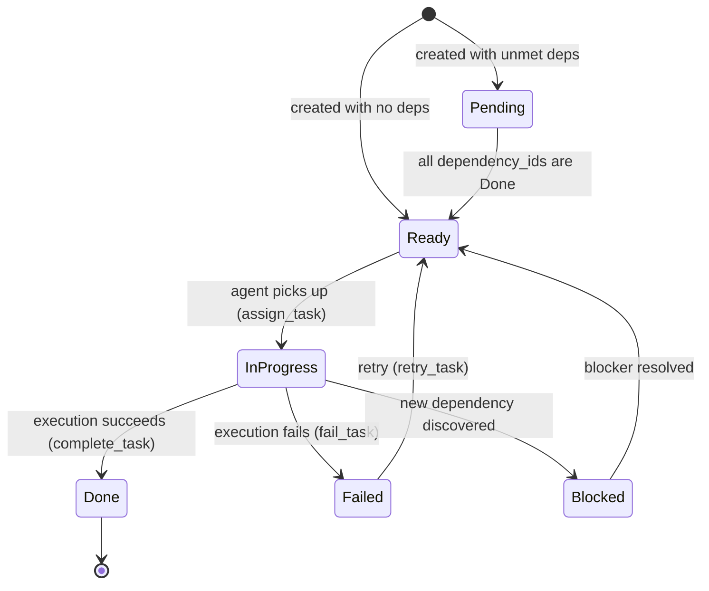
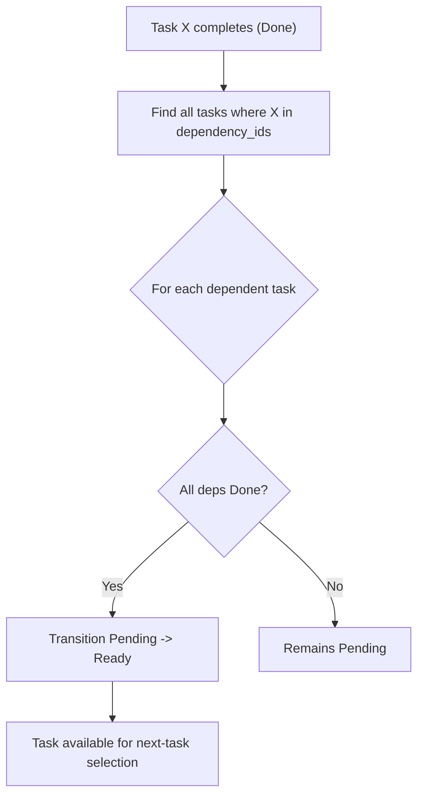

# Spec 05 — Task State Machine & Dependency Graph

## Purpose

Define task extraction from spec files, the complete task status state machine with guard conditions, the dependency graph that determines when tasks become ready, and the next-task selection algorithm. This is the scheduling brain of the system — the agent loop (Spec 07) asks "what do I work on next?" and this layer answers.

---

## Core Concepts

### Task Extraction

After spec files are generated (Spec 04), the system sends each spec's markdown to Claude and asks it to extract actionable implementation tasks. Each task gets a title, description, order within its spec, and optionally a list of dependency task titles (resolved to IDs after all tasks are created).

### Status State Machine

Every task has exactly one status at any moment. Transitions are guarded: only specific `(current_status, event)` pairs are legal. Attempting an illegal transition returns an error. The state machine is enforced in the `TaskService`, not in the entity struct.

### Dependency Graph

Tasks can depend on other tasks. A task is `Ready` only when **all** of its dependencies are `Done`. The dependency graph is a DAG (directed acyclic graph). Cycles are rejected at creation time.

### Next-Task Selection

The agent asks for the next task to work on. The selection algorithm:
1. Filter tasks by project where status is `Ready`.
2. Sort by `order_index` ascending (lower = more foundational = picked first).
3. Among ties, prefer the spec with lower `order_index`.
4. Return the first task, or `None` if no tasks are ready.

---

## Interfaces

### Task Extraction from Claude

```rust
pub struct TaskExtractionService {
    store: Arc<RocksStore>,
    settings: Arc<SettingsService>,
    claude_client: Arc<ClaudeClient>,
}

impl TaskExtractionService {
    /// Extract tasks from a single spec file.
    pub async fn extract_tasks_from_spec(
        &self,
        project_id: &ProjectId,
        spec_id: &SpecId,
    ) -> Result<Vec<Task>, TaskError> { /* ... */ }

    /// Extract tasks from all specs in a project.
    /// Resolves cross-spec dependency references after all tasks are created.
    pub async fn extract_all_tasks(
        &self,
        project_id: &ProjectId,
    ) -> Result<Vec<Task>, TaskError> {
        // 1. Load all specs ordered by order_index
        // 2. For each spec, call Claude to extract tasks
        // 3. Collect all tasks with string-based dependency refs
        // 4. Resolve dependency refs to TaskIds
        // 5. Detect cycles
        // 6. Batch write all tasks
        // 7. Run initial status resolution (mark tasks with no deps as Ready)
    }
}
```

### Task Extraction Prompt & Response

```rust
pub(crate) const TASK_EXTRACTION_SYSTEM_PROMPT: &str = r#"
You are a software implementation planner. Given a specification document,
extract concrete implementation tasks.

Respond with a JSON array. Each element has:
- "title": short task title (imperative form, e.g., "Implement X")
- "description": detailed description of what to implement and how to verify
- "depends_on": array of task titles this task depends on (empty if none)

Order tasks from most foundational to most dependent.
Respond ONLY with the JSON array, no other text.
"#;

#[derive(Debug, Clone, Serialize, Deserialize)]
pub(crate) struct RawTaskOutput {
    pub title: String,
    pub description: String,
    pub depends_on: Vec<String>,
}
```

### Task Service (State Machine Enforcement)

```rust
pub struct TaskService {
    store: Arc<RocksStore>,
}

impl TaskService {
    pub fn new(store: Arc<RocksStore>) -> Self { /* ... */ }

    /// Transition a task to a new status. Enforces the state machine.
    pub fn transition_task(
        &self,
        project_id: &ProjectId,
        spec_id: &SpecId,
        task_id: &TaskId,
        new_status: TaskStatus,
    ) -> Result<Task, TaskError> {
        let mut task = self.store.get_task(project_id, spec_id, task_id)?;
        Self::validate_transition(task.status, new_status)?;
        task.status = new_status;
        task.updated_at = Utc::now();
        self.store.put_task(&task)?;
        Ok(task)
    }

    /// Check whether a transition is legal.
    fn validate_transition(
        current: TaskStatus,
        target: TaskStatus,
    ) -> Result<(), TaskError> {
        let legal = matches!(
            (current, target),
            (TaskStatus::Pending, TaskStatus::Ready)
                | (TaskStatus::Ready, TaskStatus::InProgress)
                | (TaskStatus::InProgress, TaskStatus::Done)
                | (TaskStatus::InProgress, TaskStatus::Failed)
                | (TaskStatus::InProgress, TaskStatus::Blocked)
                | (TaskStatus::Failed, TaskStatus::Ready)
                | (TaskStatus::Blocked, TaskStatus::Ready)
        );
        if legal {
            Ok(())
        } else {
            Err(TaskError::IllegalTransition {
                current,
                target,
            })
        }
    }

    /// Assign an agent to a task (must be Ready -> InProgress).
    pub fn assign_task(
        &self,
        project_id: &ProjectId,
        spec_id: &SpecId,
        task_id: &TaskId,
        agent_id: &AgentId,
    ) -> Result<Task, TaskError> {
        let mut task = self.store.get_task(project_id, spec_id, task_id)?;
        Self::validate_transition(task.status, TaskStatus::InProgress)?;
        task.status = TaskStatus::InProgress;
        task.assigned_agent_id = Some(*agent_id);
        task.updated_at = Utc::now();
        self.store.put_task(&task)?;
        Ok(task)
    }

    /// Mark a task as done and record execution notes.
    pub fn complete_task(
        &self,
        project_id: &ProjectId,
        spec_id: &SpecId,
        task_id: &TaskId,
        notes: &str,
    ) -> Result<Task, TaskError> {
        let mut task = self.store.get_task(project_id, spec_id, task_id)?;
        Self::validate_transition(task.status, TaskStatus::Done)?;
        task.status = TaskStatus::Done;
        task.execution_notes = notes.to_string();
        task.assigned_agent_id = None;
        task.updated_at = Utc::now();
        self.store.put_task(&task)?;
        Ok(task)
    }

    /// Mark a task as failed and record the reason.
    pub fn fail_task(
        &self,
        project_id: &ProjectId,
        spec_id: &SpecId,
        task_id: &TaskId,
        reason: &str,
    ) -> Result<Task, TaskError> {
        let mut task = self.store.get_task(project_id, spec_id, task_id)?;
        Self::validate_transition(task.status, TaskStatus::Failed)?;
        task.status = TaskStatus::Failed;
        task.execution_notes = reason.to_string();
        task.assigned_agent_id = None;
        task.updated_at = Utc::now();
        self.store.put_task(&task)?;
        Ok(task)
    }

    /// Retry a failed task (Failed -> Ready).
    pub fn retry_task(
        &self,
        project_id: &ProjectId,
        spec_id: &SpecId,
        task_id: &TaskId,
    ) -> Result<Task, TaskError> {
        self.transition_task(project_id, spec_id, task_id, TaskStatus::Ready)
    }
}
```

### Dependency Resolution

```rust
impl TaskService {
    /// After completing a task, check if any dependent tasks can now move
    /// from Pending to Ready.
    pub fn resolve_dependencies_after_completion(
        &self,
        project_id: &ProjectId,
        completed_task_id: &TaskId,
    ) -> Result<Vec<Task>, TaskError> {
        let all_tasks = self.store.list_tasks_by_project(project_id)?;
        let mut newly_ready = Vec::new();

        for task in &all_tasks {
            if task.status != TaskStatus::Pending {
                continue;
            }
            if !task.dependency_ids.contains(completed_task_id) {
                continue;
            }
            let all_deps_done = task.dependency_ids.iter().all(|dep_id| {
                all_tasks
                    .iter()
                    .find(|t| &t.task_id == dep_id)
                    .map_or(false, |t| t.status == TaskStatus::Done)
            });
            if all_deps_done {
                let ready_task = self.transition_task(
                    project_id,
                    &task.spec_id,
                    &task.task_id,
                    TaskStatus::Ready,
                )?;
                newly_ready.push(ready_task);
            }
        }
        Ok(newly_ready)
    }

    /// Detect cycles in the dependency graph. Returns an error if any exist.
    pub fn detect_cycles(tasks: &[Task]) -> Result<(), TaskError> {
        // Topological sort via Kahn's algorithm.
        // If the sorted output has fewer elements than input, a cycle exists.
    }
}
```

### Next-Task Selection

```rust
impl TaskService {
    /// Select the next task for an agent to work on.
    pub fn select_next_task(
        &self,
        project_id: &ProjectId,
    ) -> Result<Option<Task>, TaskError> {
        let all_tasks = self.store.list_tasks_by_project(project_id)?;
        let specs = self.store.list_specs_by_project(project_id)?;

        let spec_order: HashMap<SpecId, u32> = specs
            .iter()
            .map(|s| (s.spec_id, s.order_index))
            .collect();

        let mut ready: Vec<&Task> = all_tasks
            .iter()
            .filter(|t| t.status == TaskStatus::Ready)
            .collect();

        ready.sort_by(|a, b| {
            let spec_ord_a = spec_order.get(&a.spec_id).copied().unwrap_or(u32::MAX);
            let spec_ord_b = spec_order.get(&b.spec_id).copied().unwrap_or(u32::MAX);
            spec_ord_a
                .cmp(&spec_ord_b)
                .then(a.order_index.cmp(&b.order_index))
        });

        Ok(ready.first().cloned().cloned())
    }
}
```

### Follow-Up Task Creation

```rust
impl TaskService {
    /// Create a follow-up task discovered during execution.
    /// Inherits the project and spec lineage of the originating task.
    pub fn create_follow_up_task(
        &self,
        originating_task: &Task,
        title: String,
        description: String,
        dependency_ids: Vec<TaskId>,
    ) -> Result<Task, TaskError> {
        let now = Utc::now();
        let task = Task {
            task_id: TaskId::new(),
            project_id: originating_task.project_id,
            spec_id: originating_task.spec_id,
            title,
            description,
            status: if dependency_ids.is_empty() {
                TaskStatus::Ready
            } else {
                TaskStatus::Pending
            },
            order_index: originating_task.order_index + 1,
            dependency_ids,
            assigned_agent_id: None,
            execution_notes: String::new(),
            created_at: now,
            updated_at: now,
        };
        self.store.put_task(&task)?;
        Ok(task)
    }
}
```

### Progress Summary

```rust
#[derive(Debug, Clone, Serialize, Deserialize)]
pub struct ProjectProgress {
    pub project_id: ProjectId,
    pub total_tasks: usize,
    pub pending_tasks: usize,
    pub ready_tasks: usize,
    pub in_progress_tasks: usize,
    pub blocked_tasks: usize,
    pub done_tasks: usize,
    pub failed_tasks: usize,
    pub completion_percentage: f64,
}

impl TaskService {
    pub fn get_project_progress(
        &self,
        project_id: &ProjectId,
    ) -> Result<ProjectProgress, TaskError> {
        let tasks = self.store.list_tasks_by_project(project_id)?;
        let total = tasks.len();
        let done = tasks.iter().filter(|t| t.status == TaskStatus::Done).count();
        let pct = if total == 0 { 0.0 } else { (done as f64 / total as f64) * 100.0 };

        Ok(ProjectProgress {
            project_id: *project_id,
            total_tasks: total,
            pending_tasks: tasks.iter().filter(|t| t.status == TaskStatus::Pending).count(),
            ready_tasks: tasks.iter().filter(|t| t.status == TaskStatus::Ready).count(),
            in_progress_tasks: tasks.iter().filter(|t| t.status == TaskStatus::InProgress).count(),
            blocked_tasks: tasks.iter().filter(|t| t.status == TaskStatus::Blocked).count(),
            done_tasks: done,
            failed_tasks: tasks.iter().filter(|t| t.status == TaskStatus::Failed).count(),
            completion_percentage: pct,
        })
    }
}
```

### Error Type

```rust
#[derive(Debug, thiserror::Error)]
pub enum TaskError {
    #[error("store error: {0}")]
    Store(#[from] StoreError),
    #[error("illegal transition from {current:?} to {target:?}")]
    IllegalTransition {
        current: TaskStatus,
        target: TaskStatus,
    },
    #[error("task not found")]
    NotFound,
    #[error("dependency cycle detected")]
    CycleDetected,
    #[error("Claude API error: {0}")]
    Claude(#[from] ClaudeClientError),
    #[error("settings error: {0}")]
    Settings(#[from] SettingsError),
    #[error("task extraction parse error: {0}")]
    ParseError(String),
}
```

---

## State Machines

### Task Status (Canonical)



### Transition Table

| From | To | Guard / Trigger |
|------|----|-----------------|
| `Pending` | `Ready` | All `dependency_ids` resolve to tasks with `Done` status |
| `Ready` | `InProgress` | `assign_task` called with valid `AgentId` |
| `InProgress` | `Done` | `complete_task` called |
| `InProgress` | `Failed` | `fail_task` called |
| `InProgress` | `Blocked` | New dependency discovered during execution |
| `Failed` | `Ready` | `retry_task` called |
| `Blocked` | `Ready` | All blockers resolved (dependencies become `Done`) |

### Dependency Resolution Flow



---

## Key Behaviors

1. **Task extraction ordering** — tasks within a spec are ordered by the order Claude returns them. Tasks across specs inherit the spec's `order_index` for selection priority.
2. **Dependency resolution by title** — during extraction, dependencies reference other tasks by title string. After all tasks for a project are created, titles are resolved to `TaskId`s. Unresolvable references are logged as warnings and dropped (the task proceeds without that dependency).
3. **Cycle detection** — `detect_cycles` runs after dependency resolution. If a cycle exists, the entire extraction fails and no tasks are stored.
4. **Initial status assignment** — tasks with empty `dependency_ids` start as `Ready`. Tasks with dependencies start as `Pending`.
5. **Cascading readiness** — when a task completes, `resolve_dependencies_after_completion` may transition multiple downstream tasks from `Pending` to `Ready` in a single call.
6. **Follow-up task lineage** — follow-up tasks created during execution inherit the `project_id` and `spec_id` of the originating task, maintaining the hierarchy.
7. **Progress calculation** — completion percentage is `done / total * 100`. A project with zero tasks has 0% completion.

---

## Dependencies

| Spec | What is used |
|------|-------------|
| Spec 01 | `Task`, `TaskId`, `TaskStatus`, `SpecId`, `ProjectId`, `AgentId` |
| Spec 02 | `RocksStore` for task CRUD and prefix scans |
| Spec 03 | `SettingsService` for Claude API key (used by extraction) |
| Spec 04 | `Spec` entities (extraction reads spec markdown), `ClaudeClient` |

---

## Tasks

| ID | Task | Description |
|----|------|-------------|
| T05.1 | Implement `validate_transition` | Pure function enforcing the transition table, with exhaustive tests |
| T05.2 | Implement `TaskService` core | `transition_task`, `assign_task`, `complete_task`, `fail_task`, `retry_task` |
| T05.3 | Implement dependency resolution | `resolve_dependencies_after_completion` — find pending tasks, check deps, transition |
| T05.4 | Implement cycle detection | Kahn's algorithm topological sort on task dependency graph |
| T05.5 | Implement `select_next_task` | Query ready tasks, sort by spec order then task order, return first |
| T05.6 | Define task extraction prompt | `TASK_EXTRACTION_SYSTEM_PROMPT` constant and `RawTaskOutput` struct |
| T05.7 | Implement `TaskExtractionService` | Per-spec extraction, cross-spec dependency resolution, batch write |
| T05.8 | Implement `create_follow_up_task` | Follow-up creation with lineage preservation |
| T05.9 | Implement `get_project_progress` | Aggregate task counts by status |
| T05.10 | Unit tests — transition validation | Every legal transition succeeds, every illegal transition returns error |
| T05.11 | Unit tests — dependency resolution | Chain of deps: complete root, verify leaves become ready |
| T05.12 | Unit tests — cycle detection | Acyclic graph passes, cyclic graph fails |
| T05.13 | Unit tests — next-task selection | Multiple ready tasks, verify correct ordering |
| T05.14 | Unit tests — progress calculation | Various distributions of statuses, verify counts and percentage |
| T05.15 | Integration tests — full extraction pipeline | Mock Claude, extract tasks, verify stored with correct deps and statuses |
| T05.16 | Clippy + fmt clean | All crates pass |

---

## Test Criteria

All of the following must pass before proceeding to Spec 06:

- [ ] Every legal transition in the table succeeds
- [ ] Every illegal transition (e.g., `Pending -> Done`, `Done -> Ready`) returns `IllegalTransition`
- [ ] Completing a task with dependents correctly transitions `Pending -> Ready` for all whose deps are met
- [ ] Cycle detection catches `A -> B -> A` and deeper cycles
- [ ] `select_next_task` picks the task from the most foundational spec with the lowest order_index
- [ ] `select_next_task` returns `None` when no tasks are `Ready`
- [ ] Task extraction with mocked Claude produces correctly ordered tasks with resolved dependencies
- [ ] Follow-up tasks inherit project/spec lineage
- [ ] `get_project_progress` returns correct counts for all status buckets
- [ ] Clippy and fmt are clean
