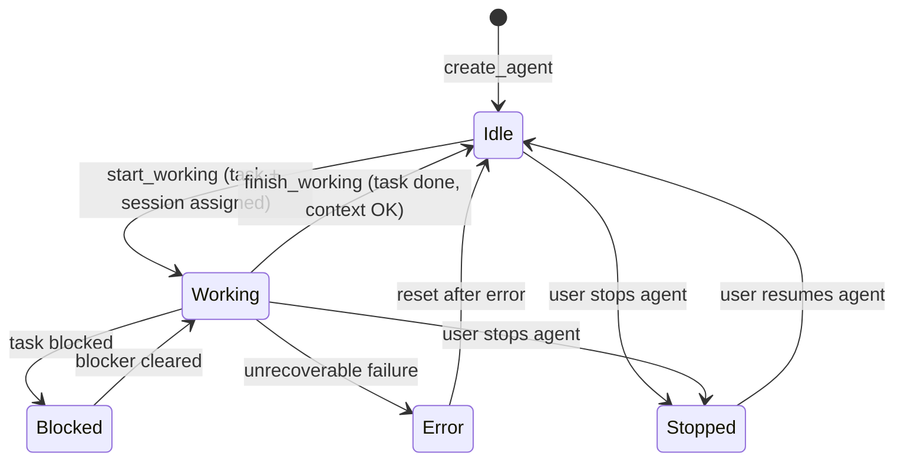
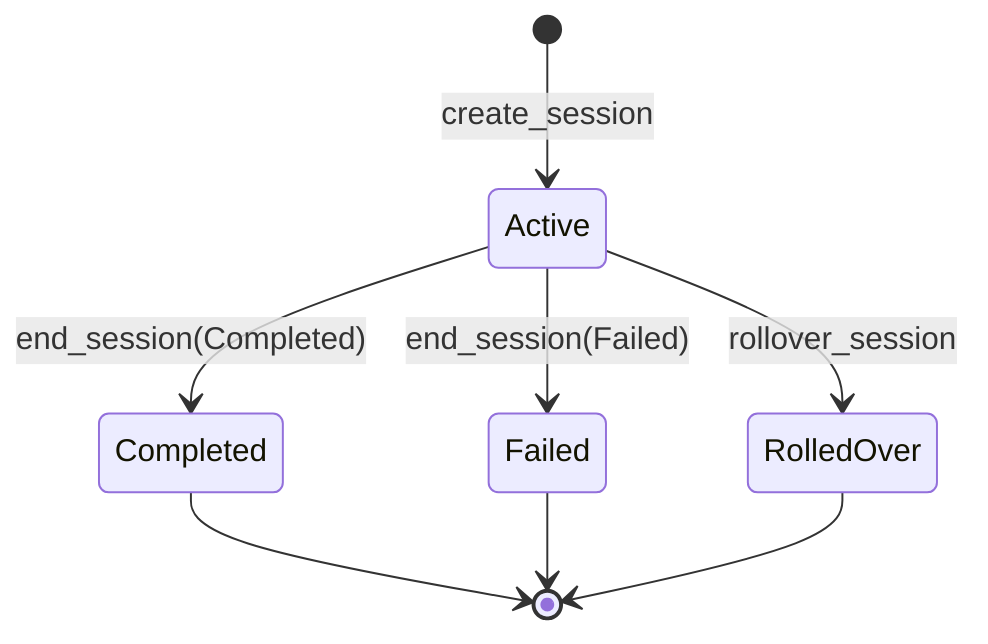
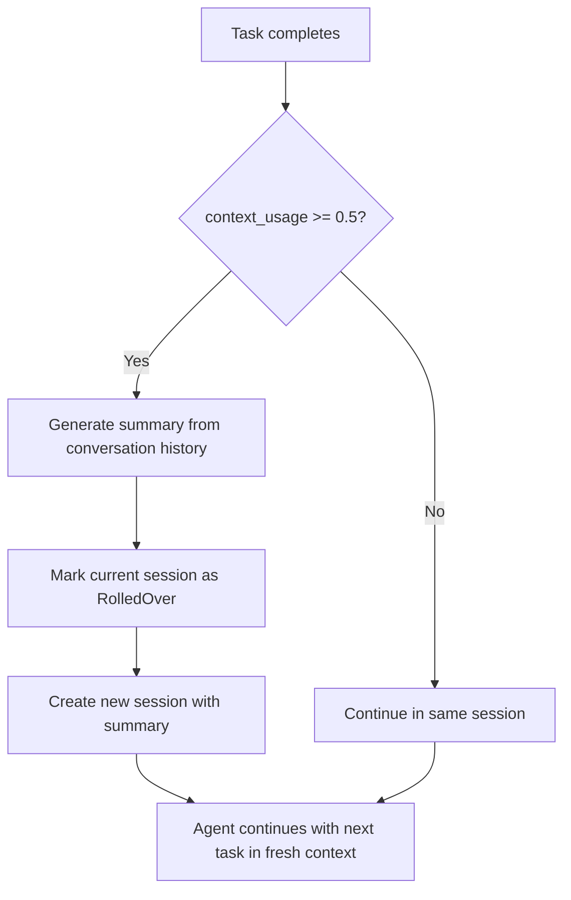

# Spec 06 — Agent & Session Lifecycle

## Purpose

Define the agent entity lifecycle, the session model that tracks context window usage, and the "Ralph-style" context rotation strategy. An agent is the active worker identity within a project. A session represents one continuous context window — when the context gets too full, the agent rolls over to a new session, carrying forward only a compact summary. This spec covers the data model and state transitions; the actual execution loop is in Spec 07.

---

## Core Concepts

### Agent

An agent is a named worker bound to a single project. The MVP supports one agent per project. The agent has a status reflecting what it is currently doing, a pointer to its active task, and a pointer to its active session.

### Session

A session represents one continuous conversation context with Claude. Each session tracks:
- **Context usage estimate** — a float from `0.0` to `1.0` approximating how full the context window is. Updated after each turn.
- **Summary of previous context** — text carried forward from the prior session, giving the new session enough background to continue.
- **Status** — `Active` while in use, then transitions to `Completed`, `Failed`, or `RolledOver` when replaced.

### Context Rotation ("Ralph-Style")

After each task completes, the agent checks the active session's `context_usage_estimate`. If it exceeds the **rollover threshold** (default: 50%), the agent:
1. Asks Claude to produce a compact summary of work done so far.
2. Marks the current session as `RolledOver`.
3. Creates a new session with the summary as `summary_of_previous_context`.
4. Continues with the next task in the fresh context.

This prevents context window exhaustion during long autonomous runs.

### Context Usage Estimation

Context usage is estimated by tracking cumulative input + output tokens across all turns in the session, divided by the model's context window size. The estimation does not need to be exact — it is a heuristic to decide when to rotate.

```
usage = (total_input_tokens + total_output_tokens) / model_context_window_size
```

For Claude Sonnet with a 200k context window, usage of 0.5 means ~100k tokens have been consumed.

---

## Interfaces

### Agent Service

```rust
pub struct AgentService {
    store: Arc<RocksStore>,
}

impl AgentService {
    pub fn new(store: Arc<RocksStore>) -> Self { /* ... */ }

    /// Create an agent for a project.
    pub fn create_agent(
        &self,
        project_id: &ProjectId,
        name: String,
    ) -> Result<Agent, AgentError> {
        let now = Utc::now();
        let agent = Agent {
            agent_id: AgentId::new(),
            project_id: *project_id,
            name,
            status: AgentStatus::Idle,
            current_task_id: None,
            current_session_id: None,
            created_at: now,
            updated_at: now,
        };
        self.store.put_agent(&agent)?;
        Ok(agent)
    }

    /// Transition the agent to a new status. Enforces the state machine.
    pub fn transition_agent(
        &self,
        project_id: &ProjectId,
        agent_id: &AgentId,
        new_status: AgentStatus,
    ) -> Result<Agent, AgentError> {
        let mut agent = self.store.get_agent(project_id, agent_id)?;
        Self::validate_transition(agent.status, new_status)?;
        agent.status = new_status;
        agent.updated_at = Utc::now();
        self.store.put_agent(&agent)?;
        Ok(agent)
    }

    fn validate_transition(
        current: AgentStatus,
        target: AgentStatus,
    ) -> Result<(), AgentError> {
        let legal = matches!(
            (current, target),
            (AgentStatus::Idle, AgentStatus::Working)
                | (AgentStatus::Working, AgentStatus::Idle)
                | (AgentStatus::Working, AgentStatus::Blocked)
                | (AgentStatus::Working, AgentStatus::Error)
                | (AgentStatus::Working, AgentStatus::Stopped)
                | (AgentStatus::Blocked, AgentStatus::Working)
                | (AgentStatus::Idle, AgentStatus::Stopped)
                | (AgentStatus::Stopped, AgentStatus::Idle)
                | (AgentStatus::Error, AgentStatus::Idle)
        );
        if legal {
            Ok(())
        } else {
            Err(AgentError::IllegalTransition { current, target })
        }
    }

    /// Assign a task to the agent and start working.
    pub fn start_working(
        &self,
        project_id: &ProjectId,
        agent_id: &AgentId,
        task_id: &TaskId,
        session_id: &SessionId,
    ) -> Result<Agent, AgentError> {
        let mut agent = self.store.get_agent(project_id, agent_id)?;
        Self::validate_transition(agent.status, AgentStatus::Working)?;
        agent.status = AgentStatus::Working;
        agent.current_task_id = Some(*task_id);
        agent.current_session_id = Some(*session_id);
        agent.updated_at = Utc::now();
        self.store.put_agent(&agent)?;
        Ok(agent)
    }

    /// Clear task assignment and return to idle.
    pub fn finish_working(
        &self,
        project_id: &ProjectId,
        agent_id: &AgentId,
    ) -> Result<Agent, AgentError> {
        let mut agent = self.store.get_agent(project_id, agent_id)?;
        Self::validate_transition(agent.status, AgentStatus::Idle)?;
        agent.status = AgentStatus::Idle;
        agent.current_task_id = None;
        agent.updated_at = Utc::now();
        self.store.put_agent(&agent)?;
        Ok(agent)
    }

    pub fn get_agent(
        &self,
        project_id: &ProjectId,
        agent_id: &AgentId,
    ) -> Result<Agent, AgentError> { /* ... */ }

    pub fn list_agents(
        &self,
        project_id: &ProjectId,
    ) -> Result<Vec<Agent>, AgentError> { /* ... */ }
}
```

### Session Service

```rust
pub struct SessionService {
    store: Arc<RocksStore>,
    rollover_threshold: f64,
    model_context_window: u64,
}

impl SessionService {
    pub fn new(store: Arc<RocksStore>) -> Self {
        Self {
            store,
            rollover_threshold: 0.5,
            model_context_window: 200_000,
        }
    }

    /// Create a new session for an agent, optionally carrying forward a summary.
    pub fn create_session(
        &self,
        agent_id: &AgentId,
        project_id: &ProjectId,
        active_task_id: Option<TaskId>,
        summary: String,
    ) -> Result<Session, SessionError> {
        let now = Utc::now();
        let session = Session {
            session_id: SessionId::new(),
            agent_id: *agent_id,
            project_id: *project_id,
            active_task_id,
            context_usage_estimate: 0.0,
            summary_of_previous_context: summary,
            status: SessionStatus::Active,
            started_at: now,
            ended_at: None,
        };
        self.store.put_session(&session)?;
        Ok(session)
    }

    /// Update the context usage estimate after a turn.
    pub fn update_context_usage(
        &self,
        project_id: &ProjectId,
        agent_id: &AgentId,
        session_id: &SessionId,
        input_tokens: u64,
        output_tokens: u64,
    ) -> Result<Session, SessionError> {
        let mut session = self.store.get_session(project_id, agent_id, session_id)?;
        let turn_usage = (input_tokens + output_tokens) as f64
            / self.model_context_window as f64;
        session.context_usage_estimate =
            (session.context_usage_estimate + turn_usage).min(1.0);
        session.updated_at_field_not_present(); // updated_at is on ended_at for sessions
        self.store.put_session(&session)?;
        Ok(session)
    }

    /// Check whether the session should be rolled over.
    pub fn should_rollover(&self, session: &Session) -> bool {
        session.context_usage_estimate >= self.rollover_threshold
    }

    /// End the current session and create a new one with a summary.
    pub fn rollover_session(
        &self,
        project_id: &ProjectId,
        agent_id: &AgentId,
        session_id: &SessionId,
        summary: String,
        next_task_id: Option<TaskId>,
    ) -> Result<Session, SessionError> {
        // 1. Mark current session as RolledOver
        let mut old_session =
            self.store.get_session(project_id, agent_id, session_id)?;
        old_session.status = SessionStatus::RolledOver;
        old_session.ended_at = Some(Utc::now());
        self.store.put_session(&old_session)?;

        // 2. Create new session with summary
        self.create_session(agent_id, project_id, next_task_id, summary)
    }

    /// End a session normally (completed or failed).
    pub fn end_session(
        &self,
        project_id: &ProjectId,
        agent_id: &AgentId,
        session_id: &SessionId,
        status: SessionStatus,
    ) -> Result<Session, SessionError> {
        let mut session =
            self.store.get_session(project_id, agent_id, session_id)?;
        session.status = status;
        session.ended_at = Some(Utc::now());
        self.store.put_session(&session)?;
        Ok(session)
    }

    pub fn get_session(
        &self,
        project_id: &ProjectId,
        agent_id: &AgentId,
        session_id: &SessionId,
    ) -> Result<Session, SessionError> { /* ... */ }

    pub fn list_sessions(
        &self,
        project_id: &ProjectId,
        agent_id: &AgentId,
    ) -> Result<Vec<Session>, SessionError> { /* ... */ }

    /// Get the session count for an agent (for display: "Session #N").
    pub fn session_count(
        &self,
        project_id: &ProjectId,
        agent_id: &AgentId,
    ) -> Result<usize, SessionError> {
        Ok(self.store.list_sessions_by_agent(project_id, agent_id)?.len())
    }
}
```

### Summary Generation

```rust
pub(crate) const SUMMARY_SYSTEM_PROMPT: &str = r#"
You are a context summarizer. Given the conversation history of an AI coding
agent working on a software project, produce a concise summary that captures:

1. What tasks were completed and their outcomes
2. Key decisions made
3. Current state of the codebase (files changed, patterns established)
4. What the next task should focus on
5. Any blockers or concerns

Keep the summary under 2000 tokens. Be specific about file paths and code patterns.
Respond with the summary text only, no JSON wrapping.
"#;

impl SessionService {
    /// Generate a summary of the current session for rollover.
    /// Called with the conversation history from the active session.
    pub async fn generate_rollover_summary(
        &self,
        claude_client: &ClaudeClient,
        api_key: &str,
        conversation_history: &str,
    ) -> Result<String, SessionError> {
        let summary = claude_client
            .complete(api_key, SUMMARY_SYSTEM_PROMPT, conversation_history, 2048)
            .await
            .map_err(SessionError::Claude)?;
        Ok(summary)
    }
}
```

### Error Types

```rust
#[derive(Debug, thiserror::Error)]
pub enum AgentError {
    #[error("store error: {0}")]
    Store(#[from] StoreError),
    #[error("illegal agent transition from {current:?} to {target:?}")]
    IllegalTransition {
        current: AgentStatus,
        target: AgentStatus,
    },
    #[error("agent not found")]
    NotFound,
}

#[derive(Debug, thiserror::Error)]
pub enum SessionError {
    #[error("store error: {0}")]
    Store(#[from] StoreError),
    #[error("session not found")]
    NotFound,
    #[error("Claude API error: {0}")]
    Claude(#[from] ClaudeClientError),
}
```

---

## State Machines

### Agent Status



### Agent Transition Table

| From | To | Trigger | Side Effects |
|------|----|---------|-------------|
| `Idle` | `Working` | `start_working` | Sets `current_task_id` and `current_session_id` |
| `Working` | `Idle` | `finish_working` | Clears `current_task_id` |
| `Working` | `Blocked` | Task enters `Blocked` | Agent waits |
| `Blocked` | `Working` | Blocker resolved | Agent resumes |
| `Working` | `Error` | Unrecoverable failure | Clears task, logs error |
| `Error` | `Idle` | Manual or automatic reset | Clears error state |
| `Idle` | `Stopped` | User stops | Preserves state for resume |
| `Working` | `Stopped` | User stops | Saves progress, pauses |
| `Stopped` | `Idle` | User resumes | Ready to pick up next task |

### Session Status



### Context Rotation Flow



---

## Key Behaviors

1. **One agent per project (MVP)** — the system creates a single agent when the dev loop starts. Multi-agent support is a future enhancement.
2. **Session continuity** — the agent's `current_session_id` points to the active session. When rolled over, the pointer updates to the new session.
3. **Rollover threshold is configurable** — default 50%, but `SessionService::rollover_threshold` can be adjusted. Lower values rotate more frequently (smaller contexts, more overhead). Higher values risk hitting the context limit.
4. **Token counting is approximate** — the system uses the token counts reported by the Claude API response. It does not re-count tokens locally.
5. **Summary quality** — the summary prompt asks for specific file paths and decisions. If the summary is too vague, the next session may lose important context. The prompt is tuned for code-focused summaries.
6. **Session history** — all sessions are preserved (never deleted). The UI can show a timeline of sessions for an agent, with session numbers for reference.
7. **Error recovery** — if the agent enters `Error` status, it can be reset to `Idle`. The failed session is marked `Failed`. The task that was being worked on is marked `Failed` and can be retried.

---

## Dependencies

| Spec | What is used |
|------|-------------|
| Spec 01 | `Agent`, `Session`, `AgentId`, `SessionId`, `AgentStatus`, `SessionStatus` |
| Spec 02 | `RocksStore` for agent/session CRUD |
| Spec 04 | `ClaudeClient` for summary generation |
| Spec 05 | `TaskId` references, agent assignment coordination |

---

## Tasks

| ID | Task | Description |
|----|------|-------------|
| T06.1 | Implement `AgentService` | `create_agent`, `transition_agent`, `start_working`, `finish_working`, `get_agent`, `list_agents` |
| T06.2 | Implement agent transition validation | `validate_transition` with exhaustive `(current, target)` match |
| T06.3 | Implement `SessionService` | `create_session`, `update_context_usage`, `should_rollover`, `rollover_session`, `end_session` |
| T06.4 | Implement `session_count` | Count sessions for display |
| T06.5 | Implement `generate_rollover_summary` | Claude call with summary prompt |
| T06.6 | Define summary prompt | `SUMMARY_SYSTEM_PROMPT` constant |
| T06.7 | Unit tests — agent transitions | Every legal transition succeeds, every illegal one returns error |
| T06.8 | Unit tests — session lifecycle | Create, update usage, check rollover threshold, roll over, end |
| T06.9 | Unit tests — context usage math | Verify usage accumulates correctly across turns, capped at 1.0 |
| T06.10 | Unit tests — rollover flow | Mock: create session, push usage above threshold, verify rollover creates new session with summary |
| T06.11 | Integration tests — agent + session coordination | Create agent, start working, complete task, rollover, continue |
| T06.12 | Clippy + fmt clean | All crates pass |

---

## Test Criteria

All of the following must pass before proceeding to Spec 07:

- [ ] Agent transitions: all legal pairs succeed, all illegal pairs fail with `IllegalTransition`
- [ ] `start_working` sets `current_task_id` and `current_session_id` on the agent
- [ ] `finish_working` clears `current_task_id` and returns agent to `Idle`
- [ ] Session created with `Active` status and `context_usage_estimate` of 0.0
- [ ] `update_context_usage` accumulates correctly and caps at 1.0
- [ ] `should_rollover` returns `true` when usage >= threshold, `false` otherwise
- [ ] `rollover_session` marks old session `RolledOver`, creates new session with summary
- [ ] `session_count` returns correct count after multiple rollovers
- [ ] `end_session` sets `ended_at` and target status
- [ ] Clippy and fmt are clean
