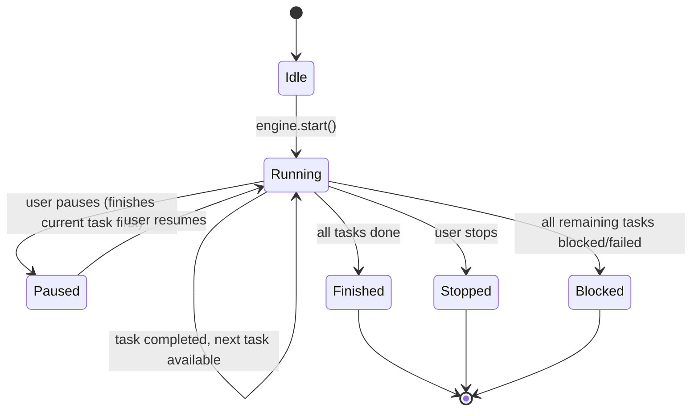
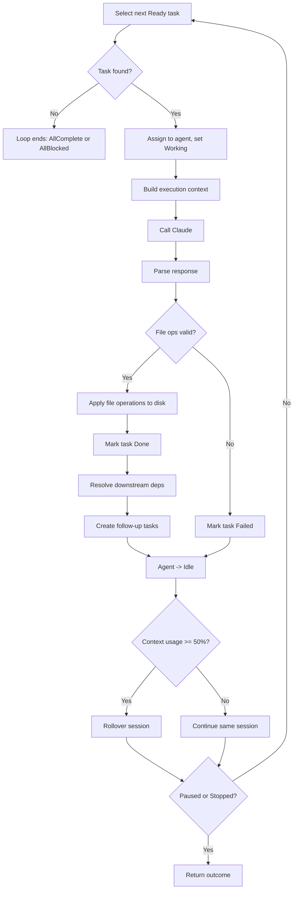

# Spec 07 — Autonomous Development Loop

## Purpose

Implement the orchestration engine that ties together all previous specs into a continuous, autonomous coding loop. This is the heart of the application: the engine selects tasks, builds context, calls Claude to generate code, writes changes to the user's local codebase, records results, rotates context when needed, and repeats — until stopped or no tasks remain. It also supports pause/resume, follow-up task creation, and plan revision.

---

## Core Concepts

### The Loop

The dev loop is a `tokio` task that runs asynchronously. It follows this cycle:

```
loop {
    1. Select next ready task (Spec 05)
    2. If none → stop (all work done or all blocked)
    3. Assign task to agent (Spec 06)
    4. Build execution context (project, spec, task, codebase snapshot)
    5. Call Claude with context + task instructions
    6. Parse Claude response into file operations
    7. Apply file operations to linked folder
    8. Record execution logs
    9. Mark task done or failed (Spec 05)
    10. Resolve downstream dependencies (Spec 05)
    11. Check context usage → rollover if needed (Spec 06)
    12. If stopped → break
}
```

### Execution Context

Before calling Claude, the engine assembles a context package:
- Project metadata (name, description)
- The spec file the task belongs to (full markdown)
- The task title and description
- Summary from previous session (if any)
- Relevant codebase files (read from linked folder)
- Any execution notes from prior attempts (for retries)

### File Operations

Claude's response is parsed into a set of file operations:
- **Create** — write a new file at a path
- **Modify** — replace content in an existing file
- **Delete** — remove a file

Operations are applied to the attached agent instance workspace directory. The engine validates paths so they cannot escape the resolved workspace root via `..`.

### Execution Logging

Every loop iteration produces a log entry recording what happened: what Claude was asked, what it responded, what files were changed, whether the task succeeded or failed, and any errors. Logs are stored as a growing text field on the task (`execution_notes`) and also emitted as events for the real-time UI.

### Pause / Resume

The user can pause the loop at any time. The engine finishes the current task iteration (does not interrupt mid-Claude-call), then stops. Resume picks up from the next ready task.

### Plan Revision

During execution, Claude may discover that the current task needs to be split, or that a prerequisite is missing. The engine supports this by:
1. Marking the current task as `Blocked` or `Failed` with notes.
2. Creating follow-up tasks (Spec 05) with appropriate dependencies.
3. Continuing with the next ready task.

---

## Interfaces

### Engine

```rust
use tokio::sync::{mpsc, watch};
use std::sync::Arc;

pub struct DevLoopEngine {
    store: Arc<RocksStore>,
    settings: Arc<SettingsService>,
    claude_client: Arc<ClaudeClient>,
    project_service: Arc<ProjectService>,
    task_service: Arc<TaskService>,
    agent_service: Arc<AgentService>,
    session_service: Arc<SessionService>,
    event_tx: mpsc::UnboundedSender<EngineEvent>,
}

impl DevLoopEngine {
    pub fn new(
        store: Arc<RocksStore>,
        settings: Arc<SettingsService>,
        claude_client: Arc<ClaudeClient>,
        project_service: Arc<ProjectService>,
        task_service: Arc<TaskService>,
        agent_service: Arc<AgentService>,
        session_service: Arc<SessionService>,
        event_tx: mpsc::UnboundedSender<EngineEvent>,
    ) -> Self { /* ... */ }

    /// Start the autonomous development loop.
    /// Returns a handle that can be used to pause/stop.
    pub async fn start(
        &self,
        project_id: ProjectId,
    ) -> Result<LoopHandle, EngineError> {
        // 1. Validate project exists and has tasks
        // 2. Get or create agent for project
        // 3. Create initial session
        // 4. Transition project to Active
        // 5. Spawn the loop task
        // 6. Return LoopHandle with stop/pause channels
    }
}
```

### Loop Handle (Pause/Resume/Stop)

```rust
pub struct LoopHandle {
    stop_tx: watch::Sender<LoopCommand>,
    join_handle: tokio::task::JoinHandle<Result<LoopOutcome, EngineError>>,
}

#[derive(Debug, Clone, Copy, PartialEq, Eq)]
pub enum LoopCommand {
    Continue,
    Pause,
    Stop,
}

#[derive(Debug, Clone)]
pub enum LoopOutcome {
    AllTasksComplete,
    Paused { completed_count: usize },
    Stopped { completed_count: usize },
    AllTasksBlocked,
    Error(String),
}

impl LoopHandle {
    pub fn pause(&self) {
        let _ = self.stop_tx.send(LoopCommand::Pause);
    }

    pub fn stop(&self) {
        let _ = self.stop_tx.send(LoopCommand::Stop);
    }

    pub async fn wait(self) -> Result<LoopOutcome, EngineError> {
        self.join_handle.await.map_err(|e| EngineError::Join(e.to_string()))?
    }
}
```

### Main Loop Implementation

```rust
impl DevLoopEngine {
    async fn run_loop(
        &self,
        project_id: ProjectId,
        agent_id: AgentId,
        mut session: Session,
        mut stop_rx: watch::Receiver<LoopCommand>,
    ) -> Result<LoopOutcome, EngineError> {
        let api_key = self.settings.decrypt_api_key()?;
        let mut completed_count: usize = 0;

        loop {
            // Check for pause/stop
            if *stop_rx.borrow() == LoopCommand::Pause {
                self.agent_service.finish_working(&project_id, &agent_id)?;
                return Ok(LoopOutcome::Paused { completed_count });
            }
            if *stop_rx.borrow() == LoopCommand::Stop {
                self.agent_service.finish_working(&project_id, &agent_id)?;
                return Ok(LoopOutcome::Stopped { completed_count });
            }

            // Select next task
            let task = match self.task_service.select_next_task(&project_id)? {
                Some(t) => t,
                None => {
                    let progress = self.task_service.get_project_progress(&project_id)?;
                    if progress.blocked_tasks > 0 || progress.failed_tasks > 0 {
                        return Ok(LoopOutcome::AllTasksBlocked);
                    }
                    return Ok(LoopOutcome::AllTasksComplete);
                }
            };

            // Assign task to agent
            self.task_service.assign_task(
                &project_id, &task.spec_id, &task.task_id, &agent_id,
            )?;
            self.agent_service.start_working(
                &project_id, &agent_id, &task.task_id, &session.session_id,
            )?;
            self.emit(EngineEvent::TaskStarted {
                task_id: task.task_id,
                task_title: task.title.clone(),
            });

            // Execute
            let result = self
                .execute_task(&project_id, &task, &session, &api_key)
                .await;

            match result {
                Ok(execution) => {
                    // Apply file operations
                    if let Err(e) = self.apply_file_ops(&project_id, &execution.file_ops).await {
                        self.task_service.fail_task(
                            &project_id, &task.spec_id, &task.task_id,
                            &format!("file operation failed: {e}"),
                        )?;
                        self.emit(EngineEvent::TaskFailed {
                            task_id: task.task_id,
                            reason: e.to_string(),
                        });
                    } else {
                        // Mark done
                        self.task_service.complete_task(
                            &project_id, &task.spec_id, &task.task_id,
                            &execution.notes,
                        )?;
                        completed_count += 1;
                        self.emit(EngineEvent::TaskCompleted {
                            task_id: task.task_id,
                        });

                        // Resolve downstream deps
                        let newly_ready = self
                            .task_service
                            .resolve_dependencies_after_completion(
                                &project_id,
                                &task.task_id,
                            )?;
                        for t in &newly_ready {
                            self.emit(EngineEvent::TaskBecameReady {
                                task_id: t.task_id,
                            });
                        }

                        // Create follow-up tasks if Claude suggested them
                        for follow_up in &execution.follow_up_tasks {
                            let new_task = self.task_service.create_follow_up_task(
                                &task,
                                follow_up.title.clone(),
                                follow_up.description.clone(),
                                vec![],
                            )?;
                            self.emit(EngineEvent::FollowUpTaskCreated {
                                task_id: new_task.task_id,
                            });
                        }
                    }

                    // Update context usage
                    self.session_service.update_context_usage(
                        &project_id,
                        &agent_id,
                        &session.session_id,
                        execution.input_tokens,
                        execution.output_tokens,
                    )?;
                }
                Err(e) => {
                    self.task_service.fail_task(
                        &project_id, &task.spec_id, &task.task_id,
                        &format!("execution error: {e}"),
                    )?;
                    self.emit(EngineEvent::TaskFailed {
                        task_id: task.task_id,
                        reason: e.to_string(),
                    });
                }
            }

            // Return agent to idle
            self.agent_service.finish_working(&project_id, &agent_id)?;

            // Context rotation check
            let current_session =
                self.session_service.get_session(
                    &project_id, &agent_id, &session.session_id,
                )?;
            if self.session_service.should_rollover(&current_session) {
                let summary = self
                    .session_service
                    .generate_rollover_summary(
                        &self.claude_client,
                        &api_key,
                        &self.build_conversation_history(&session),
                    )
                    .await?;
                let new_session = self.session_service.rollover_session(
                    &project_id,
                    &agent_id,
                    &session.session_id,
                    summary,
                    None,
                )?;
                self.emit(EngineEvent::SessionRolledOver {
                    old_session_id: session.session_id,
                    new_session_id: new_session.session_id,
                });
                session = new_session;
            }
        }
    }
}
```

### Task Execution

```rust
#[derive(Debug, Clone)]
pub struct TaskExecution {
    pub notes: String,
    pub file_ops: Vec<FileOp>,
    pub follow_up_tasks: Vec<FollowUpSuggestion>,
    pub input_tokens: u64,
    pub output_tokens: u64,
}

#[derive(Debug, Clone)]
pub struct FollowUpSuggestion {
    pub title: String,
    pub description: String,
}

#[derive(Debug, Clone, Serialize, Deserialize)]
#[serde(tag = "op", rename_all = "snake_case")]
pub enum FileOp {
    Create { path: String, content: String },
    Modify { path: String, content: String },
    Delete { path: String },
}

pub(crate) const TASK_EXECUTION_SYSTEM_PROMPT: &str = r#"
You are an expert software engineer. You are given a task to implement as part
of a larger project. You have access to the project specification and the
current state of relevant files.

Respond with a JSON object:
{
  "notes": "Brief summary of what you did",
  "file_ops": [
    { "op": "create", "path": "relative/path.rs", "content": "full file content" },
    { "op": "modify", "path": "relative/path.rs", "content": "full new content" },
    { "op": "delete", "path": "relative/path.rs" }
  ],
  "follow_up_tasks": [
    { "title": "Task title", "description": "What needs to be done" }
  ]
}

Rules:
- Paths are relative to the project root
- For "modify", provide the complete new file content
- Only include follow_up_tasks if you discover missing prerequisites
- If you cannot complete the task, set notes to explain why and leave file_ops empty
"#;

impl DevLoopEngine {
    async fn execute_task(
        &self,
        project_id: &ProjectId,
        task: &Task,
        session: &Session,
        api_key: &str,
    ) -> Result<TaskExecution, EngineError> {
        let project = self.project_service.get_project(project_id)?;
        let spec = self.store.get_spec(project_id, &task.spec_id)?;

        // Build user message with context
        let codebase_snapshot = self.read_relevant_files(&agent_instance.workspace_path, task)?;
        let user_message = self.build_execution_prompt(
            &project, &spec, task, session, &codebase_snapshot,
        );

        // Call Claude
        let response = self.claude_client
            .complete(api_key, TASK_EXECUTION_SYSTEM_PROMPT, &user_message, 8192)
            .await?;

        // Parse response
        self.parse_execution_response(&response)
    }
}
```

### File Operations (Safe I/O)

```rust
impl DevLoopEngine {
    async fn apply_file_ops(
        &self,
        project_id: &ProjectId,
        ops: &[FileOp],
    ) -> Result<(), EngineError> {
        let project = self.project_service.get_project(project_id)?;
        let base_path = Path::new(&agent_instance.workspace_path)
            .canonicalize()
            .map_err(|e| EngineError::Io(e.to_string()))?;

        for op in ops {
            match op {
                FileOp::Create { path, content } | FileOp::Modify { path, content } => {
                    let full_path = base_path.join(path);
                    self.validate_path(&base_path, &full_path)?;
                    if let Some(parent) = full_path.parent() {
                        tokio::fs::create_dir_all(parent).await
                            .map_err(|e| EngineError::Io(e.to_string()))?;
                    }
                    tokio::fs::write(&full_path, content).await
                        .map_err(|e| EngineError::Io(e.to_string()))?;
                }
                FileOp::Delete { path } => {
                    let full_path = base_path.join(path);
                    self.validate_path(&base_path, &full_path)?;
                    if full_path.exists() {
                        tokio::fs::remove_file(&full_path).await
                            .map_err(|e| EngineError::Io(e.to_string()))?;
                    }
                }
            }
        }
        Ok(())
    }

    /// Ensure path does not escape the project folder.
    fn validate_path(&self, base: &Path, target: &Path) -> Result<(), EngineError> {
        let canonical = target
            .canonicalize()
            .or_else(|_| {
                // File may not exist yet (create). Canonicalize the parent.
                target.parent()
                    .ok_or_else(|| EngineError::PathEscape(target.display().to_string()))
                    .and_then(|p| p.canonicalize()
                        .map_err(|_| EngineError::PathEscape(target.display().to_string())))
                    .map(|p| p.join(target.file_name().unwrap_or_default()))
            })?;

        if !canonical.starts_with(base) {
            return Err(EngineError::PathEscape(target.display().to_string()));
        }
        Ok(())
    }
}
```

### Codebase Reading

```rust
impl DevLoopEngine {
    fn read_relevant_files(
        &self,
        linked_folder: &str,
        task: &Task,
    ) -> Result<String, EngineError> {
        // MVP strategy: read key files from the project root.
        // Walk directory, include files matching common source patterns,
        // skip binaries and node_modules/target/.git.
        // Cap total size to avoid exceeding context window.

        let base = Path::new(linked_folder);
        let mut output = String::new();
        let max_bytes: usize = 50_000;

        self.walk_and_collect(base, base, &mut output, &mut 0, max_bytes)?;
        Ok(output)
    }

    fn walk_and_collect(
        &self,
        base: &Path,
        dir: &Path,
        output: &mut String,
        current_size: &mut usize,
        max_bytes: usize,
    ) -> Result<(), EngineError> {
        // Skip: .git, target, node_modules, __pycache__, etc.
        // Include: .rs, .ts, .tsx, .js, .json, .toml, .md, .css, etc.
        // For each file: append "--- path/to/file ---\n{content}\n\n"
        // Stop when current_size exceeds max_bytes
        Ok(())
    }
}
```

### Engine Events

```rust
#[derive(Debug, Clone, Serialize)]
#[serde(tag = "type", rename_all = "snake_case")]
pub enum EngineEvent {
    LoopStarted { project_id: ProjectId, agent_id: AgentId },
    TaskStarted { task_id: TaskId, task_title: String },
    TaskCompleted { task_id: TaskId },
    TaskFailed { task_id: TaskId, reason: String },
    TaskBecameReady { task_id: TaskId },
    FollowUpTaskCreated { task_id: TaskId },
    SessionRolledOver { old_session_id: SessionId, new_session_id: SessionId },
    LoopPaused { completed_count: usize },
    LoopStopped { completed_count: usize },
    LoopFinished { outcome: String },
    LogLine { message: String },
}

impl DevLoopEngine {
    fn emit(&self, event: EngineEvent) {
        let _ = self.event_tx.send(event);
    }
}
```

### Error Type

```rust
#[derive(Debug, thiserror::Error)]
pub enum EngineError {
    #[error("store error: {0}")]
    Store(#[from] StoreError),
    #[error("project error: {0}")]
    Project(#[from] ProjectError),
    #[error("task error: {0}")]
    Task(#[from] TaskError),
    #[error("agent error: {0}")]
    Agent(#[from] AgentError),
    #[error("session error: {0}")]
    Session(#[from] SessionError),
    #[error("settings error: {0}")]
    Settings(#[from] SettingsError),
    #[error("Claude API error: {0}")]
    Claude(#[from] ClaudeClientError),
    #[error("IO error: {0}")]
    Io(String),
    #[error("path escape attempt: {0}")]
    PathEscape(String),
    #[error("response parse error: {0}")]
    Parse(String),
    #[error("join error: {0}")]
    Join(String),
}
```

---

## State Machines

### Dev Loop Lifecycle



### Single Task Iteration



---

## Key Behaviors

1. **Non-interruptible iteration** — a pause/stop takes effect between task iterations, not during a Claude call. This prevents partial execution and corrupted state.
2. **Path safety** — all file operations are validated against the resolved agent workspace path. Any path that resolves outside that workspace is rejected with `PathEscape`.
3. **File content is full replacement** — the `modify` operation writes the complete new content, not a diff. This is simpler for the MVP; diff-based editing is a future enhancement.
4. **Codebase size cap** — the file reader caps at ~50KB of source to fit within Claude's context along with the spec, task, and summary. Larger projects need smarter file selection (future enhancement).
5. **Follow-up tasks are optional** — Claude may return an empty `follow_up_tasks` array. When present, they are created immediately and available for future iterations.
6. **Event stream** — every significant action emits an `EngineEvent` on the channel. The HTTP API (Spec 08) forwards these to WebSocket clients.
7. **Retry semantics** — a failed task remains in `Failed` status. The user (or a future auto-retry policy) can call `retry_task` to move it back to `Ready`.
8. **Session continuity on resume** — when the loop resumes after a pause, it reuses the existing session if context usage is still below threshold.

---

## Dependencies

| Spec | What is used |
|------|-------------|
| Spec 01 | All entity types and IDs |
| Spec 02 | `RocksStore` for data access |
| Spec 03 | `SettingsService::decrypt_api_key()` |
| Spec 04 | `ProjectService`, `ClaudeClient`, `Spec` retrieval |
| Spec 05 | `TaskService` (select, assign, complete, fail, resolve deps, follow-up) |
| Spec 06 | `AgentService`, `SessionService` (lifecycle, rollover) |

---

## Tasks

| ID | Task | Description |
|----|------|-------------|
| T07.1 | Create `aura-engine` crate | New crate with dependencies on `aura-os-core`, `aura-os-store`, `aura-services` |
| T07.2 | Implement `DevLoopEngine::new` | Wire all services |
| T07.3 | Implement `LoopHandle` | Pause/stop/wait via `tokio::sync::watch` |
| T07.4 | Implement `start` | Validate project, create agent+session, spawn loop |
| T07.5 | Implement `run_loop` | Main loop: select → assign → execute → update → rotate → repeat |
| T07.6 | Implement `execute_task` | Context building, Claude call, response parsing |
| T07.7 | Define `TASK_EXECUTION_SYSTEM_PROMPT` | System prompt for code generation |
| T07.8 | Implement `parse_execution_response` | JSON parsing with robustness (fenced blocks, etc.) |
| T07.9 | Implement `apply_file_ops` | Create/modify/delete with path validation |
| T07.10 | Implement `validate_path` | Canonicalization and escape detection |
| T07.11 | Implement `read_relevant_files` | Directory walk with skip patterns and size cap |
| T07.12 | Implement event emission | `EngineEvent` enum and `emit` helper |
| T07.13 | Unit tests — path validation | Paths inside project pass, `..` escape paths fail |
| T07.14 | Unit tests — response parsing | Valid JSON, fenced JSON, malformed JSON |
| T07.15 | Integration tests — single iteration | Mock Claude, execute one task, verify file written and task marked done |
| T07.16 | Integration tests — loop with multiple tasks | Two tasks with dependency, verify ordering and cascading readiness |
| T07.17 | Integration tests — pause/resume | Start loop, pause after first task, resume, verify continuation |
| T07.18 | Integration tests — context rollover | Set low threshold, verify session rolls over after task |
| T07.19 | Clippy + fmt clean | All crates pass |

---

## Test Criteria

All of the following must pass before proceeding to Spec 08:

- [ ] Single task execution: Claude mock returns file ops, files are written to temp dir
- [ ] Path validation rejects `../escape` paths
- [ ] Loop processes tasks in dependency order
- [ ] Completing a task cascades readiness to dependents
- [ ] Follow-up tasks created during execution appear in the task list
- [ ] Pause stops the loop after the current iteration completes
- [ ] Resume continues from the next ready task
- [ ] Context rollover triggers at threshold, new session carries summary
- [ ] Events are emitted for all significant loop actions
- [ ] Response parser handles valid, fenced, and malformed JSON
- [ ] Clippy and fmt are clean
