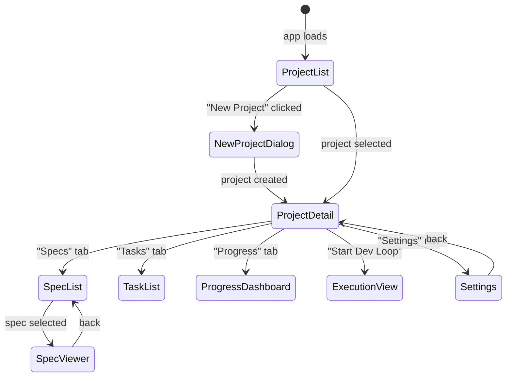
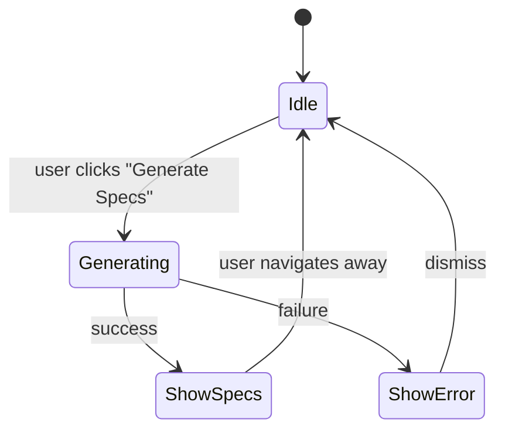

# Spec 09 — Frontend Shell & Planning UI

## Purpose

Build the React + TypeScript single-page application that runs inside the Rust webview. This spec covers the app shell layout, routing, TypeScript data types mirroring the backend, the API client layer, and the planning-phase views: project list, project detail, spec file viewer, task list grouped by spec, and the progress dashboard. These views let the user create projects, review generated specs and tasks, and understand project status before starting the dev loop.

---

## Core Concepts

### Webview Integration

The interface is a standard React SPA built with Vite, producing static assets (HTML, JS, CSS) that the Rust webview loads. The webview points to `http://localhost:3100` during development and bundles the assets in production. The interface communicates with the backend exclusively through the HTTP API defined in Spec 08.

### App Shell

The shell provides a persistent layout:
- **Top bar** — app title, current project name (if selected), global actions
- **Sidebar** — project list for quick switching
- **Main content area** — changes based on the current route/view

### Routing

Client-side routing via React Router. Routes are nested under the project context:

| Route | View |
|-------|------|
| `/` | Project list (home) |
| `/projects/:projectId` | Project detail |
| `/projects/:projectId/specs` | Spec list |
| `/projects/:projectId/specs/:specId` | Spec viewer |
| `/projects/:projectId/tasks` | Task list grouped by spec |
| `/projects/:projectId/progress` | Progress dashboard |
| `/projects/:projectId/execution` | Execution view (Spec 10) |
| `/settings` | Settings (API key) |

### State Management

Lightweight approach using React context + hooks:
- `ProjectContext` — holds the selected project and refreshes on navigation
- `ApiClient` — singleton fetch wrapper injected via context
- Local component state for view-specific data (loaded via `useEffect` + API calls)

No external state library (Redux, Zustand) for MVP. If state sharing grows complex, it will be added later.

---

## Interfaces

### TypeScript Domain Types

```typescript
// ids.ts
type ProjectId = string;
type SpecId = string;
type TaskId = string;
type AgentId = string;
type SessionId = string;

// enums.ts
type ProjectStatus = "planning" | "active" | "paused" | "completed" | "archived";
type TaskStatus = "pending" | "ready" | "in_progress" | "blocked" | "done" | "failed";
type AgentStatus = "idle" | "working" | "blocked" | "stopped" | "error";
type SessionStatus = "active" | "completed" | "failed" | "rolled_over";
type ApiKeyStatus = "not_set" | "valid" | "invalid" | "validation_pending" | "validation_failed";

// entities.ts
interface Project {
  project_id: ProjectId;
  name: string;
  description: string;
  requirements_doc_path: string;
  current_status: ProjectStatus;
  created_at: string;
  updated_at: string;
}

interface Spec {
  spec_id: SpecId;
  project_id: ProjectId;
  title: string;
  order_index: number;
  markdown_contents: string;
  created_at: string;
  updated_at: string;
}

interface Task {
  task_id: TaskId;
  project_id: ProjectId;
  spec_id: SpecId;
  title: string;
  description: string;
  status: TaskStatus;
  order_index: number;
  dependency_ids: TaskId[];
  assigned_agent_id: AgentId | null;
  execution_notes: string;
  created_at: string;
  updated_at: string;
}

interface Agent {
  agent_id: AgentId;
  project_id: ProjectId;
  name: string;
  status: AgentStatus;
  current_task_id: TaskId | null;
  current_session_id: SessionId | null;
  created_at: string;
  updated_at: string;
}

interface Session {
  session_id: SessionId;
  agent_id: AgentId;
  project_id: ProjectId;
  active_task_id: TaskId | null;
  context_usage_estimate: number;
  summary_of_previous_context: string;
  status: SessionStatus;
  started_at: string;
  ended_at: string | null;
}

interface ApiKeyInfo {
  status: ApiKeyStatus;
  masked_key: string | null;
  last_validated_at: string | null;
  updated_at: string | null;
}

interface ProjectProgress {
  project_id: ProjectId;
  total_tasks: number;
  pending_tasks: number;
  ready_tasks: number;
  in_progress_tasks: number;
  blocked_tasks: number;
  done_tasks: number;
  failed_tasks: number;
  completion_percentage: number;
}

interface ApiError {
  error: string;
  code: string;
  details: string | null;
}
```

### API Client

```typescript
// api-client.ts

const BASE_URL = "http://localhost:3100";

async function apiFetch<T>(path: string, options?: RequestInit): Promise<T> {
  const res = await fetch(`${BASE_URL}${path}`, {
    headers: { "Content-Type": "application/json" },
    ...options,
  });
  if (!res.ok) {
    const err: ApiError = await res.json();
    throw new ApiClientError(res.status, err);
  }
  if (res.status === 204) return undefined as T;
  return res.json();
}

export const api = {
  // Settings
  getApiKeyInfo: () => apiFetch<ApiKeyInfo>("/api/settings/api-key"),
  setApiKey: (apiKey: string) =>
    apiFetch<ApiKeyInfo>("/api/settings/api-key", {
      method: "POST",
      body: JSON.stringify({ api_key: apiKey }),
    }),
  deleteApiKey: () =>
    apiFetch<void>("/api/settings/api-key", { method: "DELETE" }),

  // Projects
  listProjects: () => apiFetch<Project[]>("/api/projects"),
  createProject: (data: CreateProjectRequest) =>
    apiFetch<Project>("/api/projects", {
      method: "POST",
      body: JSON.stringify(data),
    }),
  getProject: (id: ProjectId) => apiFetch<Project>(`/api/projects/${id}`),
  updateProject: (id: ProjectId, data: UpdateProjectRequest) =>
    apiFetch<Project>(`/api/projects/${id}`, {
      method: "PUT",
      body: JSON.stringify(data),
    }),
  archiveProject: (id: ProjectId) =>
    apiFetch<Project>(`/api/projects/${id}/archive`, { method: "POST" }),

  // Specs
  listSpecs: (projectId: ProjectId) =>
    apiFetch<Spec[]>(`/api/projects/${projectId}/specs`),
  getSpec: (projectId: ProjectId, specId: SpecId) =>
    apiFetch<Spec>(`/api/projects/${projectId}/specs/${specId}`),
  generateSpecs: (projectId: ProjectId) =>
    apiFetch<Spec[]>(`/api/projects/${projectId}/specs/generate`, {
      method: "POST",
    }),

  // Tasks
  listTasks: (projectId: ProjectId) =>
    apiFetch<Task[]>(`/api/projects/${projectId}/tasks`),
  listTasksBySpec: (projectId: ProjectId, specId: SpecId) =>
    apiFetch<Task[]>(`/api/projects/${projectId}/specs/${specId}/tasks`),
  extractTasks: (projectId: ProjectId) =>
    apiFetch<Task[]>(`/api/projects/${projectId}/tasks/extract`, {
      method: "POST",
    }),
  transitionTask: (projectId: ProjectId, taskId: TaskId, newStatus: TaskStatus) =>
    apiFetch<Task>(`/api/projects/${projectId}/tasks/${taskId}/transition`, {
      method: "POST",
      body: JSON.stringify({ new_status: newStatus }),
    }),
  retryTask: (projectId: ProjectId, taskId: TaskId) =>
    apiFetch<Task>(`/api/projects/${projectId}/tasks/${taskId}/retry`, {
      method: "POST",
    }),
  getProgress: (projectId: ProjectId) =>
    apiFetch<ProjectProgress>(`/api/projects/${projectId}/progress`),

  // Agents
  listAgents: (projectId: ProjectId) =>
    apiFetch<Agent[]>(`/api/projects/${projectId}/agents`),
  getAgent: (projectId: ProjectId, agentId: AgentId) =>
    apiFetch<Agent>(`/api/projects/${projectId}/agents/${agentId}`),
  listSessions: (projectId: ProjectId, agentId: AgentId) =>
    apiFetch<Session[]>(`/api/projects/${projectId}/agents/${agentId}/sessions`),

  // Loop
  startLoop: (projectId: ProjectId) =>
    apiFetch<LoopStatusResponse>(`/api/projects/${projectId}/loop/start`, {
      method: "POST",
    }),
  pauseLoop: (projectId: ProjectId) =>
    apiFetch<void>(`/api/projects/${projectId}/loop/pause`, { method: "POST" }),
  stopLoop: (projectId: ProjectId) =>
    apiFetch<void>(`/api/projects/${projectId}/loop/stop`, { method: "POST" }),
};

interface CreateProjectRequest {
  name: string;
  description: string;
  workspace_path?: string;
  requirements_doc_path: string;
}

interface UpdateProjectRequest {
  name?: string;
  description?: string;
  workspace_path?: string;
  requirements_doc_path?: string;
}

interface LoopStatusResponse {
  running: boolean;
  paused: boolean;
  project_id: ProjectId | null;
  agent_id: AgentId | null;
  session_number: number | null;
}
```

### View Components

#### App Shell

```
+------------------------------------------------------+
| [Aura]    Current Project: My App       [Settings]   |
+----------+-------------------------------------------+
|          |                                           |
| Projects |          Main Content Area                |
|          |                                           |
| > My App |    (changes based on route)               |
|   Other  |                                           |
|          |                                           |
+----------+-------------------------------------------+
```

```typescript
// AppShell.tsx
function AppShell() {
  return (
    <div className={styles.shell}>
      <header className={styles.topBar}>
        <span className={styles.logo}>Aura</span>
        <ProjectBreadcrumb />
        <Link to="/settings">Settings</Link>
      </header>
      <div className={styles.body}>
        <aside className={styles.sidebar}>
          <ProjectList />
        </aside>
        <main className={styles.content}>
          <Outlet />
        </main>
      </div>
    </div>
  );
}
```

#### Project List (Sidebar)

```typescript
// ProjectList.tsx
function ProjectList() {
  // Fetches projects on mount, renders as a nav list.
  // Clicking a project navigates to /projects/:projectId.
  // Shows a "New Project" button at the top.
  // Active project is highlighted.
}
```

#### Project Detail

```typescript
// ProjectDetail.tsx
function ProjectDetail() {
  // Shows: name, description, status, linked folder, requirements path
  // Action buttons:
  //   - "Generate Specs" (calls api.generateSpecs, shows loading)
  //   - "Extract Tasks" (calls api.extractTasks, shows loading)
  //   - "Start Dev Loop" (navigates to execution view)
  //   - "Archive" (calls api.archiveProject)
  // Navigation tabs: Specs | Tasks | Progress
}
```

#### Spec List

```typescript
// SpecList.tsx
function SpecList() {
  // Lists all specs for the project, ordered by order_index.
  // Each item shows: order number, title, truncated purpose.
  // Clicking navigates to /projects/:projectId/specs/:specId.
}
```

#### Spec Viewer

```typescript
// SpecViewer.tsx
function SpecViewer() {
  // Renders spec.markdown_contents as formatted HTML.
  // Uses a markdown rendering library (e.g., react-markdown).
  // Shows spec title and order index in a header.
  // Sidebar shows tasks belonging to this spec.
}
```

#### Task List (Grouped by Spec)

```typescript
// TaskList.tsx
function TaskList() {
  // Fetches all tasks and specs for the project.
  // Groups tasks by spec_id, ordered by spec order_index.
  // Each task row shows: title, status badge, assigned agent, order.
  // Status badges are color-coded:
  //   pending=gray, ready=blue, in_progress=yellow,
  //   done=green, failed=red, blocked=orange
  // Clicking a task expands to show description and execution_notes.
}
```

#### Progress Dashboard

```typescript
// ProgressDashboard.tsx
function ProgressDashboard() {
  // Fetches ProjectProgress from api.getProgress.
  // Displays:
  //   - Large completion percentage with circular progress indicator
  //   - Status breakdown: cards for total, done, active, ready, blocked, failed
  //   - Progress bar (done / total)
  // Auto-refreshes every 5 seconds (or via WebSocket in Spec 10).
}
```

#### Settings View

```typescript
// SettingsView.tsx
function SettingsView() {
  // Shows current API key status (masked key, validation status).
  // Input field for entering/updating the key.
  //   - Key is never shown in the input after save.
  //   - Shows masked version below: "sk-ant-...XYZ"
  // "Save" button calls api.setApiKey.
  // "Delete" button calls api.deleteApiKey.
  // Validation status indicator (green check, red X, spinner).
}
```

#### New Project Dialog

```typescript
// NewProjectDialog.tsx
function NewProjectDialog() {
  // Modal or full-page form with fields:
  //   - Name (text input, required)
  //   - Description (textarea)
  //   - Linked Folder Path (text input with folder-browse hint)
  //   - Requirements Doc Path (text input with file-browse hint)
  // "Create" button calls api.createProject.
  // On success, navigates to /projects/:newId.
}
```

---

## State Machines

### View Navigation



### Spec Generation UI Flow



---

## Key Behaviors

1. **Sidebar always visible** — the project list sidebar is always present regardless of route. The currently active project is highlighted.
2. **Spec generation loading state** — generating specs and extracting tasks can take 10-30 seconds. The UI shows a spinner with a message ("Generating specs from requirements..."). The button is disabled during the operation.
3. **Markdown rendering** — spec files are rendered with a markdown library that supports code blocks with syntax highlighting, tables, and mermaid diagrams.
4. **Task status colors** — consistent across all views: gray (pending), blue (ready), yellow (in_progress), green (done), red (failed), orange (blocked).
5. **Progress auto-refresh** — the progress dashboard polls every 5 seconds. In Spec 10, this is replaced by WebSocket-driven updates.
6. **Path inputs** — the MVP uses text inputs for folder/file paths. A native file picker is a future enhancement requiring webview IPC.
7. **Error handling** — API errors are displayed as toast notifications or inline error messages. Network failures show a "Connection lost" banner.
8. **Responsive layout** — the sidebar collapses on narrow viewports. The main content area takes full width.

---

## Dependencies

| Spec | What is used |
|------|-------------|
| Spec 08 | All HTTP endpoints consumed by the API client |

**Frontend dependencies:**

| Package | Purpose |
|---------|---------|
| `react` | UI framework |
| `react-dom` | DOM rendering |
| `react-router-dom` | Client-side routing |
| `react-markdown` | Markdown rendering |
| `remark-gfm` | GitHub-flavored markdown (tables, task lists) |
| `rehype-highlight` | Code syntax highlighting in markdown |
| `vite` | Build tool |
| `typescript` | Type safety |

---

## Tasks

| ID | Task | Description |
|----|------|-------------|
| T09.1 | Initialize interface project | `npm create vite@latest interface -- --template react-ts`, install deps |
| T09.2 | Implement TypeScript types | `ids.ts`, `enums.ts`, `entities.ts` mirroring Rust types |
| T09.3 | Implement API client | `api-client.ts` with all endpoints and error handling |
| T09.4 | Implement App Shell | `AppShell.tsx` with top bar, sidebar, main content area, routing |
| T09.5 | Implement ProjectList sidebar | Fetch projects, render nav list, highlight active |
| T09.6 | Implement NewProjectDialog | Form with validation, calls `api.createProject` |
| T09.7 | Implement ProjectDetail | Project info display, action buttons, tabbed navigation |
| T09.8 | Implement SpecList | Ordered spec list with title and purpose preview |
| T09.9 | Implement SpecViewer | Markdown rendering with syntax highlighting |
| T09.10 | Implement TaskList | Tasks grouped by spec, status badges, expandable rows |
| T09.11 | Implement ProgressDashboard | Completion percentage, status breakdown cards, progress bar |
| T09.12 | Implement SettingsView | API key input, masked display, validation status |
| T09.13 | Implement CSS module styles | Consistent design tokens, layout styles, status badge colors |
| T09.14 | Implement Rust webview shell | `src/main.rs`: start Axum server, open webview pointed at `localhost:3100` |
| T09.15 | Tests — component rendering | Verify each view renders without errors given mock data |
| T09.16 | Tests — API client | Mock fetch, verify correct URLs, methods, and body parsing |
| T09.17 | Tests — routing | Navigate between routes, verify correct view renders |

---

## Test Criteria

All of the following must pass before proceeding to Spec 10:

- [ ] App shell renders with sidebar and main content area
- [ ] Project list loads from API and displays project names
- [ ] Clicking a project navigates to project detail and highlights in sidebar
- [ ] "New Project" flow creates a project and navigates to it
- [ ] Spec list shows specs ordered by `order_index`
- [ ] Spec viewer renders markdown with code highlighting
- [ ] Task list groups tasks by spec and shows correct status badges
- [ ] Progress dashboard displays correct counts and percentage
- [ ] Settings view allows entering and masking an API key
- [ ] API client correctly calls all endpoints and handles errors
- [ ] Webview shell starts server and loads interface
- [ ] All views render without console errors
