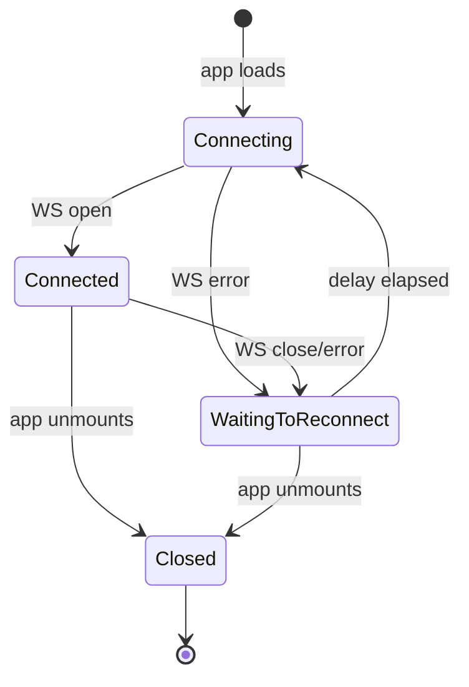
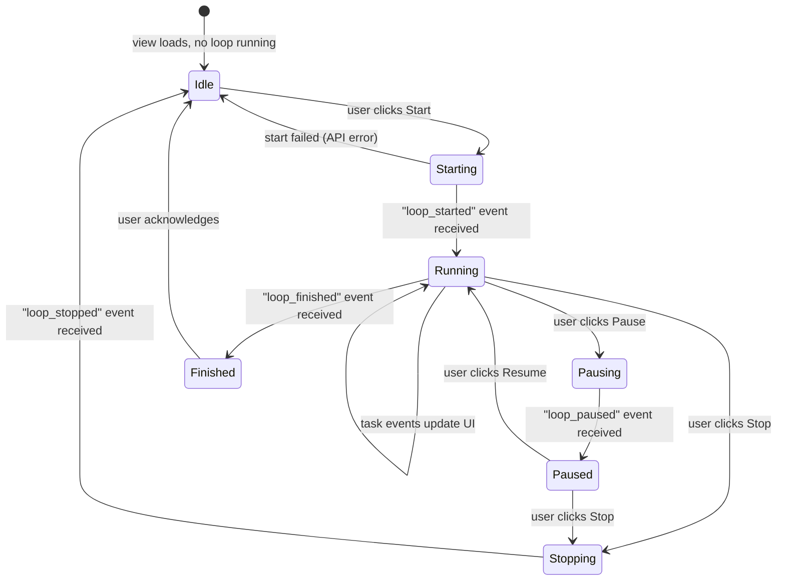
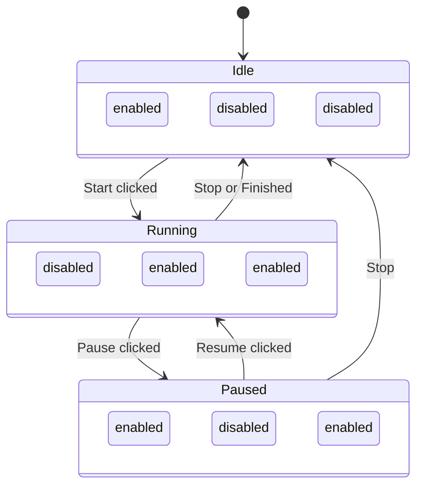

# Spec 10 — Real-Time Execution UI

## Purpose

Build the interface views that let the user start, monitor, pause, and stop the autonomous development loop in real time. This spec adds WebSocket integration to the interface, a live execution dashboard showing agent status, active task, streaming logs, session tracking, and task completion feed. It is the final vertical slice of the MVP — after this, the user can watch the system work through tasks autonomously.

---

## Core Concepts

### WebSocket Event Stream

The interface opens a single WebSocket connection to `ws://localhost:3100/ws/events` on load. All `EngineEvent` messages (defined in Spec 07) are received here and dispatched to the relevant UI components via a React context. The connection auto-reconnects on failure and falls back to polling if WebSocket is unavailable.

### Execution View

The execution view is the primary monitoring interface. It is a dedicated route (`/projects/:projectId/execution`) that combines:
- Agent status indicator
- Current task display
- Log output panel
- Session counter
- Task completion feed
- Start / Pause / Stop controls

### Event-Driven Updates

Instead of polling, all dynamic data in the execution view updates via WebSocket events. When an event arrives, the relevant component re-renders:
- `task_started` -> update current task display
- `task_completed` / `task_failed` -> update feed, refresh progress
- `session_rolled_over` -> increment session counter
- `log_line` -> append to log panel
- `loop_finished` / `loop_paused` / `loop_stopped` -> update controls

---

## Interfaces

### WebSocket Hook

```typescript
// use-event-stream.ts

type EngineEventType =
  | "loop_started"
  | "task_started"
  | "task_completed"
  | "task_failed"
  | "task_became_ready"
  | "follow_up_task_created"
  | "session_rolled_over"
  | "loop_paused"
  | "loop_stopped"
  | "loop_finished"
  | "log_line";

interface EngineEvent {
  type: EngineEventType;
  task_id?: string;
  task_title?: string;
  reason?: string;
  old_session_id?: string;
  new_session_id?: string;
  completed_count?: number;
  outcome?: string;
  message?: string;
  project_id?: string;
  agent_id?: string;
}

interface EventStreamState {
  connected: boolean;
  events: EngineEvent[];
  latestEvent: EngineEvent | null;
}

function useEventStream(): EventStreamState {
  // Opens WebSocket to ws://localhost:3100/ws/events
  // Parses incoming JSON messages as EngineEvent
  // Stores events in a bounded ring buffer (last 500)
  // Auto-reconnects with exponential backoff (1s, 2s, 4s, max 30s)
  // Returns connection status, event list, and latest event
}
```

### Event Context Provider

```typescript
// EventProvider.tsx

interface EventContextValue {
  connected: boolean;
  events: EngineEvent[];
  latestEvent: EngineEvent | null;
  subscribe: (type: EngineEventType, callback: (e: EngineEvent) => void) => () => void;
}

function EventProvider({ children }: { children: React.ReactNode }) {
  // Wraps useEventStream and provides context to all children.
  // The subscribe function allows components to register
  // for specific event types without re-rendering on every event.
}
```

### Execution View

```
+-----------------------------------------------------------+
| [Aura]  Project: My App  >  Execution           [Settings]|
+----------+------------------------------------------------+
|          | +--------------------------------------------+ |
| Projects | | Agent: worker-1          Session: #3       | |
|          | | Status: [Working]                          | |
|          | | Current Task: Implement database schema     | |
|          | +--------------------------------------------+ |
|          |                                                |
|          | +--- Task Feed ------+ +--- Log Output ------+ |
|          | | [done] Setup proj  | | > Reading src/main  | |
|          | | [done] Add deps    | | > Generating code   | |
|          | | [working] DB schema| | > Writing schema.rs | |
|          | | [ready] Add routes | | > Task completed    | |
|          | | [pending] Add UI   | |                     | |
|          | +--------------------+ +---------------------+ |
|          |                                                |
|          | +--------------------------------------------+ |
|          | | [Pause]  [Stop]         Progress: 40%      | |
|          | +--------------------------------------------+ |
+----------+------------------------------------------------+
```

```typescript
// ExecutionView.tsx

function ExecutionView() {
  const { projectId } = useParams();
  const { connected, subscribe } = useEventContext();
  const [loopRunning, setLoopRunning] = useState(false);
  const [loopPaused, setLoopPaused] = useState(false);

  return (
    <div className={styles.executionView}>
      <AgentStatusBar projectId={projectId} />
      <div className={styles.panels}>
        <TaskFeed projectId={projectId} />
        <LogPanel />
      </div>
      <LoopControls
        projectId={projectId}
        running={loopRunning}
        paused={loopPaused}
        onStart={handleStart}
        onPause={handlePause}
        onStop={handleStop}
      />
    </div>
  );
}
```

### Agent Status Bar

```typescript
// AgentStatusBar.tsx

interface AgentStatusBarProps {
  projectId: ProjectId;
}

function AgentStatusBar({ projectId }: AgentStatusBarProps) {
  // Displays:
  //   - Agent name and status (with color-coded badge)
  //   - Current session number ("Session #3")
  //   - Current task title (or "Idle" if no task)
  //   - Connection status indicator (green dot = WS connected)
  //
  // Updates via:
  //   - "task_started" event -> update current task
  //   - "task_completed" / "task_failed" -> clear current task
  //   - "session_rolled_over" -> increment session counter
  //   - "loop_paused" / "loop_stopped" -> show paused/stopped status
  //
  // Initial load: fetches agent from api.listAgents, session count
  // from api.listSessions.
}
```

### Task Feed

```typescript
// TaskFeed.tsx

interface TaskFeedProps {
  projectId: ProjectId;
}

function TaskFeed({ projectId }: TaskFeedProps) {
  // Vertical list of tasks showing recent activity.
  // Each row: [status badge] task title [timestamp]
  //
  // Ordering: active/recent at top, upcoming below.
  //   - The currently working task is highlighted
  //   - Just-completed tasks show a brief "done" animation
  //   - Failed tasks are red and show the reason on expand
  //
  // Data source:
  //   - Initial load from api.listTasks
  //   - Updated in real-time via events:
  //     "task_started" -> mark as in_progress
  //     "task_completed" -> mark as done
  //     "task_failed" -> mark as failed
  //     "task_became_ready" -> mark as ready
  //     "follow_up_task_created" -> add new task to list
  //
  // Shows at most 50 tasks. Scrollable with sticky active task.
}
```

### Log Panel

```typescript
// LogPanel.tsx

function LogPanel() {
  // Terminal-style scrollable log output.
  // Receives "log_line" events and appends to a buffer.
  // Buffer is capped at 1000 lines (oldest trimmed).
  //
  // Features:
  //   - Monospace font, dark background
  //   - Auto-scroll to bottom (can be paused by scrolling up)
  //   - "Clear" button to reset the log
  //   - Timestamps on each line
  //
  // Also shows key events as log lines:
  //   "task_started" -> "[12:34:05] Started: Implement database schema"
  //   "task_completed" -> "[12:35:22] Completed: Implement database schema"
  //   "session_rolled_over" -> "[12:35:23] Context rotated -> Session #4"
}
```

### Loop Controls

```typescript
// LoopControls.tsx

interface LoopControlsProps {
  projectId: ProjectId;
  running: boolean;
  paused: boolean;
  onStart: () => void;
  onPause: () => void;
  onStop: () => void;
}

function LoopControls({ projectId, running, paused, onStart, onPause, onStop }: LoopControlsProps) {
  // Button states:
  //   Not running: [Start] enabled, [Pause] disabled, [Stop] disabled
  //   Running:     [Start] disabled, [Pause] enabled, [Stop] enabled
  //   Paused:      [Resume] enabled, [Pause] disabled, [Stop] enabled
  //
  // Also shows a small progress bar and completion percentage.
  // Progress is fetched from api.getProgress and updated on task events.
  //
  // Start calls api.startLoop(projectId)
  // Pause calls api.pauseLoop(projectId)
  // Stop calls api.stopLoop(projectId)
}
```

### Progress Integration

```typescript
// use-live-progress.ts

function useLiveProgress(projectId: ProjectId): ProjectProgress | null {
  // Fetches initial progress from api.getProgress.
  // Subscribes to task events and optimistically updates counts:
  //   "task_completed" -> done_tasks++, in_progress_tasks--
  //   "task_failed" -> failed_tasks++, in_progress_tasks--
  //   "task_started" -> in_progress_tasks++, ready_tasks--
  //   "task_became_ready" -> ready_tasks++, pending_tasks--
  //   "follow_up_task_created" -> total_tasks++
  //
  // Periodically re-fetches from API (every 30s) to correct drift.
  // Recalculates completion_percentage on every update.
}
```

### Reconnection Logic

```typescript
// ws-reconnect.ts

interface ReconnectConfig {
  url: string;
  initialDelay: number;   // 1000ms
  maxDelay: number;        // 30000ms
  backoffMultiplier: number; // 2
}

function createReconnectingWebSocket(
  config: ReconnectConfig,
  onMessage: (data: string) => void,
  onStatusChange: (connected: boolean) => void,
): { close: () => void } {
  // Opens WebSocket.
  // On close/error: waits delay, reconnects, doubles delay.
  // On successful open: resets delay to initial.
  // close() stops reconnection attempts.
}
```

---

## State Machines

### WebSocket Connection



### Execution View State



### Loop Controls Button State



---

## Key Behaviors

1. **Single WebSocket** — one connection per app session, shared via `EventProvider` context. Components subscribe to specific event types to avoid unnecessary re-renders.
2. **Optimistic progress updates** — the progress counts update immediately on events, without waiting for an API round-trip. A periodic full refresh corrects any drift.
3. **Log panel auto-scroll** — the log scrolls to the bottom on new entries unless the user has scrolled up manually. Scrolling back to the bottom re-enables auto-scroll.
4. **Event buffering** — the event ring buffer (500 events) prevents memory growth during long sessions. Older events are discarded. The task feed refreshes its full list from the API periodically.
5. **Graceful degradation** — if WebSocket fails to connect, the execution view falls back to polling the API every 3 seconds for agent status and task list. A yellow "Live updates unavailable" banner is shown.
6. **Start prerequisites** — the Start button is disabled (with tooltip) if: the API key is not set, the project has no tasks, or a loop is already running.
7. **Confirmation on Stop** — stopping the loop shows a brief confirmation ("Stop autonomous execution? Current task will complete first.") before calling the API.
8. **Session counter persistence** — the session number is derived from `api.listSessions.length`. It does not reset between page reloads.
9. **Responsive panels** — the task feed and log panel stack vertically on narrow viewports, horizontally on wide ones.

---

## Dependencies

| Spec | What is used |
|------|-------------|
| Spec 07 | `EngineEvent` type definitions |
| Spec 08 | WebSocket endpoint `/ws/events`, loop control endpoints |
| Spec 09 | App shell, routing, API client, TypeScript types, CSS tokens |

**Additional interface dependencies:**

| Package | Purpose |
|---------|---------|
| (none new) | All required packages installed in Spec 09 |

---

## Tasks

| ID | Task | Description |
|----|------|-------------|
| T10.1 | Implement `useEventStream` hook | WebSocket connection, JSON parsing, reconnect logic |
| T10.2 | Implement `createReconnectingWebSocket` | Auto-reconnect with exponential backoff |
| T10.3 | Implement `EventProvider` context | Wraps event stream, provides subscribe/unsubscribe |
| T10.4 | Implement `ExecutionView` layout | Route, panel layout, wiring to sub-components |
| T10.5 | Implement `AgentStatusBar` | Agent name, status badge, session counter, current task |
| T10.6 | Implement `TaskFeed` | Live-updating task list with status transitions |
| T10.7 | Implement `LogPanel` | Terminal-style log with auto-scroll and buffer cap |
| T10.8 | Implement `LoopControls` | Start/Pause/Stop buttons with state management |
| T10.9 | Implement `useLiveProgress` hook | Optimistic progress updates from events + periodic API refresh |
| T10.10 | Implement polling fallback | Detect WS failure, switch to API polling, show banner |
| T10.11 | Add execution route | `/projects/:projectId/execution` in React Router |
| T10.12 | Wire "Start Dev Loop" button | ProjectDetail button navigates to execution view and starts loop |
| T10.13 | Implement CSS for execution view | Dark log panel, status colors, responsive layout |
| T10.14 | Tests — event stream hook | Mock WebSocket, verify events parsed and buffered |
| T10.15 | Tests — reconnection | Simulate WS close, verify reconnect with backoff |
| T10.16 | Tests — execution view rendering | Mock events, verify status bar, feed, and log update |
| T10.17 | Tests — loop controls state | Verify button enabled/disabled states for each loop state |
| T10.18 | End-to-end smoke test | Start app, create project, generate specs, extract tasks, start loop, verify events appear in UI |

---

## Test Criteria

All of the following must pass before the MVP is considered complete:

- [ ] WebSocket connects on app load and receives events
- [ ] Auto-reconnect works after simulated disconnect
- [ ] Agent status bar shows correct agent name, status, and session number
- [ ] Current task updates when `task_started` event arrives
- [ ] Task feed reflects status changes in real time
- [ ] Log panel appends lines from `log_line` events and auto-scrolls
- [ ] Start button calls API and transitions to Running state
- [ ] Pause button transitions to Paused state after current task
- [ ] Stop button transitions to Idle after confirmation
- [ ] Progress bar updates optimistically on task events
- [ ] Polling fallback activates when WebSocket is unavailable
- [ ] All button states match the expected enabled/disabled matrix
- [ ] Execution view is responsive (stacks panels on narrow viewport)
- [ ] No console errors during normal operation

---

## MVP Completion

With Spec 10 complete, the full MVP user flow is functional:

1. User opens the desktop app (Rust webview boots Axum server, loads React SPA)
2. User enters Claude API key in Settings (Spec 03)
3. User creates a project with requirements.md path (Spec 04)
4. User clicks "Generate Specs" -> AI produces ordered spec files (Spec 04)
5. User clicks "Extract Tasks" -> AI produces tasks from specs (Spec 05)
6. User reviews specs and tasks in the planning UI (Spec 09)
7. User clicks "Start Dev Loop" -> autonomous execution begins (Spec 07)
8. User watches real-time progress: tasks complete, logs stream, sessions rotate (Spec 10)
9. User can pause/stop/resume at any time
10. Every artifact traces back: commit -> task -> spec -> project
